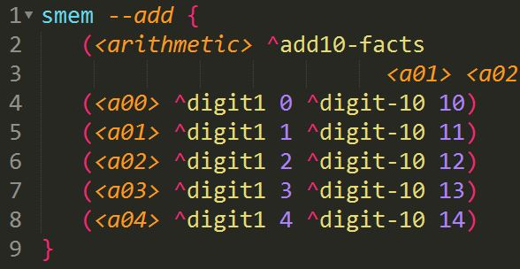
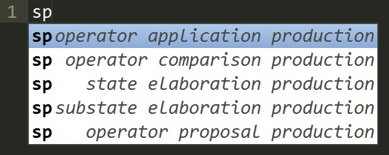
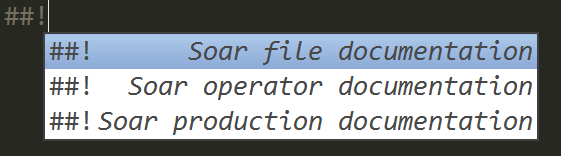
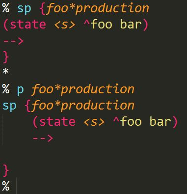

---
Tags:
    - Agent Development
    - Editor
---

# SublimeText Soar Tools Package

This extension allows the cross-platform editor SublimeText
(<http://www.sublimetext.com/>) to provide Soar-specific functionality. This
package provides the following:

*   Automatic indentation
*   Syntax coloring
*   Code folding
*   Production snippets that help you code faster
*   The ability to run the Soar CLI from SublimeText if you have the SublimeREPL
package installed

## Download Links

*   [SublimeText Soar Tools home page](https://nateglenn.com/Sublime-Soar-Tools/)
*   [Soar Tools package control page](https://packagecontrol.io/packages/Soar%20Tools)

## Documentation

### Installation

After installing [Package Control](https://packagecontrol.io/installation), use
the *Command Palette* (Ctrl+Shift+P) to select *Install Package* and then search
for "Soar Tools".

### Current Functionality

#### Syntax Highlighting

Files with the `.soar` extension are assumed to be Soar files and are highlighted
accordingly. Code folding is also provided but is irregular at the moment.
The plugin highlights both Soar productions and other curly-braced sections,
like `smem --add` commands:

#### Snippets

Production snippets help you code faster:

and SoarDoc snippets help you document faster:

#### SoarUnit Build Command

You can run SoarUnit on a single file or on an entire project as a build command
(<kbd>CTRL</kbd>+<kbd>B</kbd>). See project
[Readme](https://github.com/garfieldnate/Sublime-Soar-Tools) for setup details.

#### Soar REPL Integration

You can run the Soar CLI from SublimeText if you have the
[SublimeREPL](https://github.com/wuub/SublimeREPL) package installed (see the
project [Readme](https://github.com/garfieldnate/Sublime-Soar-Tools) for
setup details). Highlighting included!

## Contributions Welcome

Suggestions or questions, patches and PR's are welcome. Speak your mind on the
[issues](https://github.com/garfieldnate/Sublime-Soar-Tools/issues) page!

## Developer

Nathan Glenn
