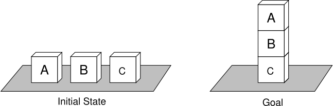
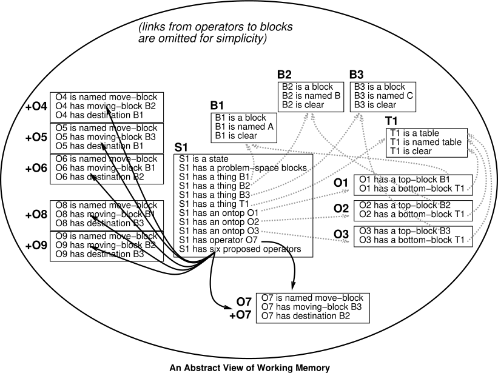
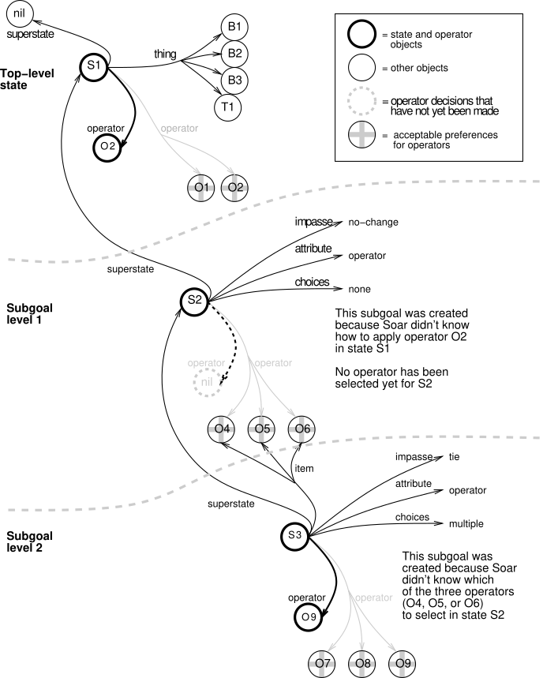

# The Soar Architecture

This chapter describes the Soar architecture. It covers all aspects of Soar except for the
specific syntax of Soar’s memories and descriptions of the Soar user-interface commands.

This chapter gives an abstract description of Soar. It starts by giving an overview of Soar and
then goes into more detail for each of Soar’s main memories (working memory, production
memory, and preference memory) and processes (the decision procedure, learning, and input
and output).

## An Overview of Soar

The design of Soar is based on the hypothesis that all deliberate goal-oriented behavior can
be cast as the selection and application of operators to a state. A state is a representation
of the current problem-solving situation; an operator transforms a state (makes changes to
the representation); and a goal is a desired outcome of the problem-solving activity.

As Soar runs, it is continually trying to apply the current operator and select the next
operator (a state can have only one operator at a time), until the goal has been achieved.
The selection and application of operators is illustrated in Figure 2.1.


Soar has separate memories (and different representations) for descriptions of its current
situation and its long-term procedural knowledge. In Soar, the current situation, including
data from sensors, results of intermediate inferences, active goals, and active operators is
held in **working memory**. Working memory is organized as objects. Objects are described
in terms of their attributes; the values of the attributes may correspond to sub-objects, so
the description of the state can have a hierarchical organization. (This need not be a strict
hierarchy; for example, there’s nothing to prevent two objects from being "substructure" of
each other.)

Long-term procedural knowledge is held in **production memory**. Procedural knowledge
specifies how to respond to different situations in working memory, can be thought of as the
program for Soar. The Soar architecture cannot solve any problems without the addition of
long-term procedural knowledge. (Note the distinction between the "Soar architecture" and
the "Soar program": The former refers to the system described in this manual, common to
all users, and the latter refers to knowledge added to the architecture.)

A Soar program contains the knowledge to be used for solving a specific task (or set of tasks),
including information about how to select and apply operators to transform the states of the
problem, and a means of recognizing that the goal has been achieved.

### Types of Procedural Knowledge in Soar

Soar’s procedural knowledge can be categorized into four distinct types of knowledge:

1. *Inference Rules*  
   In Soar, we call these state elaborations. This knowledge provides monotonic inferences
   that can be made about the state in a given situation. The knowledge created by such
   rules are not persistent and exist only as long as the conditions of the rules are met.
2. *Operator Proposal Knowledge*  
   Knowledge about when a particular operator is appropriate for a situation. Note
   that multiple operators may be appropriate in a given context. So, Soar also needs
   knowledge to determine which of the candidates to choose:
3. *Operator Selection Knowledge*  
   Knowledge about the desirability of an operator in a particular situation.
   Such knowledge can be either in terms of a single operator (e.g. never choose
   this operator in this
   situation) or relational (e.g. prefer this operator over another in this situation).
4. *Operator Application Rules*  
   Knowledge of how a specific selected operator modifies the state. This knowledge
   creates persistent changes to the state that remain even after the rule no longer matches
   or the operator is no longer selected.

Note that state elaborations can indirectly affect operator selection and
application by creating knowledge that the proposal and application rules match
on.

### Problem-Solving Functions in Soar

These problem-solving functions are the primitives for generating behavior that is relevant to
the current situation: elaborating the state, proposing candidate operators, comparing the
candidates, and applying the operator by modifying the state. These functions are driven
by the knowledge encoded in a Soar program.

Soar represents that knowledge as production rules. Production rules are similar to "if-
then" statements in conventional programming languages. (For example, a production might
say something like "if there are two blocks on the table, then suggest an operator to move
one block on top of the other block"). The "if" part of the production is called its conditions
and the "then" part of the production is called its actions. When the conditions are met in
the current situation as defined by working memory, the production is matched and it will
fire, which means that its actions are executed, making changes to working memory.

Selecting the current operator, involves making a decision once sufficient knowledge has
been retrieved. This is performed by Soar’s decision procedure, which is a fixed procedure
that interprets preferences that have been created by the knowledge retrieval functions. The
knowledge-retrieval and decision-making functions combine to form Soar’s decision cycle.

When the knowledge to perform the problem-solving functions is not directly available in
productions, Soar is unable to make progress and reaches an impasse. There are three types
of possible impasses in Soar:

1. An operator cannot be selected because no new operators are proposed.
2. An operator cannot be selected because multiple operators are proposed and
   the comparisons are insufficient to determine which one should be selected.
3. An operator has been selected, but there is insufficient knowledge to apply it.

In response to an impasse, the Soar architecture creates a substate in which operators can be
selected and applied to generate or deliberately retrieve the knowledge that was not directly
available; the goal in the substate is to resolve the impasse. For example, in a substate,
a Soar program may do a lookahead search to compare candidate operators if comparison
knowledge is not directly available. Impasses and substates are described in more detail in
[Impasses and Substates](#impasses-and-substates).

### An Example Task: The Blocks-World

We will use a task called the blocks-world as an example throughout this manual. In the
blocks-world task, the initial state has three blocks named A, B, and C on a table; the
operators move one block at a time to another location (on top of another block or onto the
table); and the goal is to build a tower withAon top,Bin the middle, andCon the bottom.
The initial state and the goal are illustrated in Figure 2.2.

The Soar code for this task is available online at
<https://web.eecs.umich.edu/~soar/blocksworld.soar> or in the
[here](blocksworld.md#blocksworld-soar-rules).  You do not need to look at the
code at this point.



The operators in this task move a single block from its current location to a new location;
each operator is represented with the following information:

- the name of the block being moved
- the current location of the block (the "thing" it is on top of)
- the destination of the block (the "thing" it will be on top of)

The goal in this task is to stack the blocks so that C is on the table, with
block B on top of block C, and block A on top of block B.

### Representation of States, Operators, and Goals

The initial state in our blocks-world task - before any operators have been proposed or
selected - is illustrated in Figure 2.3.

A state can have only one selected operator at a time but it may also have a
number of potential operators that are in consideration. These proposed
operators should not be confused with the active, selected operator.

Figure 2.4 illustrates working memory after the first operator has been
selected. There are six operators proposed, and only one of these is actually
selected.

Goals are either represented explicitly as substructures of the working memory
state with general rules that recognize when the goal is achieved, or are
implicitly represented in the Soar program by goal-specific rules that test the
state for specific features and recognize when the goal is achieved. The point
is that sometimes a description of the goal will be available in the state for
focusing the problem solving, whereas other times it may not.  Although
representing a goal explicitly has many advantages, some goals are difficult to
explicitly represent on the state.

For example, the goal in our blocks-world task is represented implicitly in the
provided Soar program. This is because a single production rule monitors the
state for completion of the goal and halts Soar when the goal is achieved.
(Syntax of Soar programs will be explained in [Chapter 3](./03_SyntaxOfSoarPrograms.md).)
If the goal was an explicit working memory structure, a rule could compare the
configuration of blocks to that structure instead of having the goal embedded
within the rule’s programming.

<!-- Figure 2.3 -->


<!-- Figure 2.4 -->


### Proposing candidate operators

As a first step in selecting an operator, one or more candidate operators are
proposed.  Operators are proposed by rules that test features of the current
state. When the blocks- world task is run, the Soar program will propose six
distinct (but similar) operators for the initial state as illustrated in Figure
2.5. These operators correspond to the six different actions that are possible
given the initial state.

### Comparing candidate operators: Preferences

The second step Soar takes in selecting an operator is to evaluate or compare
the candidate operators. In Soar, this is done via rules that test the proposed
operators and the current state, and then create preferences(stored in
preference memory). Preferences assert the relative or absolute merits of the
candidate operators. For example, a preference may say that operator A is a
"better" choice than operator B at this particular time, or a preference may say
that operator A is the "best" thing to do at this particular time. Preferences
are discussed in detail in [how preferences are evaluated to decide an operator](#how-preferences-are-evaluated-to-decide-an-operator).


### Selecting a single operator: Decision

Soar attempts to select a single operator as a decision, based on the
preferences available for the candidate operators. There are four different
situations that may arise:

1. The available preferences unambiguously prefer a single operator.
2. The available preferences suggest multiple operators, and prefer a subset that can be
   selected from randomly.
3. The available preferences suggest multiple operators,but neither case 1 or 2 above hold.
4. The available preferences do not suggest any operators.

In the first case, the preferred operator is selected. In the second case, one of the subset is
selected randomly. In the third and fourth cases, Soar has reached an impasse in problem
solving, and a new substate is created. Impasses are discussed in [Impasses and Substates](#impasses-and-substates).

In our blocks-world example, the second case holds, and Soar can select one of the operators
randomly

### Applying the operator

An operator applies by making changes to the state; the specific changes that
are appropriate depend on the operator and the current state.

There are two primary approaches to modifying the state: indirect and direct. Indirect
changes are used in Soar programs that interact with an external environment: The Soar
program sends motor commands to the external environment and monitors the external
environment for changes. The changes are reflected in an updated state description, garnered
from sensors. Soar may also make direct changes to the state; these correspond to Soar
doing problem solving "in its head". Soar programs that do not interact with an external
environment can make only direct changes to the state.

Internal and external problem solving should not be viewed as mutually exclusive activities in
Soar. Soar programs that interact with an external environment will generally have operators
that make direct and indirect changes to the state: The motor command is represented as
substructure of the state and it is a command to the environment. Also, a Soar program may
maintain an internal model of how it expects an external operator will modify the world; if
so, the operator must update the internal model (which is substructure of the state).

When Soar is doing internal problem solving, it must know how to modify the
state descriptions appropriately when an operator is being applied. If it is
solving the problem in an external environment, it must know what possible motor
commands it can issue in order to affect its environment.

The example blocks-world task described here does not interact with an external
environment. Therefore, the Soar program directly makes changes to the state
when operators are applied. There are four changes that may need to be made when
a block is moved in our task:

1. The block that is being moved is no longer where it was (it is no longer "on top" of
   the same thing).
2. The block that is being moved is in a new location (it is "on top" of a new thing).
3. The place that the block used to be in is now clear.
4. The place that the block is moving to is no longer clear — unless it is the table, which
   is always considered "clear".<sup>[1](#footnote1)</sup>

The blocks-world task could also be implemented using an external simulator. In this case,
the Soar program does not update all the "on top" and "clear" relations; the updated state
description comes from the simulator.

### Making inferences about the state

Making monotonic inferences about the state is the other role that Soar long-term procedural
knowledge may fulfill. Such elaboration knowledge can simplify the encoding of operators
because entailments of a set of core features of a state do not have to be explicitly included
in application of the operator. In Soar, these inferences will be automatically retracted when
the situation changes such that the inference no longer holds.

For instance, our example blocks-world task uses an elaboration to keep track of whether
or not a block is "clear". The elaboration tests for the absence of a block that is "on top"
of a particular block; if there is no such "on top", the block is "clear". When an operator
application creates a new "on top", the corresponding elaboration retracts, and the block is
no longer "clear".

### Problem Spaces

If we were to construct a Soar system that worked on a large number of different types of
problems, we would need to include large numbers of operators in our Soar program. For
a specific problem and a particular stage in problem solving, only a subset of all possible
operators are actually relevant. For example, if our goal is to count the blocks on the table,
operators having to do with moving blocks are probably not important, although they may
still be "legal". The operators that are relevant to current problem-solving activity define
the space of possible states that might be considered in solving a problem, that is, they
define the problem space.

Soar programs are implicitly organized in terms of problem spaces because the conditions
for proposing operators will restrict an operator to be considered only when it is relevant.
The complete problem space for the blocks world is shown in Figure 2.6. Typically, when


Soar solves a problem in this problem space, it does not explicitly generate all of the states,
examine them, and then create a path. Instead, Soar isin a specific state at a given time
(represented in working memory), attempting to select an operator that will move it to a
new state. It uses whatever knowledge it has about selecting operators given the current
situation, and if its knowledge is sufficient, it will move toward its goal.

The same problem could be recast in Soar as a planning problem, where the goal is to develop
a plan to solve the problem, instead of just solving the problem. In that case, a state in Soar
would consist of a plan, which in turn would have representations of blocks-world states and
operators from the original space. The operators would perform editing operations on the
plan, such as adding new blocks-world operators, simulating those operators, etc. In both
formulations of the problem, Soar is still applying operators to generate new states, it is just
that the states and operators have different content.

The remaining sections in this chapter describe the memories and processes of Soar: work-
ing memory, production memory, preference memory, Soar’s execution cycle (the decision
procedure), learning, and how input and output fit in.

## Working memory: The Current Situation

Soar represents the current problem-solving situation in its working memory. Thus, working
memory holds the current state and operator and is Soar’s "short-term" knowledge, reflecting
the current knowledge of the world and the status in problem solving.

Working memory contains elements called working memory elements, or WMEs for short.
Each WME contains a very specific piece of information; for example, a WME might say
that "B1 is a block". Several WMEs collectively may provide more information about the
same object, for example, "B1 is a block", "B1 is named A", "B1 is on the table", etc. These
WMEs are related because they are all contributing to the description of something that
is internally known to Soar as "B1". B1 is called an ***identifier***; the group of WMEs that
share this identifier are referred to as an object in working memory. Each WME describes a
different ***attribute*** of the object, for example, its name or type or location; each attribute
has a ***value*** associated with it, for example, the name is A, the type is block, and the
position is on the table. Therefore, each WME is an identifier-attribute-value triple, and all
WMEs with the same identifier are part of the same object.

Objects in working memory are *linked* to other objects: The value of one WME may be an
identifier of another object. For example, a WME might say that "B1 is on top of T1", and
another collection of WMEs might describe the object T1: "T1 is a table", "T1 is brown",
and "T1 is on top of F1". And still another collection of WMEs might describe the object
F1: "F1 is a floor", etc. All objects in working memory must be linked to a state, either
directly or indirectly (through other objects). Objects that are not linked to a state will be
automatically removed from working memory by the Soar architecture.

WMEs are also often called *augmentations* because they "augment" the object,
providing more detail about it. While these two terms are somewhat redundant,
WME is a term that is used more often to refer to the contents of working memory
(as a single *identifier-attribute-value* triple), while augmentation is a term
that is used more often to refer to the description of an object. Working memory
is illustrated at an abstract level in Figure 2.3.

The attribute of an augmentation is usually a constant, such as `name` or `type`, because
in a sense, the attribute is just a label used to distinguish one link in working memory from
another.<sup>[2](#footnote2)</sup>

The value of an augmentation may be either a constant, such as `red`, or an identifier, such
as 06. When the value is an identifier, it refers to an object in working memory that may
have additional substructure. In semantic net terms, if a value is a constant, then it is a
terminal node with no links; if it is an identifier it is a non terminal node.

One key concept of Soar is that working memory is a set, which means that there can never
be two elements in working memory at the same time that have the same identifier-attribute-
value triple (this is prevented by the architecture). However, it is possible to have multiple
working memory elements that have the same identifier and attribute, but that each have
different values. When this happens, we say the attribute is a *multi-valued attribute*, which
is often shortened to be *multi-attribute*.

An object is defined by its augmentations and not by its identifier. An identifier is simply a
label or pointer to the object. On subsequent runs of the same Soar program, there may be
an object with exactly the same augmentations, but a different identifier, and the program
will still reason about the object appropriately. Identifiers are internal markers for Soar;
they can appear in working memory, but they never appear in a production.

There is no predefined relationship between objects in working memory and "real objects"
in the outside world. Objects in working memory may refer to real objects, such as block
A; features of an object, such as the color red or shape cube; a relation between objects,
such as on top; classes of objects, such as blocks; etc. The actual names of attributes and
values have no meaning to the Soar architecture (aside from a few WMEs created by the
architecture itself). For example, Soar doesn’t care whether the things in the blocks world
are called "blocks" or "cubes" or "chandeliers". It is up to the Soar programmer to pick
suitable labels and to use them consistently.

The elements in working memory arise from one of four sources:

1. ***Productions***: The actions on the RHS of productions create most working memory
   elements.
2. ***Architecture***:
      - (a) State augmentations: The decision procedure automatically creates some special
      state augmentations (type, superstate, impasse, ...) whenever a state is created.
      States are created during initialization (the first state) or because of an impasse
      (a substate).
      - (b) Operator augmentations: The decision procedure creates the operator
      augmentation of the state based on preferences. This records the selection of
      the current operator.
3. ***Memory Systems*** 
4. ***SVS***
5. ***The Environment***: External I/O systems create working memory elements on the
   input-link for sensory data.

The elements in working memory are removed in six different ways:

1. The decision procedure automatically removes all state augmentations it creates when
   the impasse that led to their creation is resolved.
2. The decision procedure removes the operator augmentation of the state when that
   operator is no longer selected as the current operator.
3. Production actions that user `reject` preferences remove working memory elements that
   were created by other productions.
4. The architecture automatically removes i-supported WMEs when the productions that
   created them no longer match.
5. The I/O system removes sensory data from the input-link when it is no longer valid.
6. The architecture automatically removes WMEs that are no longer linked to a state
   (because some other WME has been removed).

For the most part, the user is free to use any attributes and values that are appropriate for the
task. However, states have special augmentations that cannot be directly created, removed,
or modified by rules. These include the augmentations created when a state is created, and
the state’s operator augmentation that signifies the current operator (and is created based
on preferences). The specific attributes that the Soar architecture automatically creates are
listed in [Impasses in Working Memory and in Production](./03_SyntaxOfSoarPrograms.md#impasses-in-working-memory-and-in-productions). Productions may create any other attributes for states.

Preferences are held in a separate *preference memory* where they cannot be tested
by productions. There is one notable exception. Since a soar program may need to
reason about candidate operators,acceptable preferences are made available in
working memory as well.  The `acceptable` preferences can then be tested by
productions, which allows a Soar program to reason about candidates operators to
determine which one should be selected. Preference memory and the different
types of preferences will be discussed in Section [Preference Memory: Selection Knowledge](02_TheSoarArchitecture.md#preference-memory-selection-knowledge).

## Production Memory: Long-term Procedural Knowledge

Soar represents long-term procedural knowledge as **productions** that are stored in
*production memory*, illustrated in Figure 2.7. Each production has a set of
conditions and a set of actions. If the conditions of a production match working
memory, the production *fires*, and the actions are performed.


### The structure of a production

In the simplest form of a production, conditions and actions refer directly to the presence
(or absence) of objects in working memory. For example, a production might say:

```
CONDITIONS: block A is clear
            block B is clear
ACTIONS:    suggest an operator to move block A ontop of block B
```

This is not the literal syntax of productions, but a simplification. The actual syntax is
presented in [Chapter 3](./03_SyntaxOfSoarPrograms.md).

The conditions of a production may also specify the *absence* of patterns in working memory.
For example, the conditions could also specify that "block A is not red" or "there are no red
blocks on the table". But since these are not needed for our example production, there are
no examples of negated conditions for now.

The order of the conditions of a production do not matter to Soar except that the first
condition must directly test the state. Internally, Soar will reorder the conditions so that the
matching process can be more efficient. This is a mechanical detail that need not concern
most users. However, you may print your productions to the screen or save them in a file; if
they are not in the order that you expected them to be, it is likely that the conditions have
been reordered by Soar.

#### Variables in productions and multiple instantiations

In the example production above, the names of the blocks are "hardcoded", that is, they are
named specifically. In Soar productions, variables are used so that a production can apply
to a wider range of situations.

When variables are bound to specific symbols in working memory elements by Soar’s match-
ing process, Soar creates an *instantiation* of the production. This instantiation consists of
the matched production along with a specific and consistent set of symbols that matched
the variables. A production instantiation is consistent only if every occurrence of a variable
is bound to the same value. Multiple instantiations of the same production can be created
since the same production may match multiple times, each with different variable bindings.
If blocks A and B are clear, the first production (without variables) will suggest one operator.
However, consider a new proposal production that used variables to test the names of the
block. Such a production will be instantiated twice and therefore suggest two operators: one
operator to move block A on top of block B and a second operator to move block B on top of
block A.

Because the identifiers of objects are determined at runtime, literal identifiers cannot appear
in productions. Since identifiers occur in every working memory element, variables must be
used to test for identifiers, and using the same variables across multiple occurrences is what
links conditions together.

Just as the elements of working memory must be linked to a state in working memory, so
must the objects referred to in a production’s conditions. That is, one condition must test
a state object *and* all other conditions must test that same state or objects that are linked
to that state.

### Architectural roles of productions

Soar productions can fulfill the following four roles, by retrieving 
[different types of procedural knowledge](#types-of-procedural-knowledge-in-soar):

1. Operator proposal
1. Operator comparison
1. Operator application
1. State elaboration

A single production should not fulfill more than one of these roles (except for
proposing an operator and creating an absolute preference for it). Although
productions are not declared to be of one type or the other, Soar examines the
structure of each production and classifies the rules automatically based on
whether they propose and compare operators, apply operators, or elaborate the
state.

### Production Actions and Persistence

Generally, actions of a production either create preferences for operator selection, or cre-
ate/remove working memory elements. For operator proposal and comparison, a production
creates preferences for operator selection. These preferences should persist only as long as
the production instantiation that created them continues to match. When the production
instantiation no longer matches, the situation has changed, making the preference no longer
relevant. Soar automatically removes the preferences in such cases. These preferences are
said to have *i-support* (for "instantiation support"). Similarly, state elaborations are simple
inferences that are valid only so long as the production matches. Working memory elements
created as state elaborations also have i-support and remain in working memory only as
long as the production instantiation that created them continues to match working memory.
For example, the set of relevant operators changes as the state changes, thus the proposal
of operators is done with i-supported preferences. This way, the operator proposals will be
retracted when they no longer apply to the current situation.

However, the actions of productions that *apply* an operator, either by adding or removing
elements from working memory, persist regardless of whether the operator is still selected or
the operator application production instantiation still matches. For example, in placing a
block on another block, a condition is that the second block be clear. However, the action of
placing the first block removes the fact that the second block is clear, so the condition will
no longer be satisfied.

Thus, operator application productions do not retract their actions, even if they no longer
match working memory. This is called *o-support* (for "operator support"). Working memory
elements that participate in the application of operators are maintained throughout the
existence of the state in which the operator is applied, unless explicitly removed (or if they
become unlinked). Working memory elements are removed by a *reject* action of a operator-
application rule.

Whether a working memory element receives o-support or i-support is determined
by the structure of the production instantiation that creates the working memory
element. O-support is given only to working memory elements created by
operator-application productions in the state where the operator was selected.

An operator-application production tests the current operator of a state and modifies the
state. Thus, a working memory element receives o-support if it is for an augmentation of
the current state or substructure of the state, and the conditions of the instantiation that
created it test augmentations of the current operator.

During productions matching, all productions that have their conditions met fire, creating
preferences which may add or remove working memory elements. Also, working memory
elements and preferences that lose i-support are removed from working memory. Thus,
several new working memory elements and preferences may be created, and several existing
working memory elements and preferences may be removed at the same time. (Of course,
all this doesn’t happen literally at the same time, but the order of firings and retractions is
unimportant, and happens in parallel from a functional perspective.)

## Preference Memory: Selection Knowledge

The selection of the current operator is determined by the **preferences** in
*preference memory*. Preferences are suggestions or imperatives about the current
operator, or information about how suggested operators compare to other
operators. Preferences refer to operators by using the identifier of a working
memory element that stands for the operator. After preferences have been created
for a state, the decision procedure evaluates them to select the current
operator for that state.

For an operator to be selected, there will be at least one preference for it, specifically, a
preference to say that the value is a candidate for the operator attribute of a state (this is
done with either an  `"acceptable` or `"require"` preference). There may also be others, for
example to say that the value is "best".

Preferences remain in preference memory until removed for one of the reasons previously
discussed in [Production Actions and Persistence](#production-actions-and-persistence).

### Preference Semantics

This section describes the semantics of each type of preference. More details on the preference
resolution process are provided in [How preferences are evaluated to decide an operator](#how-preferences-are-evaluated-to-decide-an-operator).

Only a single value can be selected as the current operator, that is, all values are mutually
exclusive. In addition, there is no implicit transitivity in the semantics of preferences. If A
is indifferent to B, and B is indifferent to C, A and C will not be indifferent to one another
unless there is a preference that A is indifferent to C (or C and A are both indifferent to all
competing values).

- **Acceptable (+)** An `acceptable` preference states that a value is a candidate for selection.
All values, except those with require preferences, must have an `acceptable` preference
in order to be selected. If there is only one value with an `acceptable` preference (and
none with a require preference), that value will be selected as long as it does not also
have a reject or a prohibit preference.

- **Reject (-)** A `reject` preference states that the value is not a candidate for selection.

- **Better (`>value`), Worse (`<value`)** A `better` or `worse` preference states, for the two
values involved, that one value should not be selected if the other value is a candidate.
`Better` and `worse` allow for the creation of a partial ordering between candidate values.
`Better` and `worse` are simple inverses of each other, so that A better than B is equivalent
to be worse than A.

- **Best (>)** A `best` preference states that the value may be better than any
competing value (unless there are other competing values that are also "best").
If a value is `best` (and not `rejected`, `prohibited`, or worse than another), it will
be selected over any other value that is not also `best` (or required). If two such
values are `best`, then any remaining preferences for those candidates
(worst,indifferent) will be examined to determine the selection. Note that if a
value (that is not `rejected` or `prohibited`) is better than a `best` value, the
better value will be selected. (This result is counter- intuitive, but allows
explicit knowledge about the relative worth of two values to dominate knowledge
of only a single value. A require preference should be used when a value must be
selected for the goal to be achieved.)

- **Worst (<)** A `worst` preference states that the value should be selected only if there are no
alternatives. It allows for a simple type of default specification. The semantics of the
worst preference are similar to those for the `best` preference.

- **Unary Indifferent (=)** A `unary indifferent` preference states that there
is positive knowledge that a single value is as good or as bad a choice as other
expected alternatives.  When two or more competing values both have indifferent
preferences, by default, Soar chooses randomly from among the alternatives. (The
[`decide indifferent-selection` function](../reference/cli/cmd_decide.md) can be used to change this behavior).

- **Binary Indifferent (=value)** A `binary indifferent` preference states that two values
are mutually indifferent and it does not matter which of these values are selected. It
behaves like a unary in different preference, except that the operator value given
this preference is only made indifferent to the operator value given as the argument.

- **Numeric-Indifferent (=number)** A `numeric-indifferent` preference is used
to bias the random selection from mutually indifferent values. This preference
includes a unary indifferent preference, and behaves in that manner when
competing with another value having a unary indifferent preference. But when a
set of competing operator values have `numeric-indifferent` preferences, the
decision mechanism will choose an operator based on their numeric-indifferent
values and the exploration policy. The available exploration policies and how
they calculate selection probability are detailed in the [documentation for the
indifferent-selection command](../reference/cli/cmd_decide.md). When a single operator is
given multiple `numeric-indifferent` preferences, they are either averaged or
summed into a single value based on the setting of the
[`numeric-indifferent-mode` command](../reference/cli/cmd_decide.md). Numeric-indifferent
preferences that are created by RL rules can be adjusted by the reinforcement
learning mechanism. In this way, it’s possible for an agent to begin a task with
only arbitrarily initialized numeric indifferent preferences and with experience
learn to make the optimal decisions.  See chapter 5 for more information.

- **Require (!)** A `require` preference states that the value must be selected if the goal is to be
achieved. A `required` value is preferred over all others. Only a single operator value
should be given a `require` preference at a time.

- **Prohibit (~)** A `prohibit` preference states that the value cannot be selected if the goal is
to be achieved. If a value has a prohibit preference, it will not be selected for a value
of an augmentation, independent of the other preferences.

If there is an `acceptable` preference for a value of an operator, and there are no other
competing values, that operator will be selected. If there are multiple `acceptable` preferences
for the same state but with different values, the preferences must be evaluated to determine
which candidate is selected.

If the preferences can be evaluated without conflict, the appropriate operator augmentation
of the state will be added to working memory. This can happen when they all suggest the
same operator or when one operator is preferable to the others that have been suggested.
When the preferences conflict, Soar reaches an impasse, as described in [Impasses and Substates](#impasses-and-substates).

Preferences can be confusing; for example, there can be two suggested values that are both
"best" (which again will lead to an impasse unless additional preferences resolve this conflict);
or there may be one preference to say that value A is better than valueB and a second
preference to say that value B is better than valueA.

### How preferences are evaluated to decide an operator

During the decision phase, operator preferences are evaluated in a sequence of eight steps,
in an effort to select a single operator. Each step handles a specific type of preference, as
illustrated in Figure 2.8. (The figure should be read starting at the top where all the operator
preferences are collected and passed into the procedure. At each step, the procedure either
exits through a arrow to the right, or passes to the next step through an arrow to the left.)

Input to the procedure is the set of current operator preferences, and the output consists of:

1. A subset of the candidate operators, which is either the empty set, a single, winning
   candidate, or a larger set of candidates that may be conflicting, tied, or indifferent.
2. An impasse-type.

The procedure has several potential exit points. Some occur when the procedure has detected
a particular type of impasse. The others occur when the number of candidates has been
reduced to one (necessarily the winner) or zero (a no-change impasse).


Each step in Figure 2.8 is described below:

- **RequireTest (!)** This test checks for required candidates in preference memory and also
constraint-failure impasses involving require preferences, cf. [Impasses and Substates](#impasses-and-substates).
      - If there is exactly one candidate operator with a require preference and that
      candidate does not have a prohibit preference, then that candidate is the winner
      and preference semantics terminates.
      - Otherwise — If there is more than one required candidate, then a constraint-
      failure impasse is recognized and preference semantics terminates by returning
      the set of required candidates.
      - Otherwise — If there is a required candidate that is also prohibited, a constraint-
      failure impasse with the required/prohibited value is recognized and preference
      semantics terminates.
      - Otherwise — There is no required candidate; candidates are passed to AcceptableCollect.

- **AcceptableCollect (+)** This operation builds a list of operators for which there is an
acceptable preference in preference memory. This list of candidate operators is passed
to the ProhibitFilter.

- **ProhibitFilter (~)** This filter removes the candidates that have prohibit preferences in
memory. The rest of the candidates are passed to the RejectFilter.

- **RejectFilter (-)** This filter removes the candidates that have reject preferences in mem-
ory.

- **Exit Point 1**:
      - At this point, if the set of remaining candidates is empty, a no-change impasse is
      created with no operators being selected.
      - If the set has one member, preference semantics terminates and this set is re-
      turned.
      - Otherwise, the remaining candidates are passed to the BetterWorseFilter.

- **BetterWorseFilter (>), (<)** This filter removes any candidates that are worse than an-
other candidate.

- **Exit point 2**:  
      - If the set of remaining candidates is empty, a conflict impasse is created returning
      the set of all candidates passed into this filter, i.e. all of the conflicted operators.
      - If the set of remaining candidates has one member, preference semantics terminates and this set is returned.
      - Otherwise, the remaining candidates are passed to the BestFilter.

- **BestFilter (>)** If some remaining candidate has a best preference, this filter removes any
candidates that do not have a best preference. If there are no best preferences for any
of the current candidates, the filter has no effect. The remaining candidates are passed
to the WorstFilter.

- **Exit Point 3**:
      - At this point, if the set of remaining candidates is empty, a no-change impasse is
      created with no operators being selected.
      - If the set has one member, preference semantics terminates and this set is re-
      turned.
      - Otherwise, the remaining candidates are passed to the WorstFilter.

- **WorstFilter (<)** This filter removes any candidates that have a `worst` preference. If all
   remaining candidates have `worst` preferences or there are no `worst` preferences, this
   filter has no effect.

- **Exit Point 4**:
      - At this point, if the set of remaining candidates is empty, a no-change impasse is
      created with no operators being selected.
      - If the set has one member, preference semantics terminates and this set is re-
      turned.
      - Otherwise, the remaining candidates are passed to the IndifferentFilter.

- **IndifferentFilter (=)** This operation traverses the remaining candidates and marks each
   candidate for which one of the following is true:
      - the candidate has a unary indifferent preference
      - the candidate has a numeric indifferent preference

This filter then checks every candidate that is not one of the above two types to see if it
has a binary indifferent preference with every other candidate. If one of the candidates
fails this test, then the procedure signals a tie impasse and returns the complete set of
candidates that were passed into the IndifferentFilter. Otherwise, the candidates are
mutually indifferent, in which case an operator is chosen according to the method set
by the [`decide indifferent-selection` command](../reference/cli/cmd_decide.md).

## Soar’s Execution Cycle: Without Substates

The execution of a Soar program proceeds through a number of decision cycles. Each
cycle has five phases:

1. **Input**: New sensory data comes into working memory.
2. **Proposal**: Productions fire (and retract) to interpret new data (state
   elaboration), propose operators for the current situation (operator proposal),
   and compare proposed operators (operator comparison). All of the actions of
   these productions are i-supported. All matched productions fire in parallel (and
   all retractions occur in parallel), and matching and firing continues until
   there are no more additional complete matches or retractions of productions
   (*quiescence*).
3. **Decision**: A new operator is selected, or an impasse is detected and a new state is
   created.
4. **Application**: Productions fire to apply the operator (operator application).
   The actions of these productions will be o-supported. Because of changes from
   operator application productions, other productions with i-supported actions may
   also match or retract. Just as during proposal, productions fire and retract in
   parallel until quiescence.
5. **Output**: Output commands are sent to the external environment.

The cycles continue until the halt action is issued from the Soar program (as the action of
a production) or until Soar is interrupted by the user.

An important aspect of productions in Soar to keep in mind is that all productions will
always fire whenever their conditions are met, and retract whenever their conditions are no
longer met. The exact details of this process are shown in Figure 2.9. The *Proposal* and
*Application* phases described above are both composed of as many **elaboration cycles** as
are necessary to reach quiescence. In each elaboration cycle, all matching productions fire
and the working memory changes or operator preferences described through their actions are
made. After each elaboration cycle, if the working memory changes just made change the
set of matching productions, another cycle ensues. This repeats until the set of matching
rules remains unchanged, a situation called **quiescence**.


After quiescence is reached in the *Proposal* phase, the *Decision* phase ensues, which is the
architectural selection of a single operator, if possible. Once an operator is selected, the
*Apply* phase ensues, which is practically the same as the *Proposal* phase, except that any
productions that apply the chosen operator (they test for the selection of that operator in
their conditions) will now match and fire.

During the processing of these phases, it is possible that the preferences that resulted in
the selection of the current operator could change. Whenever operator preferences change,
the preferences are re-evaluated and if a different operator selection would be made, then
the current operator augmentation of the state is immediately removed. However, a new
operator is not selected until the next decision phase, when all knowledge has had a chance
to be retrieved. In other words, if, during the *Apply* phase, the production(s) that proposed
the selected operator retract, that *Apply* phase will immediately end.

## Input and Output

Many Soar users will want their programs to interact with a real or simulated environment.
For example, Soar programs may control a robot, receiving sensory inputs and sending
command outputs. Soar programs may also interact with simulated environments, such as a
flight simulator. Input is viewed as Soar’s perception and output is viewed as Soar’s motor
abilities.

When Soar interacts with an external environment, it must make use of mechanisms that
allow it to receive input from that environment and to effect changes in that environment;
the mechanisms provided in Soar are called input functions and output functions.

- **Input functions** add and delete elements from working memory in response to changes in
the external environment.
- **Output functions** attempt to effect changes in the external environment.

Input is processed at the beginning of each execution cycle and output occurs at the end of
each execution cycle. See [Soar I/O: Input and Output in Soar](./03_SyntaxOfSoarPrograms.md#soar-io-input-and-output-in-soar) for more information.

A simplified version of the Soar algorithm: 
```
Soar
   while (HALT not true) Cycle;

Cycle
   InputPhase;
   ProposalPhase;
   DecisionPhase;
   ApplicationPhase;
   OutputPhase;

ProposalPhase
   while (some i-supported productions are waiting to fire or retract)
   FireNewlyMatchedProductions;
   RetractNewlyUnmatchedProductions;

DecisionPhase
   for (each state in the stack,
      starting with the top-level state)
   until (a new decision is reached)
      EvaluateOperatorPreferences; /_ for the state being considered _/
      if (one operator preferred after preference evaluation)
         SelectNewOperator;
      else /_ could be no operator available or _/
         CreateNewSubstate; /_ unable to decide between more than one _/

ApplicationPhase
   while (some productions are waiting to fire or retract)
      FireNewlyMatchedProductions;
      RetractNewlyUnmatchedProductions;
```

## Impasses and Substates

When the decision procedure is applied to evaluate preferences and determine the
operator augmentation of the state, it is possible that the preferences are
either incomplete or inconsistent. The preferences can be incomplete in that no
acceptable operators are suggested, or that there are insufficient preferences
to distinguish among `acceptable` operators. The preferences can be inconsistent
if, for instance, operator A is preferred to operator B, and operator B is preferred
to operator A. Since preferences are generated independently across different
production instantiations, there is no guarantee that they will be consistent.

### Impasse Types

There are four types of impasses that can arise from the preference scheme.

#### Tie impasse

A *tie* impasse arises if the preferences do not distinguish between two or more
operators that have `acceptable` preferences. If two operators both have best or
worst preferences, they will tie unless additional preferences distinguish
between them.

#### Conflict impasse

A *conflict* impasse arises if at least two values have conflicting better or
worse preferences (such as A is better than B and B is better than A) for an operator,
and neither one is rejected, prohibited, or required.

#### Constraint-failure impasse

A *constraint-failure* impasse arises if there is more than one `required` value for
an operator, or if a value has both a `require` and a `prohibit` preference. These
preferences represent constraints on the legal selections that can be made for a
decision and if they conflict, no progress can be made from the current
situation and the impasse cannot be resolved by additional preferences.

#### No-change impasse
A *no-change* impasse arises if a new operator is not selected during
the decision procedure. There are two types of no-change impasses: 

- A **State no-change impasse** occurs when there are no `acceptable` (or `require`)
preferences to suggest operators for the current state (or all the `acceptable`
values have also been rejected). The decision procedure cannot select a new
operator.

- A **Operator no-change impasse** occurs when either a new operator is selected for
the current state but no additional productions match during the application
phase, or a new operator is not selected during the next decision phase.

There can be only one type of impasse at a given level of subgoaling at a time. Given the
semantics of the preferences, it is possible to have a tie or conflict impasse and a constraint-
failure impasse at the same time. In these cases, Soar detects only the constraint-failure
impasse.

The impasse is detected *during* the selection of the operator, but happens
because one of the four problem-solving functions (described in 
[Problem-Solving function in Soar](#problem-solving-functions-in-soar)) 
was incomplete.

### Creating New States

Soar handles these inconsistencies by creating a new state, called a **substate** in which the
goal of the problem solving is to resolve the impasse. Thus, in the substate, operators will
be selected and applied in an attempt either to discover which of the tied operators should
be selected, or to apply the selected operator piece by piece. The substate is often called a
subgoal because it exists to resolve the impasse, but is sometimes called a substate because
the representation of the subgoal in Soar is as a state.

The initial state in the subgoal contains a complete description of the cause of the impasse,
such as the operators that could not be decided among (or that there were no operators
proposed) and the state that the impasse arose in. From the perspective of the new state,
the latter is called the `superstate`. Thus, the `superstate` is part of the substructure of each
state, represented by the Soar architecture using the `superstate` attribute. (The initial
state, created in the 0th decision cycle, contains a `superstate` attribute with the value of
`nil` - the top-level state has no superstate.)

The knowledge to resolve the impasse may be retrieved by any type of problem solving, from
searching to discover the implications of different decisions, to asking an outside agent for
advice. There is no *a priori* restriction on the processing, except that it involves applying
operators to states.

In the substate, operators can be selected and applied as Soar attempts to solve the sub-
goal. (The operators proposed for solving the subgoal may be similar to the operators in
the superstate, or they may be entirely different.) While problem solving in the subgoal,
additional impasses may be encountered, leading to new subgoals. Thus, it is possible for
Soar to have a stack of subgoals, represented as states: Each state has a single superstate
(except the initial state) and each state may have at most one substate. Newly created
subgoals are considered to be added to the bottom of the stack; the first state is therefore
called the *top-level state.*<sup>[3](#footnote3)</sup> See Figure 2.11 for a simplified illustrations of a subgoal stack.



Soar continually attempts to retrieve knowledge relevant to all goals in the subgoal stack,
although problem-solving activity will tend to focus on the most recently created state.
However, problem solving is active at all levels, and productions that match at any level will
fire.

### Results

In order to resolve impasses, subgoals must generate results that allow the problem solving
at higher levels to proceed. The **results** of a subgoal are the working memory elements and
preferences that were created in the substate, and that are also linked directly or indirectly
to a superstate (any superstate in the stack). A preference or working memory element is
said to be created in a state if the production that created it tested that state and this is
the most recent state that the production tested. Thus, if a production tests multiple states,
the preferences and working memory elements in its actions are considered to be created in
the most recent of those states (the lowest-level state) and is not considered to have been
created in the other states. The architecture automatically detects if a preference or working
memory element created in a substate is also linked to a superstate.

These working memory elements and preferences will not be removed when the impasse is
resolved because they are still linked to a superstate, and therefore, they are called the *results
of the subgoal*. A result has either i-support or o-support; the determination of support is
described below.

A working memory element or preference will be a result if its identifier is already linked to
a superstate. A working memory element or preference can also become a result indirectly
if, after it is created and it is still in working memory or preference memory, its identifier
becomes linked to a superstate through the creation of another result. For example, if the
problem solving in a state constructs an operator for a superstate, it may wait until the
operator structure is complete before creating an `acceptable` preference for the operator in
the superstate. The `acceptable` preference is a result because it was created in the state
and is linked to the superstate (and, through the superstate, is linked to the top-level state).
The substructures of the operator then become results because the operator’s identifier is
now linked to the superstate.

### Justifications: Support for results

Recall from section [Production Actions and
Persistance](#production-actions-and-persistence) that WMEs with *i-support*
disappear as soon as the production that created them
retract,<sup>[4](#footnote4)</sup> whereas WMEs with *o-support* (created
through applying an operator) persist in working memory until deliberately
removed.

Some results receive i-support, while others receive o-support. The type of support received
by a result is determined by the function it plays in the superstate, and not the function it
played in the state in which it was created. For example, a result might be created through
operator application in the state that created it; however, it might only be a state elaboration
in the superstate. The first function would lead to o-support, but the second would lead to
i-support.

In order for the architecture to determine whether a result receives i-support or o-support,
Soar must first determine the function that the working memory element or preference plays
(that is, whether the result should be considered an operator application or not). To do this,
Soar creates a temporary production, called a **justification**. The justification summarizes
the processing in the substate that led to the result:

- **The conditions** of a justification are those working memory elements that exist in the
superstate (and above) that were necessary for producing the result. This is determined
by collecting all of the working memory elements tested by the productions that fired
in the subgoal that led to the creation of the result, and then removing those conditions
that test working memory elements created in the subgoal.

- **The action** of the justification is the result of the subgoal.

Thus, when the substate disappears, the generated justification serves as the production that
supports any subgoal results.

Soar determines i-support or o-support for the justification and its actions
just as it would for any other production, as described in section
[Production Actions and Persistence](#production-actions-and-persistence). 
If the justification is an operator application, the result will receive
o-support. Otherwise, the result gets i-support from the justification. If such
a result loses i-support from the justification, it will be retracted if there
is no other support.

Justifications include any negated conditions that were in the original
productions that participated in producing the results, and that test for the
absence of superstate working memory elements. Negated conditions that test for
the absence of working memory elements that are local to the substate are not
included, which can lead to overgeneralization in the justification (see
Sections [Operational Analysis](./04_ProceduralKnowledgeLearning.md#operationality-analysis) and
[Collapsed Negative Reasoning](./04_ProceduralKnowledgeLearning.md#collapsed-negative-reasoning) for
details).

### Chunking: Learning Procedural Knowledge

When an operator impasse is resolved, it means that Soar has, through problem solving,
gained access to knowledge that was not readily available before. Therefore, when an impasse
is resolved, Soar has an opportunity to learn, by summarizing and generalizing the processing
in the substate.

One of Soar’s learning mechanisms is called **chunking** (See [chapter 4](./04_ProceduralKnowledgeLearning.md) for more information);
it attempts to create a new production, called a **chunk**. The conditions of the chunk are the
elements of the state that (through some chain of production firings) allowed the impasse to
be resolved; the action of the production is the working memory element or preference that
resolved the impasse (the result of the impasse). The conditions and action are variablized
so that this new production may match in a similar situation in the future and prevent an
impasse from arising.

Chunks and justifications are very similar in that they both summarize substate results.
They are, in fact, generated by the architecture using the same result dependency trace
mechanisms. However, there are some important distinctions:

1. Justifications disappear as soon as its conditions no longer match.
2. Chunks contain variables so that they may match working memory in other situations;
   justifications are similar to an instantiated chunk.

In other words, a chunk might be thought of as a permanent and potentially more generalized
form of a justification. Since the result that solves the impasse problem is learned in a
chunk, whenever the agent encounters the same situation again as that which resulted in the
original impasse, it can simply fire the chunk to generate the same result previously derived,
preempting the need for a substate and repeated deliberate problem solving.

### The calculation of o-support

This section provides a more detailed description of when an action is given
o-support by an instantiation.<sup>[5](#footnote5)</sup> The content here is
somewhat more advanced, and the reader unfamiliar with rule syntax (explained in
[Chapter 3](./03_SyntaxOfSoarPrograms.md)) may wish to skip this section and return at a later point.

Support is given by the production; that is, all working memory changes generated by the
actions of a single instantiated production will have the same support (an action that is not
given o-support will have i-support). The conditions and actions of a production rule will
here be referred to using the shorthand of LHS and RHS (for Left-Hand Side and Right-Hand
Side), respectively.

A production must meet the following two requirements to have o-supported actions:

1. The RHS has no operator proposals, i.e. nothing of the form
   ```
   (<s> ^operator <o> +)
   ```

2. The LHS has a condition that tests the current operator, i.e. something of the form
   ```
   (<s> ^operator <o>)
   ```

In condition 1, the variable `<s>` must be bound to a state identifier. In condition 2, the
variable `<s>` must be bound to the lowest state identifier. That is to say, each (positive)
condition on the LHS takes the form `(id ^attr value)`, some of these id’s match state
identifiers, and the system looks for the deepest matched state identifier. The tested current
operator must be on this state. For example, in this production,

```Soar
sp {elaborate*state*operator\*name
   (state <s> ^superstate <s1>)
   (<s1> ^operator <o>)
   (<o> ^name <name>)
   -->
   (<s> ^name something)}
```

the RHS action gets i-support. Of course, the state bound to `<s>` is destroyed when 
`(<s1> ^operator <o>)` retracts, so o-support would make little difference. On the other hand, this
production,

```Soar
   sp {operator*superstate*application
   (state <s> ^superstate <s1>)
              ^operator <o>)
   (<o> ^name <name>)
   -->
   (<s1> ^sub-operator-name <name>)}
```

gives o-support to its RHS action, which remains after the substate bound to `<s>` is destroyed.

An extension of condition 1 is that operator augmentations should always receive
i-support (augmentations define the proposed operator). Soar has been written to
recognize augmentations directly off the operator (ie, `(<o> ^augmentation value)`),
and to attempt to give them i-support. However, what should be done
about a production that simultaneously tests an operator, doesn’t propose an
operator, adds an operator augmentation, and adds a non-operator augmentation?

For example:

```Soar
sp {operator*augmentation*application
   (state <s> ^task test-support
              ^operator <o>)
   -->
   (<o> ^new augmentation)
   (<s> ^new augmentation)}
```

In such cases, both receive i-support. Soar will print a warning on firing this production,
because this is considered bad coding style.

### Removal of Substates: Impasse Resolution

Problem solving in substates is an important part of what Soar *does*, and an
operator impasse does not necessarily indicate a problem in the Soar program.
They are a way to decompose a complex problem into smaller parts and they
provide a context for a program to deliberate about which operator to select.
Operator impasses are necessary, for example, for Soar to do any learning about
problem solving (as will be discussed in [Chapter 4](./04_ProceduralKnowledgeLearning.md)).
This section describes how impasses may be resolved during the execution of a
Soar program, how they may be eliminated during execution without being
resolved, and some tips on how to modify a Soar program to prevent a specific
impasse from occurring in the first place.

#### Resolving Impasses

An impasse is *resolved* when processing in a subgoal creates results that lead to the selection
of a new operator for the state where the impasse arose. When an operator impasse is
resolved, Soar has an opportunity to learn, and the substate (and all its substructure) is
removed from working memory.

Here are possible approaches for resolving specific types of impasses are listed below:

- **Tie impasse** — A tie impasse can be resolved by productions that create preferences that
prefer one option (`better`, `best`, `require`), eliminate alternatives (`worse`, `worst`,
`reject`,`prohibit`), or make all of the objects indifferent (`indifferent`).

- **Conflict impasse** — A conflict impasse can be resolved by productions that
create preferences to require one option (`require`), or eliminate the
alternatives (`reject`, `prohibit`).

- **Constraint-failure impasse** — A constraint-failure impasse cannot be resolved
by additional preferences, but may be prevented by changing productions so that
they create fewer `require` or `prohibit` preferences. A substate can resolve a
constraint-failure impasse through actions that cause all but one of the
conflicting preferences to retract.

- **State no-change impasse** — A state no-change impasse can be resolved by productions
that create `acceptable` or `require` preferences for operators.

- **Operator no-change impasse** — An operator no-change impasse can be resolved by
productions that apply the operator, change the state so the operator proposal
no longer matches, or cause other operators to be proposed and preferred.

#### Eliminating Impasses

An impasse is resolved when results are created that allow progress to be made in the state
where the impasse arose. In Soar, an impasse can be *eliminated* (but not resolved) when
a higher level impasse is resolved, eliminated, or regenerated. In these cases, the impasse
becomes irrelevant because higher-level processing can proceed. An impasse can also become
irrelevant if input from the outside world changes working memory which in turn causes
productions to fire that make it possible to select an operator. In these cases, the impasse
is eliminated, but not "resolved", and Soar does not learn in this situation.

For example, in the blocks-world domain, an agent might deliberate in a substate to deter-
mine whether it should move block A onto block C or block B onto block C in its current
situation. If a child suddenly throws block A out a window, this problem solving becomes
irrelevant, and the impasse is eliminated.

#### Regenerating Impasses

An impasse is regenerated when the problem solving in the subgoal becomes
inconsistent with the current situation. During problem solving in a subgoal,
Soar monitors which aspect of the surrounding situation (the working memory
elements that exist in superstates) the problem solving in the subgoal has
depended upon. If those aspects of the surrounding situation change, either
because of changes in input or because of results, the problem solving in the
subgoal is inconsistent, and the state created in response to the original
impasse is removed and a new state is created. Problem solving will now continue
from this new state. The impasse is not "resolved", and Soar does not learn in
this situation.

The reason for regeneration is to guarantee that the working memory elements and
preferences created in a substate are consistent with higher level states. As
stated above, inconsistency can arise when a higher level state changes either
as a result of changes in what is sensed in the external environment, or from
results produced in the subgoal. The problem with inconsistency is that once
inconsistency arises, the problem being solved in the subgoal may no longer be
the problem that actually needs to be solved. Luckily, not all changes to a
superstate lead to inconsistency.

In order to detect inconsistencies, Soar maintains a *Goal Dependency Set* (GDS)
for every subgoal/substate. The dependency set consists of all working memory
elements that were tested in the conditions of productions that created
o-supported working memory elements that are directly or indirectly linked to
the substate (in other words, any superstate knowledge used to derive persistent
substate knowledge). Whenever such an o-supported WME is created, Soar records
which superstate WMEs were tested, directly or indirectly, to create it.
Whenever any of the WMEs in the dependency set of a substate change, the
substate is regenerated. (See Sections
[print](../reference/cli/cmd_print.md#printing-the-goal-dependency-set)  and
[trace](../reference/cli/cmd_trace.md#trace-levels) for how to examine GDS information
through the user-interface.)

Note that the creation of i-supported structures in a subgoal does not increase
the dependency set, nor do o-supported results. Thus, only subgoals that involve
the creation of internal o-support working memory elements risk regeneration,
and then only when the basis for the creation of those elements changes.

#### Substate Removal

Whenever a substate is removed, all working memory elements and preferences that were
created in the substate that are not results are removed from working memory. In Figure
2.11, state `S3` will be removed from working memory when the impasse that created it is
resolved, that is, when sufficient preferences have been generated so that one of the operators
for state `S2` can be selected. When state `S3` is removed, operator `O9` will also be removed,
as will the `acceptable` preferences for `O7`, `O8`, and `O9`, and the `impasse`, `attribute`, and
`choices` augmentations of state `S3`. These working memory elements are removed because
they are no longer linked to the subgoal stack. The `acceptable` preferences for operators `O4`,
`O5`, and `O6` remain in working memory. They were linked to state `S3`, but since they are also
linked to state `S2`, they will stay in working memory until `S2` is removed (or until they are
retracted or rejected).

### Soar’s Cycle: With Substates

When there are multiple substates, Soar’s cycle remains basically the same but has a few
minor changes.

The main change when there are multiple substates is that at each phase of the decision
cycle, Soar goes through the substates, from oldest (highest) to newest (lowest), completing
any necessary processing at that level for that phase before doing any processing in the next
substate. When firing productions for the proposal or application phases, Soar processes
the firing (and retraction) of rules, starting from those matching the oldest substate to the
newest. Whenever a production fires or retracts, changes are made to working memory
and preference memory, possibly changing which productions will match at the lower levels
(productions firing within a given level are fired in parallel – simulated). Productions firings
at higher levels can resolve impasses and thus eliminate lower states before the productions
at the lower level ever fire. Thus, whenever a level in the state stack is reached, all production
activity is guaranteed to be consistent with any processing that has occurred at higher levels.

### Removal of Substates: The Goal Dependency Set

This subsection describes the Goal Dependency Set (GDS) with discussions on the motivation
for the GDS and behavioral consequences of the GDS from a developer/modeler’s point of
view. It goes into greater detail than might be beneficial for someone becoming familiar with
the general operation of Soar for the first time. Readers may skip this section and return
later if desired.

#### Why the GDS was needed

As a symbol system, Soar attempts to approximate a true knowledge level but will
necessarily always fall short. We can informally think of the way in which Soar
falls short as its peculiar "psychology." Those interested in using Soar to
model human cognition would like Soar’s psychology to approximate human
psychology. Those using Soar to create agent systems would like to make Soar’s
processing approximate the knowledge level as closely as possible. Soar 7 had a
number of symbol-level quirks that appeared inconsistent with human psychology
and that made building large-scale, knowledge-based systems in Soar more
difficult than necessary. Bob Wray’s thesis <sup>[6](#footnote6)</sup> addressed many of these
symbol-level problems in Soar, among them logical inconsistency in symbol
manipulations, non-contemporaneous constraints in chunks , race conditions in
rule firings and in the decision process, and contention between original task
knowledge and learned knowledge.

The Goal Dependency Set implements a solution to logical inconsistencies between
persis- tent (o-supported) WMEs in a substate and its "context". The context
consists of all the WMEs in any superstates above the local goal/state.<sup>[7](#footnote7)</sup> In
Soar, any action (application) of an operator receives an o-support preference.
This preference makes the resulting WME persistent: it will remain in memory
until explicitly removed or until its local state is removed, regardless of
whether it continues to be justified.

Persistent WMEs are pervasive in Soar, because operators are the main unit of problem
solving. Persistence is necessary for taking any non-monotonic step in a problem space.
However, persistent WMEs also are dependent on WMEs in the superstate context. The
problem in Soar prior to GDS, especially when trying to create a large-scale system, is that
the knowledge developer must always think about which dependencies can be "ignored"
and which may affect the persistent WME. For example, imagine an exploration robot that
makes a persistent decision to travel to some distant destination based, in part, on its power
reserves. Now suppose that the agent notices that its power reserves have failed. If this
change is not communicated to the state where the travel decision was made, the agent will
continue to act as if its full power reserves were still available.

Of course, for this specific example, the knowledge designer can encode some
knowledge to react to this inconsistency. The fundamental problem is that the
knowledge designer has to consider all possible interactions between all
o-supported WMEs and all contexts. Soar systems often use the architecture’s
impasse mechanism to realize a form of decomposition.  These potential
interactions mean that the knowledge developer cannot focus on individual
problem spaces in isolation when creating knowledge, which makes knowledge
development more difficult. Further, in all but the simplest systems, the
knowledge designer will miss some potential interactions. The result is that
agents were unnecessarily brittle, failing in difficult-to-understand,
difficult-to-duplicate ways.

The GDS also solves the the problem of non-contemporaneous constraints in
chunks. A non-contemporaneous constraint refers to two or more conditions that
never co-occur simultaneously. An example might be a driving robot that learned
a rule that attempted to match "red light" and "green light" simultaneously.
Obviously, for functioning traffic lights, this rule would never fire. By
ensuring that local persistent elements are always consistent with the
higher-level context, non-contemporaneous constraints in chunks are *guaranteed*
not to happen.

The GDS captures context dependencies during processing, meaning the architecture will
identify and respond to inconsistencies automatically. The knowledge designer then does
not have to consider potential inconsistencies between local, o-supported WMEs and the
context.

#### Behavior-level view of the Goal Dependency Set

The following discussion covers what the GDS does, and how that impacts
production knowledge design and implementation.


**Operation of the Goal Dependency Set**: Consider i-support. The persistence of an
i-supported ("instantiation supported") WME depends upon the creating production
instantiation (and, more specifically, the features the instantiation tests).
When one of the conditions in the production instantiation no longer matches,
the instantiation is retracted, resulting in the loss of that support for the
WME. I-support is illustrated in Figure 2.12. A copy of A in the subgoal,As, is
retracted automatically when A changes to A’. The substate WME persists only as
long as it remains justified by A.

In the broadest sense, we can say that some feature `<b>` is "dependent" upon
another element `<a>` if `<a>` was used in the creation of `<b>`, i.e., if `<a>`
was tested in the production instantiation that created `<b>`. Further, a
dependent change with respect to feature `<b>` is a change to any of its
instantiating features. This applies to both i-supported and o- supported WMEs.
In Figure 2.12, the change from A to A’ is a dependent change for feature 1
because A was used to create 1.

When A changes, the persistent WME 1 may be no longer consistent with its context
(e.g., A’). The specific solution to this problem through GDS is inspired by the dependency
analysis portion of the justification/chunking algorithm (see [Chapter 4](./04_ProceduralKnowledgeLearning.md)). Whenever an o-
supported WME is created in the local state, the superstate dependencies of that new feature
are determined and added to the goal dependency set (GDS) of that state. Conceptually
speaking, whenever a working memory change occurs, the dependency sets for every state
in the context hierarchy are compared to working memory changes. If a removed element
is found in a GDS, the state is removed from memory (along with all existing substructure).
The dependency set includes only dependencies for o-supported features. For example, in
Figure 2.13, at time $t_0$ , because only i-supported features have been created in the subgoal,
the dependency set is empty.


Three types of features can be tested in the creation of an o-supported feature. Each requires
a slightly different type of update to the dependency set.

1. **Elements in the superstate**: WMEs in the superstate are added directly to the
   goal’s dependency set. In Figure 2.13, the persistent subgoal item 3 is dependent upon
   A and D. These superstate WMEs are added to the subgoal’s dependency set when 3
   is added to working memory at time $t_1$. It does not matter that A is i-supported and
   Do-supported.
2. **Local i-supported features**: Local i-supported features are not added to the goal
   dependency set. Instead, the superstate WMEs that led to the creation of the i-
   supported feature are determined and added to the GDS. In the example, when 4
   is created,A, B and C must be added to the dependency set because they are the
   superstate features that led to 1 , which in turn led to 2 and finally 4. However, because
   item A was previously added to the dependency set at $t_1$ , it is unnecessary to add it
   again.
3. **Local o-supported features**: The dependencies of a local o-supported feature have
   already been added to the state’s GDS. Thus, tests of local o-supported WMEs do not
   require additions to the dependency set. In Figure 2.13, the creation of element 5 does
   not change the dependency set because it is dependent only upon persistent items 3
   and 4 , whose features had been previously added to the GDS.

At any time after t 1 , either the D to D’ or A to A’ transition would cause the removal of
the entire subgoal. TheEtoE’transition causes no retraction becauseEis not in the goal’s
dependency set.

**The role of the GDS in agent desig**n: The GDS places some design time constraints
on operator implementation. These constraints are:

- Operator actions that are used to remember a previous state/situation should be asserted in the top state.
- All operator elaborations should be i-supported.
- Any operator with local actions should be designed to be re-entrant.

Because any dependencies for o-supported subgoal WMEs will be added to the GDS, the
developer must decide if an o-supported element should be represented in a substate or the
top state. This decision is straightforward if the functional role of the persistent element is
considered. Four important capabilities that require persistence are:

1. **Reasoning hypothetically**: Some structures may need to reflect hypothetical states.
   These are "assumptions" because a hypothetical inference cannot always be grounded
   in the current context. In problem solvers with truth maintenance, only assumptions
   are persistent.
2. **Reasoning non-monotonically**: Sometimes the result of an inference changes one
   of the structures on which the inference is dependent. As an example, consider the
   task of counting. Each newly counted item replaces the old value of the count.
3. **Remembering**: Agents oftentimes need to remember an external situation or
   stimulus, even when that perception is no longer available.
4. **Avoiding Expensive Computations**: In some situations, an agent may have the
   information needed to derive some belief in a new world state but the expense of
   performing the necessary computation makes this derivation undesirable. For example,
   in dynamic, complex domains, determining when to make an expensive calculation is
   often formulated as an explicit agent task.

When remembering or avoiding an expensive computation, the agent/designer is making
a commitment to retain something even though it might not be supported in the current
context. These WMEs should be asserted in the top state. For many Soar systems, especially
those focused on execution in a dynamic environment, most o-supported elements will need
to be stored on the top state.

For any kind of local, non-monotonic reasoning about the context (counting, projection
planning), features should be stored locally. When a dependent context change occurs,
the GDS interrupts the processing by removing the state. While this may seem like a
severe over-reaction, formal and empirical analysis have suggested that this solution is less
computationally expensive than attempting to identify the specific dependent assumption.

## Footnotes

- <a name="footnote1">[1]</a>: In this blocks-world task, the table always has
   room for another block, so it is represented as always being "clear".
- <a name="footnote2">[2]</a>: In order to allow these links to have some
   substructure, the attribute name may be an identifier, which means that the
   attribute may itself have attributes and values, as specified by additional
   working memory elements.
- <a name="footnote3">[3]</a>:  The original state is the "top" of the stack
   because as Soar runs, this state (created first), will be at the top of the
   computer screen, and substates will appear on the screen below the top-level
   state.
- <a name="footnote4">[4]</a>: Technically, an i-supported WME is only retracted
   when it loses instantiation support, not when the creating production is
   retracting. For example, a WME could receive i-support from several different
   instantiated productions and the retraction of only one would not lead to the
   retraction of the WME.  justification. If such a result loses i-support from the
   justification, it will be retracted if there is no other support.
- <a name="footnote5">[5]</a>: In the past, Soar had various experimental
   support mode settings. Since version 9.6, the support mode used is what was
   previously called mode 4.  with rule syntax (explained in [Chapter
   3](./03_SyntaxOfSoarPrograms.md)) may wish to skip this section and return at a
   later point.
- <a name="footnote6">[6]</a>: Robert E. Wray. Ensuring Reasoning Consistency in
   Hierarchical Architectures. PhD thesis, University of Michigan, 1998.
- <a name="footnote7">[7]</a>: This subsection will primarily use "state," not
   "goal." While these terms are often used nearly-interchangeably in the context
   of Soar, states refer to the set of WMEs comprising knowledge related to a
   peculiar level of goal. TheGoalDependency Set is the set of state elements upon
   which a goal depends.  