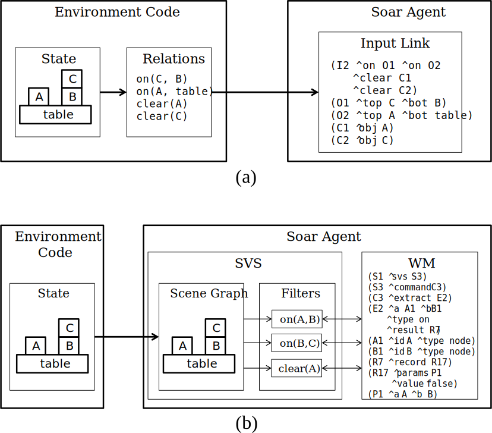
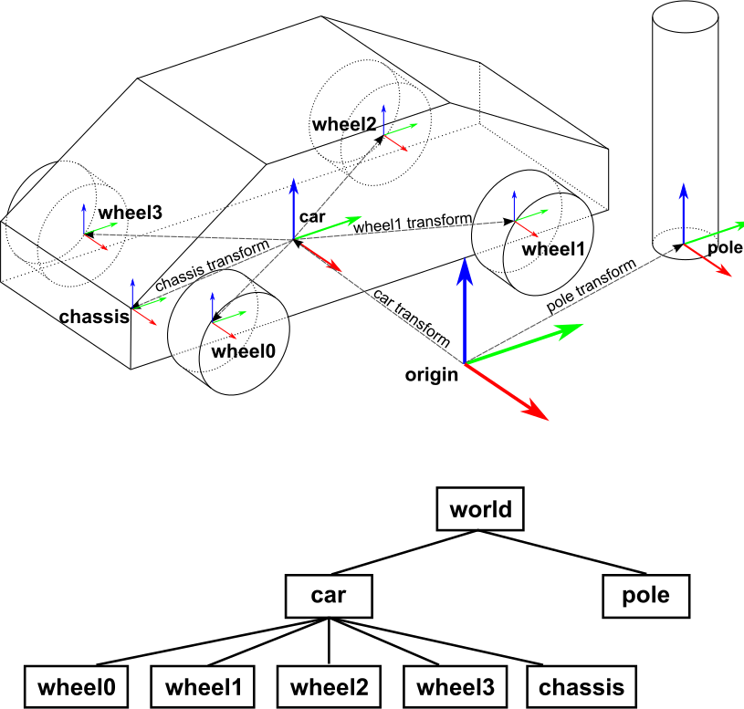

# Spatial Visual System


The Spatial Visual System (SVS) allows Soar to effectively represent and reason
about continuous, three dimensional environments. SVS maintains an internal
representation of the environment as a collection of discrete objects with
simple geometric shapes, called the scene graph. The Soar agent can query for
spatial relationships between the objects in the scene graph through a working
memory interface similar to that of episodic and semantic memory.  Figure 8.1
illustrates the typical use case for SVS by contrasting it with an agent that
does not utilize it. The agent that does not use SVS (a. in the figure) relies
on the environment to provide a symbolic representation of the continuous state.
On the other hand, the agent that uses SVS (b) accepts a continuous
representation of the environment state directly, and then performs queries on
the scene graph to extract a symbolic representation internally. This allows the
agent to build more flexible symbolic representations without requiring
modifications to the environment code. Furthermore, it allows the agent to
manipulate internal copies of the scene graph and then extract spatial
relationships from the modified states, which is useful for look-ahead search
and action modeling. This type of imagery operation naturally captures and
propagates the relationships implicit in spatial environments, and doesn’t
suffer from the frame problem that relational representations have.



## The scene graph

The primary data structure of SVS is the scene graph. The scene graph is a tree
in which the nodes represent objects in the scene and the edges represent
"part-of" relationships between objects. An example scene graph consisting of a
car and a pole is shown in Figure 8.2. The scene graph’s leaves are **geometry
nodes** and its interior nodes are **group nodes**. Geometry nodes represent atomic
objects that have intrinsic shape, such as the wheels and chassis in the
example. Currently, the shapes supported by SVS are points, lines, convex
polyhedrons, and spheres. Group nodes represent objects that are the aggregates
of their child nodes, such as the car object in the example. The shape of a
group node is the union of the shapes of its children. Structuring complex
objects in this way allows Soar to reason about them naturally at different
levels of abstraction. The agent can query SVS for relationships between the car
as a whole with other objects (e.g. does it intersect the pole?), or the
relationships between its parts (e.g. are the wheels pointing left or right with
respect to the chassis?). The scene graph always contains at least a root node:
the **world node**.

Each node other than the world node has a transform with respect to its parent.
A transform consists of three components:

- position(x,y,z) Specifies the x, y, and z offsets of the node’s origin with
  respect to its parent’s origin.
- rotation(x,y,z) Specifies the rotation of the node relative to its origin in
  Euler angles.  This means that the node is rotated the specified number of
  radians along each axis in the order x-y-z. For more information,
  see <http://en.wikipedia.org/wiki/Euler_angles>.
- scaling(x,y,z) Specifies the factors by which the node is scaled along each axis.

The component transforms are applied in the order scaling, then rotation, then
position.  Each node’s transform is applied with respect to its parent’s
coordinate system, so the transforms accumulate down the tree. A node’s
transform with respect to the world node, or its world transform, is the
aggregate of all its ancestor transforms. For example, if the car has a position
transform of (1, 0 ,0) and a wheel on the car has a position transform of (0, 1
,0), then the world position transform of the wheel is (1, 1 ,0).

SVS represents the scene graph structure in working memory under the^spatial-scene
link. The working memory representation of the car and pole scene graph is



```Soar
(S1 ^svs S3)
  (S3 ^command C3 ^spatial-scene S4)
    (S4 ^child C10 ^child C4 ^id world)
      (C10 ^id pole)
      (C4 ^child C9 ^child C8 ^child C7 ^child C6 ^child C5 ^id car)
        (C9 ^id chassis)
        (C8 ^id wheel3)
        (C7 ^id wheel2)
        (C6 ^id wheel1)
        (C5 ^id wheel0)
```

Each state in working memory has its own scene graph. When a new state is
created, it will receive an independent copy of its parent’s scene graph. This
is useful for performing look-ahead search, as it allows the agent to
destructively modify the scene graph in a search state using mental imagery
operations.


### svs_viewer

A viewer has been provided to show the scene graph visually. Run the
program svs viewer -s PORTfrom the soar/out folder to launch the viewer listening
on the given port. Once the viewer is running, from within soar use the
command svs connect viewer PORTto connect to the viewer and begin drawing the
scene graph. Any changes to the scene graph will be reflected in the viewer. The
viewer by default draws the top state scene graph, to draw that on a substate
first stop drawing the top state with svs S1.scene.draw off and then svs
S7.scene.draw on.

## Scene Graph Edit Language

The **Scene Graph Edit Language** (SGEL) is a simple, plain text, line oriented
language that is used by SVS to modify the contents of the scene graph.
Typically, the scene graph is used to represent the state of the external
environment, and the programmer sends SGEL commands reflecting changes in the
environment to SVS via the `Agent::SendSVSInput` function in the SML API. These
commands are buffered by the agent and processed at the beginning of each input
phase. Therefore, it is common to send scene changes through
SendSVS Input before the input phase. If you send SGEL commands at the end of the
input phase, the results won’t be processed until the following decision cycle.

Each SGEL command begins with a single word command type and ends with a newline.
The four command types are

- **add ID PARENT_ID [GEOMETRY] [TRANSFORM]**
  Add a node to the scene graph with the givenID, as a child ofPARENTID, and with
  typeTYPE(usually object).TheGEOMETRYandTRANSFORMarguments are optional and
  described below.

- **change ID [GEOMETRY] [TRANSFORM]** 
  Change the transform and/or geometry of the node with the givenID.

- **delete ID**
  Delete the node with the givenID.

- **tag [add|change|delete] ID TAG_NAME TAG_VALUE**
  Adds, changes, or deletes a tag from an object. A tag consists of a TAG_NAME and
  TAG_VALUE pair and is added to the node with the given ID. Both TAG_NAMEand
  TAG_VALUE must be strings. Tags can differentiate nodes (e.g. as a type field) and
  can be used in conjunction with the tag select filter to choose a subset of the nodes.

The `TRANSFORM` argument has the `form[p X Y Z] [r X Y Z] [s X Y Z]`, corresponding to
the position, rotation, and scaling components of the transform, respectively.
All the components are optional; any combination of them can be excluded, and
the included components can appear in any order.

The `GEOMETRY` argument has two forms:

- **b RADIUS**
  Make the node a geometry node with sphere shape with radius RADIUS.

- **v X1 Y1 Z1 X2 Y2 Z2**
  Make the node a geometry node with a convex polyhedron shape with the specified
  vertices. Any number of vertices can be listed.

### Examples

Creating a sphere called ball4 with radius 5 at location (4, 4, 0).
add ball4 world b 5 p 4 4 0

Creating a triangle in the xy plane, then rotate it vertically, double its size,
and move it to (1, 1, 1).

```
add tri9 world v -1 -1 0 1 -1 0 0 0.5 0 p 1 1 1 r 1.507 0 0 s 2 2 2
```

Creating a snowman shape of 3 spheres stacked on each other and located at (2, 2, 0).

```
add snowman world p 2 2 0
add bottomball snowman b 3 p 0 0 3
add middleball snowman b 2 p 0 0 8
add topball snowman b 1 p 0 0 11
```

Set the rotation transform on box11 to 180 degrees around the z axis.

```
change box11 r 0 0 3.14159
```

Changing the color tag on box7 to green.

```
tag change box7 color green
```

## Commands

The Soar agent initiates commands in SVS via the **^command** link, similar to semantic
and episodic memory. These commands allow the agent to modify the scene graph and
extract filters. Commands are processed during the output phase and the results are added
to working memory during the input phase. SVS supports the following commands:

- `add_node` Creates a new node and adds it to the scene graph
- `copy_node` Creates a copy of an existing node
- `delete_node` Removes a node from the scene graph and deletes it
- `set_transform` Changes the position, rotation, and/or scale of a node
- `set_tag` Adds or changes a tag on a node
- `delete_tag` Deletes a tag from a node
- `extract` Compute the truth value of spatial relationships in the current scene graph.
- `extract_once` Same as extract, except it is only computed once and doesn’t update when the scene changes.

### add_node

This commands adds a new node to the scene graph.

- `^id [string]` The id of the node to create
- `^parent [string]` The id of the node to attach the new node to (default is world)
- `^geometry << group point ball box >>` The geometry the node should have
- `^position.{ ^x ^y ^z }` Position of the node (optional)
- `^rotation.{ ^x ^y ^z }` Rotation of the node (optional)
- `^scale.{ ^x ^y ^z }` Scale of the node (optional)

The following example creates a node called box 5 and adds it to the world. The
node has a box shape of side length 0.1 and is placed at position (1, 1, 0).

```Soar
(S1 ^svs S3)
  (S3 ^command C3 ^spatial-scene S4)
    (C3 ^add_node A1)
      (A1 ^id box5 ^parent world ^geometry box ^position P1 ^scale S6)
        (P1 ^x 1.0 ^y 1.0 ^z 0.0)
        (S6 ^x 0.1 ^y 0.1 ^z 0.1)
```

### copy_node

This command creates a copy of an existing node and adds it to the scene graph.
This copy is not recursive, it only copies the node itself, not its children.
The position, rotation, and scale transforms are also copied from the source node
but they can be changed if desired.

- **^id [string]** The id of the node to create
- **^source [string]** The id of the node to copy
- **^parent [string]** The id of the node to attach the new node to (default is world)
- **^position.{^x ^y ^z}** Position of the node (optional)
- **^rotation.{^x ^y ^z}** Rotation of the node (optional)
- **^scale.{^x ^y ^z}** Scale of the node (optional)

The following example copies a node called box5 as new node box6 and moves it to
position (2, 0, 2).

```Soar
(S1 ^svs S3)
  (S3 ^command C3 ^spatial-scene S4)
    (C3 ^copy_node A1)
      (A1 ^id box6 ^source box5 ^position P1)
        (P1 ^x 2.0 ^y 0.0 ^z 2.0)
```

### delete_node

This command deletes a node from the scene graph. Any children will also
be deleted.


- **`^id [string]** The id of the node to delete

The following example deletes a node called

```Soar
(S1 ^svs S3)
  (S3 ^command C3 ^spatial-scene S4)
    (C3 ^delete_node D1)
      (D1 ^id box5)
```

### set_transform

This command allows you to change the position, rotation, and/ or scale
of an existing node. You can specify any combination of the three
transforms.

- **`^id [string]`** The id of the node to change
- **`^postion`** Position of the node (optional)
- **`^position.{^x ^y ^z}`** Rotation of the node (optional)
- **`^scale{^x ^y ^z}`** Scale of the node (optional)

The following example moves and rotates a node called `box5`.

```Soar
(S1 ^svs S3)
  (S3 ^command C3 ^spatial-scene S4)
    (C3 ^set_transform S6)
      (S6 ^id box5 ^position P1 ^rotation R1)
        (P1 ^x 2.0 ^y 2.0 ^z 0.0)
        (R1 ^x 0.0 ^y 0.0 ^z 1.57)
```

### set_tag

This command allows you to add or change a tag on a node. If a tag with
the same id already exists, the existing value will be replaced with the
new value.

- **`^id [string]`** The id of the node to set the tag on
- **`^tag_name [string]`** The name of the tag to add
- **`^tag_value [string]`** The value of the tag to add

The following example adds a shape tag to the node `box5`.

```Soar
(S1 ^svs S3)
  (S3 ^command C3 ^spatial-scene S4)
    (C3 ^set_tag S6)
      (S6 ^id box5 ^tag_name shape ^tag_value cube)
```

### delete_tag

This command allows you to delete a tag from a node.

- **^id [string]** The id of the node to set the tag on
- **^tag_name [string]** The name of the tag to add
- **^tag_value [string]** The value of the tag to add

The following example deletes the shape tag from the node .

```Soar
(S1 ^svs S3)
  (S3 ^command C3 ^spatial-scene S4)
    (C3 ^delete_tag D1)
      (D1 ^name box5 ^tag_name shape)
```

### extract and extract_once

This command is commonly used to compute spatial relationships in the scene
graph. More generally, it puts the **result** of a filter pipeline (described in
section [svs-filters](#filters) in working memory. Its syntax is the same as
filter pipeline syntax. During the input phase, SVS will evaluate the filter and
put a `^result` attribute on the command’s identifier.  Under the `^result`
attribute is a multi-valued `^record` attribute. Each record corresponds to an
output value from the head of the filter pipeline, along with the parameters
that produced the value. With the regular `extract` command, these records will be updated
as the scene graph changes. With the `extract_once` command, the records will be created once
and will not change. Note that you should not change the structure of a filter
once it is created (SVS only processes a command once). Instead to extract
something different you must create a new command. The following is an example
of an extract command which tests whether the car and pole objects are
intersecting.  The `^status` and `^result` WMEs are added by SVS when the command is finished.

```Soar
(S1 ^svs S3)
  (S3 ^command C3 ^spatial-scene S4)
    (C3 ^extract E2)
      (E2 ^a A1 ^b B1 ^result R7 ^status success ^type intersect)
        (A1 ^id car ^status success ^type node)
        (B1 ^id pole ^status success ^type node)
        (R7 ^record R17)
          (R17 ^params P1 ^value false)
            (P1 ^a car ^b pole)
```

## Filters

**Filters** are the basic unit of computation in SVS. They transform the
continuous information in the scene graph into symbolic information that
can be used by the rest of Soar. Each filter accepts a number of labeled
parameters as input, and produces a single output. Filters can be
arranged into pipelines in which the outputs of some filters are fed
into the inputs of other filters. The Soar agent creates filter
pipelines by building an analogous structure in working memory as an
argument to an "extract" command. For example, the following structure
defines a set of filters that reports whether the car intersects the
pole:
```Soar
(S1 ^svs S3)
  (S3 ^command C3 ^spatial-scene S4)
    (C3 ^extract E2)
      (E2 ^a A1 ^b B1 ^type intersect)
        (A1 ^id car ^type node)
        (B1 ^id pole ^type node)
```

The `^type` attribute specifies the type of filter to instantiate, and the other
attributes specify parameters. This command will create three filters: an
`intersect` filter and two node filters. A **node** filter takes an `id`
parameter and returns the scene graph node with that ID as its result. Here, the
outputs of the `car` and `pole` node filters are fed into the `^a` and `^b`
parameters of the filter. SVS will update each filter’s output once every
decision cycle, at the end of the input phase. The output of the intersect
filter is a boolean value indicating whether the two objects are intersecting.
This is placed into working memory as the result of the extract command:

```Soar
(S1 ^svs S3)
  (S3 ^command C3 ^spatial-scene S4)
    (C3 ^extract E2)
      (E2 ^a A1 ^b B1 ^result R7 ^status success ^type intersect)
        (A1 ^id car ^status success ^type node)
        (B1 ^id pole ^status success ^type node)
        (R7 ^record R17)
          (R17 ^params P1 ^value false)
            (P1 ^a car ^b pole)
```

Notice that a `^status` success is placed on each identifier corresponding to a
filter. A result WME is placed on the extract command with a single record with
value **false**.

### Result lists

Spatial queries often involve a large number of objects. For example,
the agent may want to compute whether an object intersects any others in
the scene graph. It would be inconvenient to build the extract command
to process this query if the agent had to specify each object involved
explicitly. Too many WMEs would be required, which would slow down the
production matcher as well as SVS because it must spend more time
interpreting the command structure. To handle these cases, all filter
parameters and results can be lists of values. For example, the query
for whether one object intersects all others can be expressed as

```Soar
(S1 ^svs S3)
  (S3 ^command C3)
    (C3 ^extract E2)
      (E2 ^a A1 ^b B1 ^result R7 ^status success ^type intersect)
        (A1 ^id car ^status success ^type node)
        (B1 ^status success ^type all_nodes)
        (R7 ^record R9 ^record R8)
          (R9 ^params P2 ^value false)
            (P2 ^a car ^b pole)
          (R8 ^params P1 ^value true)
            (P1 ^a car ^b car)
```

The all_nodes filter outputs a list of all nodes in the scene graph, and the
intersect filter outputs a list of boolean values indicating whether the car
intersects each node, represented by the multi-valued attribute **record**. Notice
that each record contains both the result of the query as well as the
parameters that produced that result. Not only is this approach more
convenient than creating a separate command for each pair of nodes, but
it also allows the intersect filter to answer the query more efficiently using
special algorithms that can quickly rule out non-intersecting objects.

### Filter List

The following is a list of all filters that are included in SVS. You can also
get this list by using the cli command `svs filters` and get information about a
specific filter using the command `svs filters.FILTER_NAME`. Many filters have a
`_select` version. The select version returns a subset of the input nodes which
pass a test.  For example, the intersect filter returns boolean values for each
input (a, b) pair, while the intersect_select filter returns the nodes in set b
which intersect the input node a. This is useful for passing the results of one
filter into another (e.g.  take the nodes that intersect node a and find the
largest of them).

- **Node**: Given an `^id`, outputs the node with that id.
- **all_nodes**: Outputs all the nodes in the scene
- **combine_nodes**: Given multiple node inputs as `^a`, concatenates them into a single output set.
- **remove_nodes**: Removes node `^a` from the input set and outputs the rest.
- **node_position**: Outputs the position of each node in input `^a`.
- **node_rotation**: Outputs the rotation of each node in input `^a`.
- **node_scale**: Outputs the scale of each node in input `^a`.
- **node_bbox**: Outputs the bounding box of each node in input `^a`.
- **distance and distance_select**: 
  Outputs the distance between input nodes `^a` and `^b` Distance can be specified
  by `^distance_type << centroid hull >>`, where is the euclidean distance between the centers, and the hull is the
  minimum distance between the node surfaces. `distance_select` chooses nodes in set b in
  which the distance to node a falls within the range `^min`and `^max`.
- **closest and farthest**
  Outputs the node in set `^b` closest to or farthest from `^a` (also uses `distance_type`).
- **axis_distance and axis_distance_select**
  Outputs the distance from input node `^a` to `^b` along a particular axis
  (`^axis << x y z >>`). This
  distance is based on bounding boxes. A value of 0 indicates the nodes
  overlap on the given axis, otherwise the result is a signed value
  indicating whether node b is greater or less than node a on the given
  axis. The `axis_distance_select` filter also uses `^min` and `^max` to select nodes in set b.
- **volume and volume_select**
  Outputs the bounding box volume of each node in set `^a`. For volume_select,
  it outputs a subset of the nodes whose volumes fall within the range `^min`
  and `^max`.
- **largest and smallest**
  Outputs the node in set `^a`} with the largest or smallest volume.
- **larger and larger_select**
  Outputs whether input node `^a` is larger than each input node `^b`, or selects all nodes in b for which a is larger.
- **smaller and smaller_select**
  Outputs whether input node `^a` is smaller than each input node `^b`, or
  selects all nodes in b for which a is smaller.
- **contain and contain_select**
  Outputs whether the bounding box of each input node `^a` contains the bounding
  box of each input node `^b`, or selects those nodes in b which are contained
  by node a.
- **intersect and intersect_select**
  Outputs whether each input node `^a` intersects each input node `^b`, or
  selects those nodes in b which intersect node a. Intersection is specified by
  `^intersect_type << hull box >>`; either the convex hull of the node or
  the axis-aligned bounding box.
- **tag_select**
  Outputs all the nodes in input set `^a` which have the tag specified by
  `^tag_name` and `^tag_value`.

### Examples

Select all the objects with a volume between 1 and 2.

```Soar
(S1 ^svs S3)
  (S3 ^command C3)
    (C3 ^extract E1)
      (E1 ^type volume_select ^a A1 ^min 1 ^max 2)
        (A1 ^type all_nodes)
```

Find the distance between the centroid of ball3 and all other objects.

```Soar
(S1 ^svs S3)
(S3 ^command C3)
    (C3 ^extract E1)
      (E1 ^type distance ^a A1 ^b B1 ^distance_type centroid)
        (A1 ^type node ^id ball3)
        (B1 ^type all_nodes)
```

Test where ball2 intersects any red objects.

```Soar
(S1 ^svs S3)
  (S3 ^command C3)
    (C3 ^extract E1)
      (E1 ^type intersect ^a A1 ^b B1 ^intersect_type hull)
        (A1 ^type node ^id ball2)
        (B1 ^type tag_select ^a A2 ^tag_name color ^tag_value red)
          (A2 ^type all_nodes)
```

Find all the objects on the table. This is done by selecting nodes where
the distance between them and the table along the z axis is a small
positive number.

```Soar
(S1 ^svs S3)
  (S3 ^command C3)
    (C3 ^extract E1)
      (E1 ^type axis_distance_select ^a A1 ^b B1 ^axis z ^min .0001 ^max .1)
        (A1 ^type node ^id table)
        (B1 ^type all_nodes)
```

Find the smallest object that intersects the table (excluding itself).

```Soar
(S1 ^svs S3)
  (S3 ^command C3)
    (C3 ^extract E1)
      (E1 ^type smallest ^a A1)
        (A1 ^type intersect_select ^a A2 ^b B2 ^intersect_type hull)
          (A2 ^type node ^id table)
          (B1 ^type remove_node ^id table ^a A3)
            (A3 ^type all_nodes)
```

## Writing new filters

SVS contains a small set of generally useful filters, but many users
will need additional specialized filters for their application. Writing
new filters for SVS is conceptually simple.

1.  Write a C++ class that inherits from the appropriate filter
    subclass.
1.  Register the new class in a global table of all filters ().
1.  Recompile the kernel.

### Filter subclasses

The fact that filter inputs and outputs are lists rather than single
values introduces some complexity to how filters are implemented.
Depending on the functionality of the filter, the multiple inputs into
multiple parameters must be combined in different ways, and sets of
inputs will map in different ways onto the output values. Furthermore,
the outputs of filters are cached so that the filter does not repeat
computations on sets of inputs that do not change. To shield the user
from this complexity, a set of generally useful filter paradigms were
implemented as subclasses of the basic `filter` class. When writing custom
filters, try to inherit from one of these classes instead of from `filter`
directly.

#### Map filter

This is the most straightforward and useful class of filters. A filter
of this class takes the Cartesian product of all input values in all
parameters, and performs the same computation on each combination,
generating one output. In other words, this class implements a
one-to-one mapping from input combinations to output values.

To write a new filter of this class, inherit from the `map_filter` class, and
define the `compute` function. Below is an example template:

```c++
class new_map_filter : public map_filter<double> // templated with output type
{
  public:
    new_map_filter(Symbol *root, soar_interface *si, filter_input *input, scene *scn)
    : map_filter<double>(root, si, input)   // call superclass constructor
    {}

    /* Compute
        Do the proper computation based on the input filter_params
        and set the out parameter to the result
        Return true if successful, false if an error occured */
    bool compute(const filter_params* p, double& out){
      sgnode* a;
      if(!get_filter_param(this, p, "a", a)){
        set_status("Need input node a");
        return false;
      }
      out = // Your computation here
    }
};
```

#### Select filter

This is very similar to a map filter, except for each input combination
from the Cartesian product the output is optional. This is useful for
selecting and returning a subset of the outputs.

To write a new filter of this class, inherit from the `select_filter` class, and define
the `compute` function. Below is an example template:

```c++
class new_select_filter : public select_filter<double> // templated with output type
{
  public:
    new_select_filter(Symbol *root, soar_interface *si, filter_input *input, scene *scn)
    : select_filter<double>(root, si, input)   // call superclass constructor
    {}

    /* Compute
        Do the proper computation based on the input filter_params
        and set the out parameter to the result (if desired)
        Also set the select bit to true if you want to the result to be output.
        Return true if successful, false if an error occurred */
    bool compute(const filter_params* p, double& out, bool& select){
      sgnode* a;
      if(!get_filter_param(this, p, "a", a)){
        set_status("Need input node a");
        return false;
      }
      out = // Your computation here
      select = // test for when to output the result of the computation
    }
};
```

#### Rank filter

A filter where a ranking is computed for each combination from the Cartesian
product of the input and only the combination which results in the highest (or
lowest) value is output. The default behavior is to select the highest, to
select the lowest you can call `set_select_highest(false)` on the filter.

To write a new filter of this class, inherit from the `rank_filter` class, and define
the `rank` function. Below is an example template:

```c++
class new_rank_filter : public rank_filter
{
  public:
    new_rank_filter(Symbol *root, soar_interface *si, filter_input *input, scene *scn)
    : rank_filter(root, si, input)   // call superclass constructor
    {}

    /* Compute
        Do the proper computation based on the input filter_params
        And set r to the ranking result.
        Return true if successful, false if an error occured */
    bool compute(const filter_params* p, double& r){
      sgnode* a;
      if(!get_filter_param(this, p, "a", a)){
        set_status("Need input node a");
        return false;
      }
      r = // Ranking computation
    }
};
```

### Generic Node Filters

There are also a set of generic filters specialized for computations
involving nodes. With these you only need to specify a predicate
function involving nodes. (Also see filters/base_node_filters.h ).

There are three types of these filters:

#### Node Test Filters

These filters involve a binary test between two nodes (e.g. intersection
or larger). You must specify a test function of the following form:

```c++
bool node_test(sgnode* a, sgnode* b, const filter_params* p)
```

For an example of how the following base filters are used, see filters/intersect.cpp.

- node_test_filter  
  For each input pair (a, b) this outputs the boolean result of .
- node_test_select_filter  
  For each input pair (a, b) this outputs node b if .  
  (Can choose to select b if the test is false by calling ).

#### Node Comparison Filters

These filters involve a numerical comparison between two nodes (e.g.
distance). You must specify a comparison function of the following form:

```
double node_comparison(sgnode* a, sgnode* b, const filter_params* p)
```

For an example of how the following base filters are used, see filters/distance.cpp.

- node_comparison_filter  
  For each input pair (a, b), outputs the numerical result of `node_comparison(a, b)`.
- node_comparison_select_filter  
  For each input pair (a, b), outputs node b if `min <= node_comparison(a, b) <=
  max`. Min and max can be set through calling `set_min(double)` and
  `set_max(double)`, or as specified by the user through the filter_params.
- node_comparison_rank_filter  
  This outputs the input pair (a, b) for which `node_comparison(a, b)` produces the highest value.
  To instead have the lowest value output call `set_select_highest(true)`.

#### Node Evaluation Filters

These filters involve a numerical evaluation of a single node (e.g.
volume). You must specify an evaluation function of the following form:

```
double node_evaluation(sgnode* a, const filter_params* p)
```

For an example of how the following base filters are used, see filters/volume.cpp.

- node_evaluation_filter  
  For each input node a, this outputs the numerical result of .
- node_evaluation_select_filter  
  or each input node a, this outputs the node if . Min and max can be set
  through calling and , or as specified by the user through the
  filter_params.
- node_evaluation_rank_filter  
  This outputs the input node a for which produces the highest value. To
  instead have the lowest value output call .

## Command line interface

The user can query and modify the runtime behavior of SVS using the `svs`
command. The syntax of this command differs from other Soar commands due to the
complexity and object-oriented nature of the SVS implementation.  The basic idea
is to allow the user to access each object in the SVS implementation (not to be
confused with objects in the scene graph) at runtime. Therefore, the command has
the form `svs PATH [ARGUMENTS]`, where `PATH` uniquely identifies an object or
the method of an object. `ARGUMENTS` is a space separated list of strings that
each object or function interprets in its own way. For example, `svs
S1.scene.world.car` identifies the car object in the scene graph of the top
state.  As another example, `svs connect_viewer 5999` calls the method to
connect to the SVS visualizer with 5999 being the TCP port to connect on. Every
path has two special arguments.

- `svs PATH dir` prints all the children of the object at `PATH`.
- `svs PATH help` prints text about how to use the object, if available.

See [SVS](#spatial-visual-system) for more details.