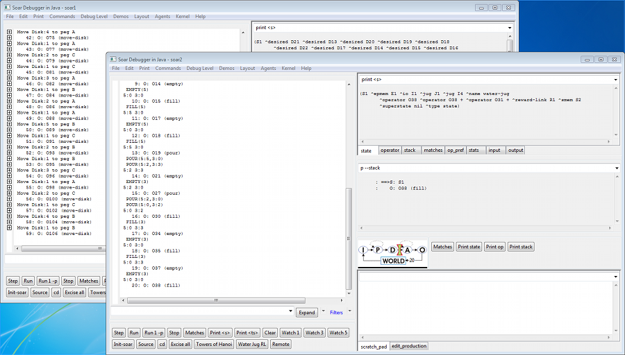
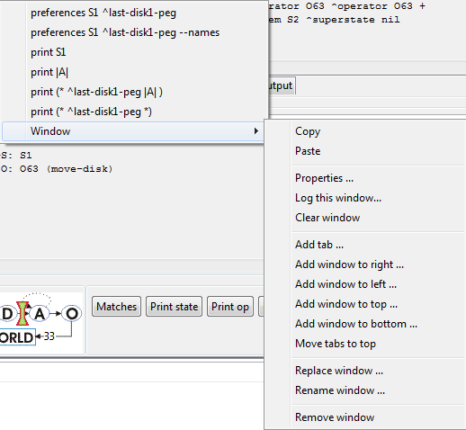

# Introduction to the Soar Debugger

## Overview

With Soar 8.6 we made a new method for interfacing into Soar based around SML
(Soar Markup Language). This interface allows tools to be built that have a higher
level understanding of the data being sent back and forth to the Soar kernel and
allows for more dynamic debugging sessions (connecting and disconnecting from an
existing kernel instance).

In order to take advantage of these features we needed a new debugger and we chose
to implement it in Java due to its cross-platform support and the relative ease of
working with the language.

## Quick Tour

On launch you should see a display similar to this:

The window on the left side is the main trace window. As Soar executes, debug
information is streamed to this window.

On the right are a series of other utility windows which we'll discuss later.

To get things going load the towers of Hanoi demo. This can be done by either
pressing the "towers of Hanoi" button or from the "Demos" menu. Then type `run 20`
into the line to the left of the Expand button.

You should be rewarded with a display like this:

This is hard to read but the trace window on the left shows the series of operators
that have just fired during the course of the first 20 decisions. You should also
have noticed that at the end of the run the windows on the right updated
automatically to print the current state and stack. In fact, they are just issuing
the command typed at the top of the window, so you can customize the window to print
any values you'd like to see at the end of a run. Because the windows only update
after the run completes there is no performance hit from these windows during a run.

The different tabbed windows at the top right of the display (state, operator, stack
etc.) show examples of some values you might find useful. In a real debugging session
you can use this simple mechanism to watch a particular part of working memory (e.g.
printing the input link) while you step forward.

The default layout that you started with uses a tree view for the main trace window.
To see this in action press the "watch 5" button and then type `run 20` again at the
command prompt.

This should result in a display like this:

The trace looks similar, but doing the obvious thing of expanding the tree nodes
will reveal the detailed trace information collected during the run:

You can also expand the current page of trace information using the "expand"
button or the drop down menu next to it. (Once the expand button has been pressed
future trace output will appear in the window already expanded until collapse is
pressed).

The window in the lower right is something of a scratch pad. Commands typed at
the top of this window (e.g. print s4) are printed below and just stay there. This
helps solve the problem of output "scrolling off the top" of the main trace window.

If you want to keep information in the main trace window from scrolling away during
a run (i.e. in the case where stopping Soar isn't an option), you can click in the
trace window. This puts a cursor in the trace window which "freezes" the trace at
that point; new trace information just gets appended to the bottom of the trace.
The cursor can be moved with the arrow keys and page up/page down. To continue
scrolling with the trace, put the cursor on the last line of the trace. The easiest
way to do this while Soar is still running is to press Ctrl-End.

## Agents

The debugger can be used with multiple agents. To see this, select "Agents |
Create Agent -- New Window" and you'll get a new top level window for agent "soar2".

If you load another demo here (e.g. "Water Jug Demo") and then type `run 20` you
will see both sets of windows updating as both agents run.

The relationship between a top level debugger window (a frame) and the agent is
pretty loose. For instance, we can switch the second window to observe the first
agent (Agent | Select Agent and choose "soar1"). This gives you two windows pointed
at the same agent. Probably not very useful, but it illustrates the point that the
debugger windows and the agent are separate entities.

The Agent menu also allows you to create a new agent without a new window or create
a new window without a new agent. You also should be aware that closing a debugger
window does not delete the agent. If you want to delete an agent you must do so
explicitly from the Agent menu.

There's also a checkbox for whether a new window is created when an agent is
created. This only matters when you're connected to another environment and that
environment is creating agents. The checkbox determines whether or not windows pop
open in the debugger as this happens.

## Kernels

When you launch the debugger it creates a new instance of the Soar kernel as part
of the debugger's process. We refer to this as a "local" kernel.

You can also connect the debugger to a "remote" kernel which is running inside
another process or even on another machine.

All Soar kernels (using the SML interface) support this sort of remote connection
automatically, so we can see an example of this by using two debuggers (with a little
care). To see this launch a second instance of the debugger so you have two running.
You'll need to keep track of which debugger was launched first.

On the debugger launched second choose "Kernel | Connect to remote Soar". You'll
get a warning that there's a local kernel running. Say "OK" to shut that down.
You'll see a dialog like this:

This allows you to enter an IP address (for a truly remote machine) or a different
port number (which requires a change to the kernel you are connecting to). For this
example and in almost all cases you'll want to leave these as the default settings.

Clicking ok connects this debugger to the remote kernel and selects an agent to
focus on. (You could use the Agent menu to select which agent if there were multiple
agents running in this kernel).

Now you can type commands into either debugger (e.g. type "run 10") and you'll see
both windows update.

Obviously, the idea isn't to connect two debuggers together, but to connect to
environments. This sort of connecting and disconnecting allows us to build
environments that run a local or embedded kernel (for maximum performance) and
then connect a debugger to them to see what they are doing.

There's nothing special about the way the debugger is doing this. All instances
of an SML kernel support this sort of remote connecting, so it's also possible (by
changing a single line of code) to build an environment that connects to a remote
debugger instance and so on. Also multiple tools (or clients) can connect to a single
kernel at the same time, allowing different types of debuggers to be connected to
an environment as necessary.

## Using the debugger with an environment

### Java Towers of Hanoi (TOH)

To walkthrough this demonstration, start by launching the
[Java version of Towers of Hanoi](../../downloads/examples_and_unsupported/towers_of_hanoi.md):

The simulation starts an embedded Soar kernel when it's launched. You can run
the environment by pressing "run"/"stop" as you'd expect.

To debug what's happening launch the debugger and then choose Kernel | Connect
to remote Soar and say "OK" to the two dialogs (keep the defaults for the IP/port
values).

You should now see the name of the agent (in the title bar of the debugger) change
to "remote TOH" like this:

At this point pressing run in the environment will generate trace output in the
debugger. (The agent starts at watch 0 in this simulation so you just see `write`
statements from productions).

Pressing "stop" in the environment again stops the run. So far this is simple enough.

## Controlling an environment from the debugger

Another option is controlling the environment from the debugger.

### "run" and "stop-soar"

To run the environment, type `run 10` in the debugger or `run` and then press
"stop" in either the debugger or the environment. You can run Soar in any step
size and the environment should update correctly, e.g. you can use `run 1 --p`
to run by phases and the environment will only update once the agent passes
through its output phase.

## Running the agent without the environment

With a suitably designed environment it is possible for the user to type `run --self`
in the debugger to indicate that we wish to only run the agent and not the
environment. They can also force the environment to update in this situation
`run --self --update`. These values are passed to the environment when it is run
and it is up to the environment to interpret them appropriately.

Running without updating the environment makes little sense in towers of Hanoi anyway
and once these commands function as intended you would just get a series of state
no changes here. But for other environments this would be a useful capability.

## `init-soar`

You can also type `init-soar` in the debugger which will reset the agent to its
initial state (as usual) but also transmits the current state of the simulation over
the input link, so that the agent can potentially pick up and continue to reason.

(As of the writing of this document this doesn't work for towers-of-hanoi, but this
is just a reflection of the way the agent has been written, rather than a limitation
of the system. For large environments the ability to restart the agent without having
to restart a simulation can save a lot of time when debugging.)

## Connecting and Disconnecting

It is also possible to start the environment running before connecting to it with
the debugger and then making a connection. The trace information will pick it in
mid-stride.

Similarly it is possible to start the environment or agent running from the debugger
and then disconnect from it.

These capabilities open the door to "dropping-in" on agents in a large environment,
stopping the agent, figuring out what's going wrong, possibly make adjustments and
then restarting it.

In all cases, the standard model is for the agent to run embedded within the
environment, ensuring maximum performance when the debugger is not connected and
still excellent performance even if the debugger is connected, as long as the agent
is not generating much trace output. This is the reverse of the relationship with
the 8.5 TSI debugger, where the environment was always external to the kernel, so
even when set to watch 0 all I/O traffic would pass over a socket making performance
significantly slower.

It's worth pointing out that if for a particular situation the debug information
will dominate the I/O traffic, it's also possible to change a single line of code
in the environment and have it establish a remote connection to a kernel running
inside the debugger (thus recreating the 8.5 relationship between debugger and simulation).

## Customizing the Debugger

### Layouts

A particular arrangement of windows within the debugger is referred to as a layout.
The Layout menu allows you to select from two basic window layouts based around a
text trace window or a tree trace window.

You can also create your own preferred window layout. To start this process, right
click on a window in the debugger. The context menu will either look like this:

Or it will offer this menu as a "Window" pop out on the context menu like this:

This window menu allows you to customize the collection of windows by adding,
removing or replacing windows. The types of windows you can add is based on the list
of modules loaded into the debugger and should grow in time. Right now there are
just five:

Creating a new layout can take a while as we don't yet have a "Move Window" option.
This is something to be added in the future. Once you've created a new layout it
will be saved automatically as your layout for the future (technically it's the
layout of the last frame window closed if you're using multiple agent windows).

You can also share window layouts that you find useful by saving the layout file
(a DLF file) or loading other layout files. This is offered through both the File
menu and the Layout menu.

These DLF files are pretty simple XML files, so it's sometimes easier to adjust
the layout by just editing this file directly (e.g. to move windows around in the
display).

### Properties

The window right-click menu from above includes a "Properties..." item which
allows you to bring up a dialog and adjust certain properties for a particular window.

For instance, right clicking and choosing "Properties" for one of the
automatically updating windows (top right in the default layout) brings up these
properties:

By adjusting these properties you can allow the results to collect in the window
rather than being cleared each time a command is executed or you can have a window
that updates every 10th decision during a run rather than just at the end of a run.

## Known Limitations

Also the modules we've so far implemented are all fairly basic -- with simple
text entry of commands and text displays of the output.

The great saving grace of this debugger is that if you know Java and want to spend
a little time, you can write your own module to add to the framework and build the
debugger you wished you had. If you find yourself wanting to do this, please drop
us a line (<soar-sml-list@umich.edu>) before you start coding and we'll help you
along and hopefully share in the results.

If you run Soar from within the debugger for long periods of time (i.e. tens of
thousands of decision cycles), you may notice that memory usage grows over time.
In fact, eventually, Soar will start running very slowly and then not at all. This
is because the Java virtual machine is running out of heap memory. The increasing
memory usage is actually because of a very old Soar kernel bug. As a workaround,
you can tell Java to allow more memory to be used by using the `--Xmx` command line
switch for Java. For example, to tell Java to use up to 256 megabytes for the heap,
you would do this:

    java.exe --Xmx256m --jar SoarJavaDebugger.jar

On Windows you can use javaw.exe if you prefer. This and other `--X` options are
non-standard and may not exist on non-Sun JVMs. Also, note that the default value
is only `64m` (64 megabytes).

## Design Principles

The central design principles for the Soar debugger in Java are:

### 1. Plug-in architecture

Each window within the debugger is designed as a separate module, with control
over its own user interface and its own methods for accepting commands from a user,
submitting those to Soar and receiving the results. The intention is that the list
of modules will grow over time and that the user community will (in time) be able
to develop and submit their own modules, extending the capability of the debugger
in ways they deem important.

For example, if you were working on learning you might find a module that displays
a tree of information showing all of the working memory elements that were tested
in creating a chunk very helpful. By creating this as a module within the debugger
you would be provided with substantial support (e.g. methods for sending commands
to Soar and listening to events Soar generates&mdash;such as notification when a
new chunk was formed) and the new module could then be shared with all other
developers increasing the overall power of the debugger.

### 2. User configurable

There's a basic tension in designing a debugger for a diverse user community (such
as the Soar community) in that many users have very different needs from a debugger.
When a new feature is added some rejoice at the new capability and others curse at
the performance hit or the loss of screen real estate to a feature they don't care
about. To alleviate this problem this debugger has been designed from the start to
be highly configurable. Windows can be added or removed at will from the display
and the behavior of individual windows can be adjusted through properties.

This allows us as a community to build the new modules (described just above)
without concern for whether they are of universal appeal as each user is free to
include a given module (window) in their debugger or not as they please.

## Performance Comparison

A key concern with any debugger is how fast is it? In the initial release of the
debugger we're offering two main forms of "trace" window---one based around a
simple text display and the other based around a structured tree display. We
compared the performance of these two different forms of window to the performance
of the TSI debugger included with 8.5.2 on the towers of Hanoi task.

Method is to maximize each window then use `time {run x}` in TSI or `time run x`
in Java Debugger to time each run. Obviously, times could vary from run to run,
but in practice the variance is usually small. Maximizing the windows ensures
that scrolling effort is similar.

These are the timing results:

|  | TSI (8.5.2) | Java Debugger (Tree View) | Java Debugger (Text View) |
| --- | --- | --- | --- |
| Watch 0 (run to completion) | 15.51s | 7.828s | 8.047s |
| Watch 1 (run 100 dc) | 1.25s | 0.75s | 0.734s |
| Watch 5 (run 100 dc) | 59.68s | 1.51s (0.579 with full filtering) | 2.141s |

Watch 0 of TOH still generates output (write commands in productions).

So the conclusions are that the Tree and Text view in the Java debugger run at
about the same speed. The tree view can actually run a bit faster on a high watch
trace because it's not displaying all of the text at the moment it is created.
(The base watch 5 times assume the trace is displayed as a collapsed tree with
the full-filtering value showing the performance if the user initially filters
out all of the display -- filtering will be explained more later on). Also,
running at watch 5 is no longer vastly slower than running at watch 1 (for this
Towers of Hanoi task).

The other observation is that the new debugger is substantially faster than the
previous version (sometimes order of magnitude faster), especially when tracing at
high watch levels. (The reason we can go faster even while doing more work is that
we have optimized the path for generating trace output).

## Related

-   [Command line options](../reference/CommandLineOptionsForDebuggerAndCLI.md)
-   [Tutorial 1](../tutorials/soar_tutorial/01.md)
