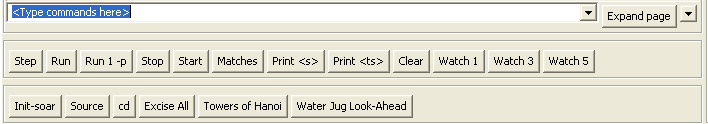
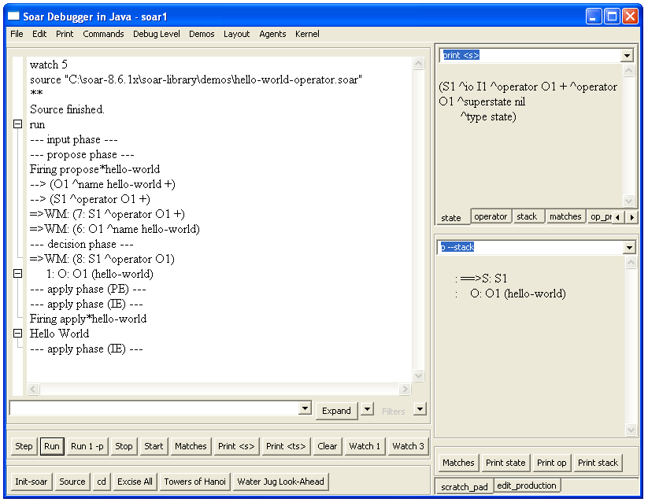
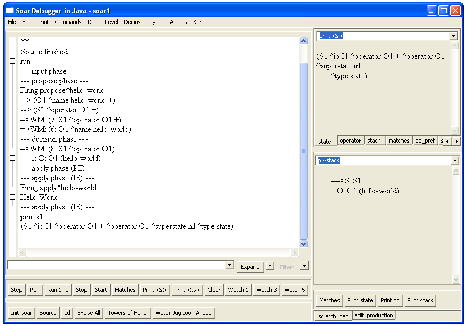
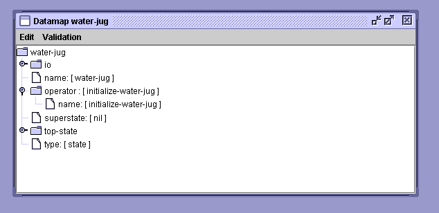
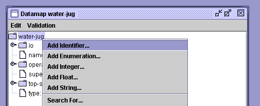

# Part I: Simple Soar Programs

Throughout this tutorial, you will be writing and running Soar programs
for simple tasks. In this part, you will be writing simple programs that
do not use Soar subgoaling or chunking mechanisms.

## Installing Soar

Before reading further in the tutorial, you should install Soar and its
associated software on your computer so that you can run the examples
and exercises. Using your favorite browser, visit the Soar tutorial
downloads page which you can find off the following link:
<https://soar.eecs.umich.edu/articles/downloads/soar-suite>. Follow the
directions on that page for installation. This will allow you to install
three downloads that include with the most recent release of Soar, the
Soar Debugger, the Eaters game, the TankSoar game, and VisualSoar.

## Building a Simple Soar Agent Using Rules

All of the knowledge in a Soar agent is represented as if-then _rules_.
In Soar, rules are called _productions,_ and we will use the terms
interchangeably. Rules are used to select and apply things called
_operators,_ and much of this tutorial will be describing how rules and
operators fit together. But before we get to operators, we are going to
learn about writing rules for a very simple agent – one that just prints
“Hello World.” Before we dive into rules, you will need to start up Soar
so that we can run the programs you write.

### Creating a Soar Agent and Using the Soar Debugger

To start Soar, double click (or whatever is appropriate on your
platform) on the Soar Debugger script in the folder where you installed
Soar. After Soar has started, you will have a new window on your screen.
This window is the Soar Debugger, which is shown below. This program
will be used to run all of your Soar programs. Your version may look
somewhat different, depending on the features added since this document
was written.


The large window to the left is called the Interaction window (above).
During Soar execution, all debugging information and print statements
will be displayed in the Interaction window. Just below the interaction
window is the Command Box for typing in user commands. The windows on
the right display information that you will find useful later.

When the Soar Debugger starts, a default agent entitled ‘soar1’ is
created. The name of the agent can be seen on the title bar. The bottom
of the window contains buttons for single stepping, running, or stopping
an agent. When it is time to run your Soar programs, commands can either
be entered by typing them into the command box, or by clicking the
buttons



### Hello-World Rule: English

The first Soar agent we will examine prints “Hello World”. In general,
an operator should perform this type of activity, but in order to ease
you slowly into Soar, we start with a single rule. Below is a simple
rule written in English.

```Soar
hello-world:
If I exist, then write “Hello World” and halt.
```

Soar cannot directly interpret English, so you must write rules in
Soar’s very stylized and precise language. A major component of the
rest of this tutorial is teaching you that language.

Soar works by testing the ”if” parts of rules (“If I exist”). These ”if”
parts are called _conditions_. If all of the conditions of a rule are
true in the current situation, the ”then” parts, or _actions,_ of the
rule (“write ‘Hello World’ and halt”) are executed, which usually
involves making changes to _working memory,_ which holds all of the
dynamic data structures in a Soar program. Executing the actions of a
rule is called _firing_ the rule. To determine if the conditions are
true, Soar compares them to data structures in working memory. Working
memory defines the current situation, which for an agent consists of its
perception of its world, results of intermediate calculations, active
goals, and operators.

The figure below shows a high level view of Soar. On the right are all
of the underlying architectural processes that select operators, create
states, learn new rules, etc. These are all written in C and you will
not be changing them at all (so don’t worry if you don’t know C). In the
upper center is the rule memory, which contains all of the rules. Rules
encode the long-term knowledge in Soar and adding them is the way Soar
is programmed – you do not change the way Soar creates states or learns,
but you create rules. Working memory is where short-term information is
stored and your rules will create and test structures in working memory.
In contrast to C or Java, which have programs that are executed
sequentially, Soar has rules that are matched and executed in parallel.
C and Java have data structures, variables, etc. while Soar has working
memory. While these other languages have a combination of local and
global data, Soar has no local data – everything in working memory is
global. Working memory consists of a graph structure of individual
_elements_. The elements are created by rules as well as from sensors
(not shown in the diagram), and the Soar architecture creates a limited
set of working memory elements (the core part of states) automatically.
Working memory is matched against rule memory to determine which rules
will fire. When rules fire, they can make changes to working memory, as
well as performing simple actions such as printing messages in the
interaction window.

### Loading and Running Hello-World

Before going through the nitty-gritty of Soar syntax, let’s see an
example of Soar executing the hello-world rule. In order to execute the
hello-world rule, it must be loaded from a file into Soar’s rule memory.
You can load in the rules from a file via the Interaction window by
either clicking the “source” button or by using the File menu at the top
left (you can also type the source command directly into the interaction
window, but for that you need to know the path to the file).

To use the File menu, click on the toolbar as shown in the figure below.


The following menu will pop up; select Load source file…


Alternatively, click on the “source” button at the bottom of the
interaction window. In both cases, a menu to select the file will pop
up, such as below (your menu might have a different set of files
available). You can navigate in this menu to get to the correct
directory (`<soardir>/Agents/`) and then select the file you want to
load (hello-world-rule.soar).


When rules are loaded into Soar, an “\*” is printed for each rule. When
the file has loaded, you will see the word “source” followed by the
location of the file in the interaction window,

At this point you can type run, or click on the run button in the bottom
left of the interaction window. The first thing that happens is that
Soar automatically creates the initial state, S1 (but this is not shown
in the interaction window, but is shown in the window on the right where
the state S1 is printed). All of working memory is organized as states,
so even before any rules fire, a state is created. After the state is
created the rule matches (details explained later) and it fires,
performing its actions, printing “Hello World” and then halting.


## Hello-World Rule: Soar

As stated earlier, Soar has a stylized and precise language for writing
rules. Here is the Soar rule for hello-world.

```Soar
sp {hello-world
(state <s> ^type state)
-->
(write |Hello World|)
(halt)}
```

Every rule starts with the symbol “sp”, which stands for “Soar
production.” The remainder of the rule body is enclosed in curly braces:
“{“ and “}”. The body consists of the rule name, followed by one or more
conditions (the “if” part), then the symbol “-->“, and then one or more
actions (the “then” part). Below is a template for rules:

```Soar
sp {rule\*name
(condition)
(condition)

…
-->
(action)
(action)

…}
```

The name of the rule can be any arbitrary combination of letters,
numbers, dashes (“-“), and asterisks (“\*”). The one exception is that a
name cannot be a single letter followed by a number such as S1 or O45.
Soar reserves those names for its own purposes. The specific name is
irrelevant to the operation of the rule, but you should always pick a
name that is meaningful. Following the name, there must be at least one
condition. A condition tests for the existence (or absence) of data in
working memory. If all of the conditions match, then the rule will fire
and all of the actions are performed. Most actions create new working
memory elements or remove existing working memory elements. Some actions
create preferences for selecting operators (more on that later), while
others perform functions such as writing text to the screen or halting
as in hello-world.

In the next several sections we will explore the structure of conditions
and actions and explain what all of the special symbols, such as `<s>`
and ^type, mean. Before doing that, we need to first look at the
structure of working memory in more detail.

### Working Memory

Working memory contains all of a Soar agent’s dynamic information about
its world and its internal reasoning. It contains sensor data,
intermediate calculations, current operators and goals. In Soar, all of
working memory is organized as graph structures in _states_. Thus, every
working memory element is connected directly or indirectly to a state
symbol. For the first agents you will build, there will be a single
state. Below is a simple example of what the structure of working memory
might be like if the agent were representing that there were two blocks,
one on top of the other, which is then on a table as shown in the figure
below.

Below is a graphic picture of the working memory structures that Soar
creates automatically for every agent – so although not shown in the
above figure, S1 would have these additional structures.

As a graph, there are nodes (or vertices) and links (or edges). The
nodes, such as S1, B1, B2, A, and blue, are connected by links, such as
block, table, name, color, and superstate. Soar has two kinds of nodes:
_identifiers_ and _constants._ The nodes that can have links emanating
from them (they are non-terminal nodes), such as S1 and B1, are called
_identifiers, while the others (they are terminal nodes), such as state,
blue, block, and nil, are called constants_.

In the example above, S1 is the identifier for the state. All of the
identifiers symbols are created automatically by Soar and consist of a
single letter followed by a number. Although I2 and I3 in the lower
figure do not have any links emanating from them, they are identifiers
and can have additional substructures added later. In contrast, the
symbol state is not an identifier and cannot have links emanating from
it. The links are called _attributes_ in Soar and are prefaced by a “^”.
Only identifiers have attributes. In the bottom figure, S1 has three
attributes: superstate, io, and type. I1 has two: output-link and
input-link.

Working memory is actually built of individual elements which are
triples of an identifier, an attribute, and _value,_ and where the value
is that node pointed to by the attribute. The value can be either a
constant or an identifier. In the example above, the symbols nil, I1,
state, I2, and I3 are all _values_. It is these triples that you add and
delete when writing Soar programs.

There are five working memory elements in the figure above:

```Soar
S1 ^superstate nil
S1 ^io I1
S1 ^type state
I1 ^output-link I2
I1 ^input-link I3
```

This is the minimal contents of working memory, and as your programs get
larger and more complex, they will manipulate many more working memory
elements.

A collection of working memory elements that share the same first
identifier is called an _object_. For example, the three working memory
elements that have S1 as their identifier are all part of the state
object. The working memory elements that make up an object are called
_augmentations_. Although we call them objects, they consist of the
individual working memory elements that share the same identifier.
Objects are usually written as a list of the augmentations surrounded by
parentheses. The first item in the list is the identifier that is shared
by all of the augmentations, followed by the pairs of attributes and
values for each augmentation. The objects for the above working memory
elements are:

```Soar
(S1 ^io I1 ^superstate nil ^type state)
(I1 ^input-link I3 ^output-link I2)
```

An individual augmentation can also be written in this form:
`(S1 ^type state)`

A working memory object usually represents something about the world,
such as a block, a wall, a piece of food, or a cell on the board. The
individual augmentations represent properties (such as color, size, or
weight), or relations with other objects (such as on top of, behind, or
inside).

Soar can be used for many different tasks, and for each different task,
working memory will contain descriptions of the task objects. The
working memory elements for the blocks would be as follows:

Working memory usually also contains objects that are only conceptual
things and do not have an identifiable physical existence, such as state
s1, which organizes other objects, relations, and properties. The exact
representation of objects is up to you, the designer of a Soar program.

Soar does not require any declarations of the possible attributes and
constants. In fact, some Soar programs generate new attributes and
constant values as they execute. The Soar editing and development tool,
VisualSoar, does require declarations for the structure of working
memory elements, and those declarations are used to check for errors in
your rules but they are not used by Soar when it is executing a program.

## Hello-World Rule: Soar Details

You now know enough to return to the first example rule. The original
English version included the test

“If I exist”

Remember that when every Soar agent is created, it has `(s1 ^type state)`
in working memory, which signifies in someway that the agent does exist.
Thus, you can test for the presence of that structure in working memory
to determine if the agent exists. The obvious condition to write would
be `(s1 ^type state)`. However, s1 is just an arbitrary symbol and might
not be the identifier of that state every time the agent is run.[1]
Thus, we need a test that there is an identifier, but without testing a
specific value. That is exactly what a _variable_ does – it matches any
symbol in working memory with the only constraint being that all
occurrences of the same variable in a rule match the same symbol. A
variable can match an identifier, an attribute, or a value, depending on
its position in a condition - if it is first in a condition it will
match the identifier, second the attribute, and third the value. A
variable is a symbol surrounded by `<` and `>`, such as `<s>`. The
exact symbol used in the variable (such as “s”) is irrelevant but should
be picked to be meaningful to you.

Putting these pieces together gives: `(<s> ^type state)`. That is almost
correct, but in Soar, every rule must start by matching a structure in a
state, and to remind you of this, the first condition of every rule must
start with the word “state”.

```Soar
sp {hello-world
(state <s> ^type state)
-->
(write |Hello World|)
(halt)}
```

The original text for the rule’s actions was: then write “Hello World”
and halt.

The rule’s first action prints “Hello World” in the Interaction window.
Vertical bars, “|”, mark constants with special characters. These
constants can contain any characters, which allows you to print spaces,
upper and lower-case letters. The second action is a special command in
Soar that halts the agent. From this simple example, you should be able
to write your own rules that print out different messages for Soar.

If you wish to try this out yourself, you have two choices. The first is
to use VisualSoar. VisualSoar is the Soar development environment and it
lets you develop and manage Soar programs. It has its own documentation
and tutorial and can be found at the Soar web pages. Also, the Water-Jug
problem that is presented later in this tutorial contains an explanation
of how to use VisualSoar. Although it will initially slow you down to
learn VisualSoar, it will be worth it in the long run.

If you want to use a text editor, almost any will do, such as Word,
WordPerfect, Wordpad, Notepad, or Emacs. In this editor, create a new
file hello-world.soar in your new folder/directory. Make sure the file
ends in “.soar”. This may be difficult to do in Wordpad or Notepad,
which automatically add “.txt” to the end of a file, but this will be
important for the Eaters and Tanksoar tasks. If you are having trouble
with this in Windows, go to the Settings item off the Start menu. Select
Folder Options and the pick the File Type tab. Select "New Type…" and in
the pop-up window define the soar type. You need to fill in "soar"
(without quotes) under the "Associated extension" and select
"text/plain" under "Content Type." Whenever you save the file, make sure
you save it as a text file with linefeeds. Soar cannot handle formatted
text and text without linefeeds.

# Building Simple Agents Using Operators

In this section, you will learn how to use rules to select and apply
_operators_. Operators perform actions, either in the world or
internally in the “mind” of an agent. In the Water Jug problem, they
“pour” water between jugs in the mind of the agent. In Eaters, the
operators will create commands to move the eater around the board. There
could also be operators to remember uneaten food, count food, or
remember where walls are that only make changes to the working memory of
the Eater. Operators in a Tic Tac Toe program would mark X’s or O’s on
the board. Operators for a soccer program would probably include move,
turn, kick the ball, send messages to teammates, interpret messages from
teammates, choose a tactic or strategy, and so on.

Because operators perform actions, they are the locus of decision
making. They are where knowledge is used to decide what to do (or not to
do). Thus, Soar’s basic operation is a cycle in which operators are
continually proposed, selected, and applied. Rules fire to propose and
apply operators, while the decision procedure selects the current
operator. This may seem restrictive; however, it forces you to separate
out where decisions are being made (proposal and selection) and where
actions are being performed (application).

For Soar to use operators, they must first be created in working memory
by _proposal_ rules. Proposal rules test features of the state to ensure
that the operator is appropriate and then they create a representation
of the operator in working memory along with an _acceptable preference_
for that operator. The preference is a way of telling the architecture
that this operator is a candidate for selection. For simple operators,
the representation in working memory is often just a name of the
operator. For example, in section 3.1 we will create an operator to
print “Hello World” and that operator will just have the name
hello-world in working memory. More complex operators can also contain
representations of parameters. For example, when we encode the water jug
problem in Soar, one operator will fill a jug with water and it will
have a parameter as to which jug should be filled. At an extreme, the
representation of an operator can specify exactly which changes should
be made to working memory when it is applied.

Once the operator is _selected,_ rules that apply the operator will
match and perform whatever actions are appropriate by creating or
removing working memory elements. If the chosen operator is represented
in working memory as just a name, rules that explicitly test that name
will be required to apply that operator. If the operator already
includes a representation of what changes need to be made, then very
general rules can be used to apply the operator that can also be used
with other operators. Thus, working memory acts as an intermediary for
actions by being the place where alternative operators are proposed, one
is selected, and then rules apply the operator by making changes to the
state.

## Hello World Operator: English Version

To demonstrate a very simple operator, you will now write an operator
instead of a single rule to print “Hello World”. Operators allow you to
have an action considered in multiple situations (rules that propose the
operator), allow multiple reasons for selecting an action (rules for
selecting operators), and allow multiple ways for doing it (rules that
apply the operator). For printing “Hello World”, an operator is not
necessary because there are no alternatives, but as soon as other
actions are possible and choices must be made, operators become
necessary.

To use an operator, we need two rules: one to propose the operator and
one to apply it:

```Soar
Propose*hello-world:
If I exist, propose the hello-world operator.

Apply*hello-world:
If the hello-world operator is selected, write “Hello World” and halt.
```

The first rule proposes the hello-world operator, and the second
performs its actions after the operator has been selected. Notice that
the first rule only proposes the hello-world operator. As described
earlier, an operator is selected by Soar’s _decision procedure,_ which
collects together proposed operators and selects one.

To see this operator run, you can either create a new agent and then
destroy your previous agent (this is done on the same pull down menu
that was used to create an agent), or you can remove all of the existing
rules in your agent by using the “excise --all” command, which removes
all of the rules from memory and initializes Soar. Next, load in the
hello-world-operator file using source. To see the individual
productions fire, you can modify the “watch” level. There are many
different watch levels: and watch level 3 (and higher) includes traces
of production firings. Go ahead and set the highest level: watch 5. You
can use the “Watch 5” button at the bottom of the interaction window or
use the Debug Level entry in the menu bar at the top. Then click the run
button.

The interaction window allows you to trace the execution of Soar at many
different levels (decisions, phases, production firings, working memory
changes), but selectively view the trace by expanding and collapsing the
trace (using the “+” and “-” items on the left of the trace) and setting
filters. Make sure you have the “tree view,” which is set under the
layout tab in the top tool bar. A standard practice is to do a full
trace (Watch 5), but only view decisions by collapsing the trace. If an
error arises, or you want to look at the behavior in more detail, you
can expand the trace. The button at the lower right corner of the
interaction window allows you to toggle between “collapse” and “expand”
easily. You can then control the level of the trace by using the
“filters” button that is next to the collapse/expand button. This
allows you to view the trace at a high level and only dive into the
details when necessary.

After typing run, expand the “run” and “1: O: O1 (hello-world)” lines by
clicking on the “+” signs next to them. The trace shows that
propose*hello-world fires first to propose the operator. The operator
hello-world (O1) is then selected (by the decision procedure). After
hello-world is selected, apply*hello-world fires and performs the
actions of the operator by printing out “Hello World” and halting.

### 

## Hello-World Operator: Soar Version

In this case, there is a one-to-one mapping of the English rules to Soar
rules. The condition of `propose*hello-world` is the same as the
condition for the original hello-world rule. The difference is in the
action, where `propose*hello-world` proposes the hello-world operator. A
rule proposes an operator by creating an _acceptable_ _preference_ for
the operator. An acceptable preference is a statement that an operator
is as a candidate for selection. The rule below proposes the hello-world
operator:

```Soar
sp {propose*hello-world
(state <s> ^type state)
-->
(<s> ^operator <o> +)
(<o> ^name hello-world)}
```

The first action creates an acceptable preference for a new operator
(which is added to working memory) and the second action creates a
working memory element that augments the operator with its name.

A preference looks just like other working memory elements except that
it has a fourth item: the type of preference, which in this case is “+”.
The identifier of the preference is `<s>`, which means that the
identifier matched to `<s>` in the condition is used in creating the
action. For example, if working memory contained `(s1 ^type state)`, then
when this rule fired the preference would begin with (`s1 ^operator`. The
value of the preference, `<o>`, is a new variable that did not occur in
the condition. When new variables appear in actions, Soar automatically
creates a new identifier and uses it for all occurrences of that
variable in the action. For example, if o1 is the identifier created for
`<o>`, then `(s1 ^operator o1 +)` and `(o1 ^name hello-world)` are added to
working memory. For variables in actions, such as `<o>`, a different
identifier is created each time a rule fires.

Additional rules may create preferences to compare operators. The
decision procedure selects an operator based on all the created
preferences. If a single operator is proposed, that operator is
selected. In this case, `propose*hello-world` fires creating a single
acceptable preference for o1, and then the decision procedure selects o1
to be the current operator and adds `(s1 ^operator o1)` to working memory.
Note that this working memory augmentation _does not_ have the “+”
following the value. Only the decision procedure can add such an
operator augmentation for a state to working memory (while proposal
rules can add acceptable preferences for operators that differ by ending
with the “+”).

Once the operator is selected, `apply*hello-world` should fire.

```Soar
sp {apply*hello-world
  (state <s> ^operator <o>)
  (<o> ^name hello-world)
-->
  (write |Hello World|)
  (halt)}
```

This rule has exactly the same actions as `hello*world`, but with
conditions that test that the operator hello-world has been selected.
The first condition tests that some operator has been selected. We
cannot include a specific identifier for the value (such as o1) because
the exact value of the identifier can be different each time we run the
program, so a variable, in this case <o>, is used.

The second condition tests that some object in working memory has name
hello-world. The rule will only match if both `<o>`’s match the same
identifier (such as o1). This is true for all variables in Soar; if the
same variable shows up multiple times in the conditions of a rule, the
rule will not match (and fire) unless all occurrences of the variable in
the rule match the same symbol in working memory. In this case, they
both match o1, and this rule fires.

If the same variable is used in multiple rules, it can match completely
different identifiers or constants – that is, the identity of variables
only matters within a rule. The exact symbols used in a variable are
irrelevant, although as a general convention, `<s>` is usually used to
match state identifiers and `<o>` is usually used to match operator
identifiers.

## Examining Working Memory

We can get an even more detailed look at Soar’s processing by examining
the data structures in working memory. You can print out working memory
in the Interaction Window using the print command. To print out all of
the attributes and values that have s1 as the identifier, first click in
command box below the interaction window, and type
<span class="underline">print s1</span> followed by the “Enter” key. The
debugger also has additional windows to the right of the Interaction
Window that display common structures, such as the current state, the
current operator, etc. The topmost window on the right should already
show the state. This window has tabs for examining different structures
in working memory. You can modify the command in these windows by typing
in a new command (such as replacing “print s1” with “print s1 –d 2”), or
you can add new tabs or create a new window that executes different
commands. You do this by right clicking on a blank part of the window,
and a menu will appear that let’s you create a new window or a new tab.



You now see all of the attributes and values that have S1 as their
identifier. The attributes io, superstate, and type are created
automatically for the state before the program starts to run. The
operator attribute is created when the hello-world operator (o1) is
selected. Only the **selected** operator has a working memory element
_without_ the following “+”. In addition to the selected operator, the
acceptable preference for the operator is there, marked with the "+". If
there were additional operators proposed with acceptable preferences,
there would be additional working memory elements with the operator
attribute with the ids of the operators followed by the “+”, but for a
given state there is only one working memory element with the operator
attribute without the “+”, which signifies the _selected_ operator. The
attributes are ordered alphabetically when they are printed, but that is
just to make it easier to find a specific attribute.

We can examine more of the structure of o1 using the print command. This
time, select the operator tab or type <span class="underline">p
o1</span>. The letter p means “print.” Almost all commands in Soar also
have one or two-character shortcuts.


Operator o1 has an augmentation with attribute name and value
hello-world. We can also examine the augmentations of some of the other
values. I1 is the value of the ^io attribute, which stands for
input-output. To see more about input and output, print I1. However,
instead of using the print or p command, you can use the mouse to print
information about I1. (If you don’t have a mouse, just use print.) To do
this, type print s1 again as before and move the cursor over I1 in the
upper right window, then press the right mouse button. A menu will
appear that has a list of commands: print, preferences, WMEs,
productions, and run. Move the mouse over the print command and click
the left button once.


The information for I1 now appears in the Interaction window to the left
where the trace is displayed.


There are two attributes of io: input-link and output-link. The
input-link is where an agent’s sensory information is available in
working memory. The output-link is where action commands must be created
for the agent to move in its world. Using the mouse, explore the
structure of the input-link (I2). You can also try out some of the other
commands available through the mouse, although we will work our way
through them later in the tutorial.

You now know the basic structure of rules and operators in Soar. You
should be able to create your own agents that print out simple messages
with operators.

## An Introduction to VisualSoar

To create your own Soar programs, you can use almost any editor. We
recommend VisualSoar because it has internal support for creating Soar
programs. VisualSoar can be found in the same place that the Soar
debugger was found. On launch, a fairly blank window entitled VisualSoar
will pop-up. At the top, click File | New Project… and you will see a
new pop-up window entitled New Agent. In the new window under Agent Name
type “water-jug” (without the quotes) and under Agent Path, click Browse
(if you receive a “no disk” error, ignore it by simply clicking
continue) and locate the folder to which you want to save the project
to. When this is done, click New.

You will see a new window on the left that should contain 5 things in
the form of a tree. This is called the operator window. At the root is
the name of your project, and the four things below it are the default
files that are automatically created. The specifics of these four files
will be explained as the tutorial proceeds. It is files like these that
will contain the rules you write for an agent. The rules will be grouped
into different files and file types depending on their function. It is
from this window that you will control the way the rules are grouped
together. The actual grouping of rules in VisualSoar is actually
completely arbitrary to Soar but will make maintaining and debugging
your code much easier for you. Due to this arbitrariness, do not feel
that you can create an error by grouping your rules wrong.

One of the toughest parts of writing Soar code is visualizing the
tree-like structure of working memory. VisualSoar has a structure called
the Datamap for describing working memory structure. In some ways, it is
like making type definitions in other languages. To examine the Datamap,
right-click on the root of the tree entitled ‘water-jug’ and click on
Open Datamap in the pop-up window. Doing this displays the hierarchical
structure of the working memory of your agent in the Datamap water-jug
window. VisualSoar not only lets you visually construct what memory
should look like, it also lets you run tests to make sure your code
follows the proper structure, automatically finding spelling mistakes,
misplaced structures, and so on. You can close the Datamap water-jug
window by clicking on the \[x\] in its top-right corner.

Throughout the rest of Part 1 of this manual you will write code to
solve the water jug problem. Write this code into your Soar editor as
you go. Once you get the hang of it, try and write the next step in the
code before you look at it (make sure to double-check it with our code
of course).


## Creating Agents to Solve the Water Jug Problem

This part of the tutorial will teach you how to build Soar programs that
solve problems through internal problem solving. You will build a Soar
program for a classic AI problem: The Water Jug. Other classic AI
problems, including Blocks World, the Eight Puzzle, Missionaries and
Cannibals, and Towers of Hanoi are included in the set of demonstration
programs that comes with the Soar release. The Soar programs you develop
will solve these problems through search and the manipulation of
internal data structures. You will start by building the operators,
state descriptions, and goal tests that are required to define the
problem. You will also be introduced to more of the theory of problem
solving based on search in problem spaces. In Part V, you will learn how
to modify and extend to your programs so that they use planning and
learning to solve problems. If you run into problems debugging your
programs, you might want to skip ahead to Part II, Section 5.3, which
contains details on debugging commands for Soar.

### Water Jug

Water Jug Problem Statement:

> You are given two empty jugs. One holds five gallons of water and the
> other holds three gallons. There is a well that has unlimited water that
> you can use to completely fill the jugs. You can also empty a jug or
> pour water from one jug to another. There are no marks for intermediate
> levels on the jugs. The goal is to fill the three-gallon jug with one
> gallon of water.

The first step in formulating a problem is determining the space of
possible states that the problem solver can be in. The space of states,
or _problem space,_ is determined by the objects that are available to
be manipulated (the two jugs) and their possible values (0-5 gallons
full). A problem is then defined as an initial state that the problem
solver starts at, (in this case two empty jugs) and a set of desired
states (any state where the three-gallon jug has one gallon of water).
Problem solving consists of starting at the initial state, then
searching for a desired state by applying _operators_, which transform
one state into another. For the water jug problem, the operators are
_fill_ a jug, _empty_ a jug, and _pour_ from one jug to the other.

In addition to the knowledge required to formulate the problem,
knowledge can be used to select which operator to apply at each state.
In the water jug, you might have knowledge that specifies never emptying
a jug immediately after it has been filled. In Soar, this knowledge is
often called _search control_ _knowledge_, because _operator selection
is the locus of all decision making in Soar._ It is the _one_ place
where multiple alternatives can be proposed, compared and evaluated
before a selection is made. An important part of Soar’s design is that
it makes it possible to separate all of the problem formulation
knowledge from the knowledge that is used to control the search.

At an abstract level, a trace of the problem solving starts with the
creation of the initial state and is followed by the selection and
application of operators. To represent the states in the water jug
problem, we will have two values: the amount of water in the five gallon
jug, and the amount of water in the three gallon jug. For example:
5:0,3:0 will represent that the 5 gallon container has 0 gallons of
water, and the 3 gallon container has 0 gallons of water. Below is a
trace of the optimal solution for the problem showing the states and the
operators that are applied to each state.

```
(5:0,3:0) Fill 3 gallon jug
(5:0,3:3) Pour 3 gallon jug into 5 gallon jug
(5:3,3:0) Fill 3 gallon jug
(5:3,3:3) Pour 3 gallon jug into 5 gallon jug
(5:5,3:1)
```

The rest of this section will take you through all of the steps of
representing the problem in Soar, including determining the
representation of the states in working memory, creating the initial
state, representing the operators in rules (and working memory), and so
on.

### State Representation

For tasks that involve interaction with the outside world, much of the
state structure is determined by what comes in via perception. For the
water jug problem, we could hook up Soar to a water jug simulator (or
real world robot) and have it issue commands to pour water into and out
of jugs, but to simplify learning Soar, we will have Soar solve the
problem through the manipulation of internal data structures. .
Moreover, this will prepare you for planning, where your program will
need to create an internal representation of the problem even if there
is an external world.

What are the parts of the problem that must be represented on the state?
There are really two types of information: dynamic information that
changes during problem solving, such as how much water is in each jug,
and static information that doesn’t change, such as the size of each
jug.

So one state representation might include:

-   The amount of water each jug currently holds.
-   The amount of water each jug can hold.

You can combine these together by having the volume of the jug as an
attribute with the value being the current contents. Under this scheme,
the initial state would look something like:

```Soar
(state <s> ^five-gallon-jug-contents 0
^three-gallon-jug-contents 0)
```

This is a very compact representation; however you will have to write
very specific rules for proposing and applying operators. You will need
one set of rules to propose the operators for the five-gallon jug and
one for the three-gallon jug.

A more general approach would be to represent each jug as an object that
had two attributes:

-   The amount of water each jug currently holds (^contents).
-   The amount of water each jug can hold (^volume).

In this scheme, the initial state would look something like this.

```Soar
(state <s> ^jug <j1>
  ^jug <j2>)
(<j1> ^volume 5
  ^contents 0)
(<j2> ^volume 3
  ^contents 0)
```

Note that jug is an attribute that can have multiple values at the same
time. We call this a _multi-valued_ _attribute_. Multi-valued attributes
allow you to represent sets of objects, such as the set of two jugs.

Using this representation, you can write one set of rules for
manipulating both jugs. Although this representation is sufficient for
defining and solving the problem, as you will see later, the rules to
propose operators can be simplified if you add an attribute for the
amount of water that can be added to a jug to fill it (^empty). As you
will see later, the value of this augmentation can be computed
dynamically using _state elaboration_ rules that test the volume and
contents augmentations and subtract the volume from the contents. Thus,
states will include the following structures:

-   An object for each jug (^jug).
-   The amount of water each jug can hold (^volume).
-   The amount of water each jug currently holds (^contents).
-   The amount of empty space available in each jug (^empty).

Although this representation is sufficient, one more working memory
structure is extremely useful: a description of the task that is being
attempted, in this case water-jug. By having some description of the
task, the rules we create can be specific to that task and easily
combined with rules from other tasks without interference. Thus, a
common Soar _convention_ is to label the state with information about
the task being attempted. The simplest approach is to have a ^name
attribute, where the value is the name of the task. For some tasks,
other information is useful, but this will be sufficient for the water
jug task.

-   The task name (^name water-jug)

### Initial State Creation: The initialize-water-jug Operator

In order for Soar to start on a problem, the structures of initial state
must be in working memory. For tasks involving interaction with an
external environment, much of the state will be created by the
perceptual information that comes in from sensors. That information
would be created on the input-link structure of the state. But for this
task, we are assuming there is no external environment, so the initial
state must be created by rules that you add to the system.

Thus, the first step is to define an operator that will create the
initial state. By using an operator instead of a single rule, the act of
initialization is a choice that can be controlled – that is, the
operator to initialize the problem will be proposed and a decision will
be made whether to do it. If other tasks are possible, the agent can
decide which task will be attempted by using control knowledge to pick
among the different initialization operators.

The first step in creating an operator is to write down the proposal
rule in English.

Type the English versions of the proposal and application rules for the
initialize-water-jug operator. These versions will be documentation, so
we have to tell Soar to ignore them. You can do this by starting each
line with the pound-sign (“\#”). Soar ignores lines that start with a
pound sign.

In Soar, the name of the rule can be almost any string of characters,
but it is a good idea for it to be a meaningful summary of the purpose
of the rule. A useful convention is to split the name into parts
separated by asterisks (“\*”). The first part is the task, the second
part is the function (propose, apply, elaborate), and the third is the
name of the operator. There may be additional parts for more details of
what the rule does.

As with every operator, we must define two types of rules: one to
propose the operator and one to apply the operator. This operator should
be proposed only at the beginning, before any task is selected. Thus,
the proposal should be:

```
water-jug*propose*initialize-water-jug
```

If no task is selected,

then propose the initialize-water-jug operator.

Writing this rule in Soar is a challenge given what you know so far. How
can you test that no task has been selected or that no jugs are defined?
In Soar it is possible to test for the _absence of working memory
elements_ by preceding the attribute with “-“. Every rule in Soar must
have at least one positive condition, so you still need to test that the
state exists and in this case we use (^superstate nil).

```Soar
sp {water-jug*propose*initialize-water-jug
  (state <s> ^superstate nil)
    -(<s> ^name)
-->
  (<s> ^operator <o> +)
  (<o> ^name initialize-water-jug)}
```

**VisualSoar** – The purpose of this production is to propose the
operator that will initialize the water-jug. If you look at the operator
window in VisualSoar you will see that the file at the bottom is titled
“initialize-water-jug.” This is created automatically when you created
the water-jug project because a standard practice is to use an
initialization operator for a new task. Either double-click on that file
or right-click on the file and click Open Rules. This will open up a
rule editor in which you will see two rules already partially written.
The initialization written above is a very standard one, and because of
this VisualSoar automatically creates a template of it for you (it is
the first rule at the top). It may look a little different because
VisualSoar uses a few shortcuts that you will learn later, feel free to
leave it how it is or change it to the way it is above, it will not
matter. Leave this rule window open.

Just a reminder that the order of the conditions don’t matter except
that the first condition must be a _positive test of the state_. Thus,
there is no difference between the above rule and one where the test for
the absence of the jug comes before the absence of the name. Soar
analyzes the rule and automatically reorders the conditions in order to
improve the efficiency of matching the rules.

The second condition will match only if there is not any working memory
element on the state with attribute name. The condition does no test for
a value, because it doesn’t matter what the value is. You could include
variables in the value position (such as <name>) if you wanted, and
that would not change the meaning of the rule.

All the conditions test attributes of the same object (the state), and
you can simplify the rule by combining these conditions (just as
VisualSoar did) into a single structure where the identifier `(<s>)` is
followed by the attributes:

```Soar
sp {water-jug*propose*initialize-water-jug
(state <s> ^type state

-^name)
-->
(<s> ^operator <o> +)
(<o> ^name initialize-water-jug)}
```

Soar automatically translates this structure into the one above.

To apply the initialize-water-jug operator, we need another rule. The
initialization application rule adds the name to the state and creates
the jugs with contents of 0. The rule needs to add working memory
elements for the initial values of the jugs and their attributes.

```
water-jug*apply*initialize-water-jug
```

If the initialize water-jug operator is selected,

then create an empty 5 gallon jug and an empty 3 gallon jug.

```Soar
sp {water-jug*apply*initialize-water-jug
(state <s> ^operator <o>)
(<o> ^name initialize-water-jug)
-->
(<s> ^name water-jug
^jug <j1>
^jug <j2>)
(<j1> ^volume 5
^contents 0)
(<j2> ^volume 3
^contents 0)}
```

This rule does not include the creation of the ^empty attribute – it
will be created by another rule that dynamically computes it based on
the volume and contents (see Section 4.5).

**VisualSoar** – In the initialize-water-jug rule window you will notice
that VisualSoar has attempted to write this rule for you also. The
application of initializing the water-jug is not as standard as the
proposal and VisualSoar is not able to initialize all of the attributes
that this project will need. Modify the second rule in the rule window
to match the rule above.

Now, at the top of VisualSoar, click on Datamap | Check All Productions
Against the Datamap. In the feedback window at the bottom you will see a
list of blue warnings. What you just did was make VisualSoar check all
of your rules to see if they matched the Datamap for this project.
Recall that the Datamap is a representation of the structure of working
memory. Since you just added new augmentations to the state in your
rule, but not to the Datamap, warnings are created. To fix this,
right-click in the operator window on “water-jug” and click on Open
Datamap so that now you have the Datamap and initialize-water-jug
windows open. You will notice that VisualSoar has already included the
structure for the Initialize-water-jug operator – this is automatically
created whenever a new operator is added to the operator set. The
Datamap is a hierarchical structure that looks like folders and files as
in the operator window, but it is really the structure of working
memory. The folders are used to represent working memory elements (such
as operator) whose values are identifiers, and thus can have
substructure. The file-like structures are attributes that have
constants as values – either sets of symbols (enumeration), integers,
floating point numbers (floats), or strings. You must now add entries
into the Datamap for the water-jug state structure.



What you need to add to the Datamap are the jug structures that are
created by initialize-water-jug and that will be used by the remaining
operator. In order to add a new attribute to the Datamap, you start by
right clicking on the “water-jug” folder in the Datamap (not in the
operator window). The water-jug folder in the Datamap represents the
top-state structure in Soar. After right-clicking, a menu will appear
that let’s you select the type of value that will be associated with the
attribute you are creating. Since the jug attribute will have an
identifier as its value, select “Add Identifier …”



You will then be prompted for the attribute name. Type in “jug”.


This will add the jug structure to the Datamap. You can now right click
on the jug structure, and select “Add Integer …” to add the contents
attribute to the jug structure. Type in the name, and then repeat this
for the empty and volume attributes. If the attribute had values that
were different possible symbols, you would use the “Add Enumeration …”
selection. Your screen should now look like this:


Now have VisualSoar check all productions against the Datamap (using the
command under the Datamap tab in the toolbar), you should have no
errors. Make sure to save and feel free to close the Datamap and
initialize-water-jug windows.

In the above rule, the variable <o> is used to connect the first
condition to the second. To simplify the writing and reading of rules,
Soar allows you to combine conditions that are linked by variables. To
do this, you can just string together attributes, replacing the
intermediate variables with a period, “.”, to separate the attributes.
In Soar, we call this “dot” or “path” notation. Below is the same rule
as before using dot notation.

```Soar
sp {water-jug*apply*initialize-water-jug
  (state <s> ^operator.name initialize-water-jug)
-->
  (<s> ^name water-jug
    ^jug <j1>
    ^jug <j2>)
  (<j1> ^volume 5
    ^contents 0)
  (<j2> ^volume 3
    ^contents 0)}
```

## Persistence of Working Memory Elements

When the water-jug*apply*initialize-water-jug rule fires, all of the
structures in its action are added to working memory. At this point, it
would be desirable for the initialize-water-jug operator to be removed
from working memory so that other operators can be selected. This is
exactly what Soar does because the conditions of the proposal rule no
longer match (the conditions testing for the absence of a task and the
absence of the jug augmentation fail to match because those structures
have been added to working memory). Once that rule _retracts_, the rule
that applied the operator also no longer matches because the operator is
no longer in working memory. However, we do not want the application
rule to remove the structures it created when it no longer matches. If
it did, the system would never be able to make any real progress – it
would get in an infinite loop of proposing and applying an operator,
retracting its results, and then proposing and applying the operator
again.

In order to support the different needs of different problem solving
functions (in this case operator proposal and operator application),
Soar makes a distinction between the _persistence_ of working memory
elements created by operator application rules and the persistence of
working memory elements created by other types of rules. Operator
application needs to create persistent results because operators are the
deliberate commitments that the system has made – it has decided to
apply the operator and make potentially non-monotonic changes to the
state – to move itself to a new state in the problem space. All other
rules in Soar compute the entailments/elaborations of the current state
without actually changing it and should be retracted when they no longer
match the current state. This is a very important feature of Soar – it
makes a distinction between knowledge that modifies the current state
(knowledge in operator applications), and knowledge that just computes
the entailments of the current situation (including which operators
should be considered for the current state).

Soar automatically classifies rules as to whether they are part of an
operator application or not. A rule is an operator application rule if
it tests the selected operator and modifies the state. The working
memory elements created by such a rule persist and are said to have
_operator-support,_ or _o-support_ because they are created as part of
an operator. These working memory elements can be removed by other
operator applications rules (this type of removal has yet to be
introduced in the tutorial), or if they become disconnected from the
state (because of the removal of other working memory elements).

For non-operator application rules, including rules that propose an
operator, rules that compare operators, rules that elaborate operators,
or rules that elaborate the state, the working memory elements created
by the rules are removed from working memory if the rule no longer
matches. These working memory elements are said to have
_instantiation-support_ or _i-support_ _–_ meaning they will persist
only as long as the rule instantiation that created them still matches.

We will examine the persistence of working memory elements in more
detail when we create the rules for the Water Jug, but this is a
fundamental and sometimes difficult part of Soar for people to learn. It
differentiates Soar from most other rule-based systems that don’t have
rules that automatically retract their results when they no longer match
and it gives Soar its own Truth-Maintenance System (TMS).

###

###

## Water Jug State Elaboration

The initialization operator creates jugs that include the volume and
content. As mentioned earlier, it will be useful for each jug to include
the amount of additional water that can be added to it before it is
full. Although this could be created by the initialization operator, it
would have to be maintained by every operator application and that would
make the operator application rules more complex. An alternative is to
compute the available volume for each jug in the state with a separate
rule. This rule will test the state and create a new structure on the
state. This type of rule is called a _state elaboration rule._ State
elaboration rules are ubiquitous in large Soar systems because they can
create useful abstractions of combinations of other working memory
elements and represent them directly on the state as a new augmentation.
These new augmentations can then be tested in other rules in place of
complex combinations of conditions, simplifying rules and making the
structures in working memory more meaningful. A critical aspect of state
elaboration rules is that they create i-supported working memory
elements so that when the parts of the state they test change, they
recompute their actions automatically.

For the Water Jug problem, the state elaboration will compute the amount
of empty space in a jug:

water-jug*elaborate*empty

If the state is named water-jug and a jug can hold volume v and
currently has contents c, then add that it has v – c available (empty)
space.

The first condition that it tests is that the state is named water-jug,
so that it will only apply for water-jug problems. This test will be
included in all of the water jug rules. It then tests that there is a
jug and adds an appropriate empty attribute. Translating the conditions
of this rule to Soar is straightforward. We have to include conditions
for the jug, its volume and its contents.

The action requires adding a new attribute to the jug (thus using the
same variable as matched in the condition, `<j>`) and then computing the
value by doing some math. In Soar, all math is done using prefix
notation where the math operations `(+, -, *, /)` come before the
arguments, with parentheses surrounding the computation. For example, if
the value was going to be the sum of `<v>` and `<c>`, you would put
`(+ <v> <c>)` where the value should be (right after the `^empty`
attribute). You can nest operations using additional parentheses, such
as `(+ 2 (* <v> <c>))` to add 2 to the product of `<v>` and `<c>`,
but for this case, nesting is not necessary. See if you can write the
rule yourself before looking below:

```Soar
sp {water-jug*elaborate*empty
  (state <s> ^name water-jug
    ^jug <j>)
  (<j> ^volume <v>
    ^contents <c>)
-->
  (<j> ^empty (- <v> <c>))}
```

When the contents of a jug changes through an operator application rule,
this rule will retract the old value of ^empty and fire to compute a new
value.

**VisualSoar** – This rule is an elaboration. VisualSoar has a folder
named elaborations in the operator window to hold files for state
elaborations. Right-click on this folder and click “Add a File…”. You
will see a text box pop-up. In the Name category type “empty” and click
OK. Expand the elaborations folder and you should see the file you just
created and two default files named “\_all” and “top-state.” These files
are provided for all Soar programs and have a few simple rules that are
useful for tasks with substates. You should now open the “empty” file by
double clicking on it. You can add the rule from scratch and just type
it in, or you can use a template. To use a template, click on Insert
Template in the toolbar and select elaborate-state. That will give you
the basic structure of an elaboration rule. Just as before, check your
file against the Datamap.

## Water Jug State Initialization and Elaboration

At this point you should have written your initialization rule and the
state elaboration rule into your Soar editor. Make sure to save this
file then start up the Soar Debugger and load these rules in using the
source command.

Now set the watch level to 5 and expand the trace so you can see rules
fire and the creation on working memory elements.

As you step through the execution,

1.  The water-jug*propose*initialize-water-jug rule fires to propose
    the initialization operator. Expand the plus sign next to 1:O: O1
    (initialize-water-jug)
2.  The operator and the acceptable preference for it are added to
    working memory: (s1 ^operator o1 +), (o1 ^name
    initialize-water-jug). The “+” signifies that the operator is
    proposed and not selected.
3.  The initialization operator is selected by the decision procedure.

A working memory element is added to working memory to indicate that the
operator is selected: (s1 ^operator o1). Note that the operator
preference is still in working memory.

4.  The application operator fires and creates the jugs on the state and
    the name.
5.  The operator proposal retracts because the condition that tests for
    the absence of the name fails and the water-jug*elaborate*empty
    rule fires twice, once for each jug, and computes the empty
    augmentation for each of the jugs.
6.  A substate is created (ignore for now) because there are no other
    rules to fire.

Note that in number 4, `water-jug*elaborate*empty` fires twice because
there are two jugs and this rule matches successfully with each jug.
Each of these matches is called an _instantiation._ An instantiation
consists of a set of working memory elements that successfully match a
rule. In this case, there will be two sets of three working memory
elements that are completely separate. Sometimes a rule will have
multiple instantiations that share some of the same working memory
elements, while in other cases such as this one, they are all different.

Given that there are two instantiations, which one should fire first?
There really is no way to say that one is more important than another,
and in Soar, we attempt to avoid decisions when we really don’t have to
make them, so in Soar, all rules that newly match fire at the same time,
_in parallel._ Of course the Soar program is running on a serial
computer (usually), so it isn’t really in parallel, but for all intents
and purposes, the rules fire in parallel. This is very different than
most programming languages and can be confusing (and liberating) because
you will find that rules fire as soon as they match.

Below is a more complete look at Soar’s basic cycle. For this problem
there is no input and output, so those boxes are skipped. Starting at
the left, rules fire (or retract) that elaborate the state or propose
operators. There might be multiple rules firing (or retracting) in
parallel, and the results of one rule firing (or retraction) might lead
to additional rules firing (or retracting), and Soar continues to fire
these waves of rules until there are no new firings (or retractions).
Once there are no more rules to fire (or retract), quiescence is reached
and the decision procedure is entered to select the operator. This
approach guarantees that when a decision is made, all of the available
knowledge from rules is available.

After the operator is selected, rules that apply the operator can fire.
Operator application will usually lead to firing and retracting of state
elaboration and operator proposal rules and that will also happen during
the operator application phase. When that phase reaches quiescence,
output and then input are processed followed by the first phase
described above. In tasks where there is an external environment, many
operators require action in the world, and so changes to the state will
appear during input. In the water jug task, all state changes happen in
operator application, so that the elaborate state and propose operator
phase do not lead to additional rule firings after the first time
through the cycle.

## Water Jug Operator Proposals

In the Water Jug problem, there are three operators: fill, empty, and
pour. In this section we will create the rules that propose these
operators. One thing Soar lets us do is separately compute when an
operator can apply (proposal rules that create acceptable preferences
for operators) from when it should apply (search control rules that
create other types of preferences).

Listed below with each operator are the conditions under which an
operator is legal. These conditions will be the basis for the operator
proposals.

-   _Fill_ a jug with water from the well, if that the jug is not full.
-   _Empty_ the water from a jug to the well, if there is water in the
    jug.
-   _Pour_ water from one jug to another jug, if there is water in the
    source jug and the destination jug is not full.

Although one could attempt to fill a jug that is already full; in Soar,
operators _must_ change the state in some way so that another operator
can be selected. Thus, in our formulation, filling a full jug must be
disallowed. Now write English descriptions of the proposals.

```
water-jug*propose*fill
```

If the task is water-jug and there is a jug that is not full,

then propose filling that jug.

```
water-jug*propose*empty
```

If the task is water-jug and there is a jug that is not empty,

then propose emptying that jug.

```
water-jug*propose*pour
```

If the task is water-jug and there is a jug that is not full and the
other jug is not empty,

then propose pouring water from the second jug into the first jug.

Each of these rules can potentially match either one of the jugs.

In translating these rules into Soar, we need to write the tests in the
conditions, but we also need to write actions that will create the
operator. The hello-world and initialization operators were just a name;
however, with these new operators, you want to have some _parameters_
that specify which jugs are being filled, emptied, or poured. If you
really wanted to, you could encode everything in the name of the
operators, but then we would need six different operators, such as
“fill-jug-three” or “pour-jug-five-into-jug-three”, and this would
require separate rules to apply each of those operators. Instead, by
having parameters _with the operators, you can have_ fewer rules that
apply the appropriate changes to the state. For this task, a set of
operator parameters and possible labels are listed below:

-   The name of the operator: `^name fill/empty/pour`.
-   The jug that is being filled by the fill operator: `^fill-jug <j>`.
-   The jug that is being emptied by the empty operator: `^empty-jug <j>`.
-   The jug that is being poured out of by pour: `^empty-jug <j1>`.
-   The jug being poured into by pour: `^fill-jug <j2>`.

For example, with this representation, the operator representation for
pouring from jug <j1> to <j2> would be:
(<o> ^name pour
^empty-jug <j1>
^fill-jug <j2>)

There are lots of other possibilities and it is not necessary to share
the name of the parameters between the pour operators and the others.

Now try to write the first proposal as a Soar rule for proposing fill.
The only test besides the name of the state is that the jug is not full.
Using what you know already, one way to write this rule is:

```Soar
sp {water-jug*propose*fill
(state <s> ^name water-jug
^jug <j>)
(<j> -^empty 0)
-->
(<s> ^operator <o> +)
(<o> ^name fill
^fill-jug <j>)}
```

This rule tests that jug <j> does not have an empty augmentation of 0.
This is a double negative, and although correct in the context of what
has been written, it is difficult to understand. An alternative is to
test that the ^empty augmentation has a value greater than 0. Soar
supports simple tests in conditions including greater than (>), greater
than or equal (>=), less than (<), less than or equal (<=), and not
equal (<>). The tests are associated with the value (or variable) that
_follows_ them. So an alternative way to write this rule is:

```Soar
sp {water-jug*propose*fill
(state <s> ^name water-jug
^jug <j>)
(<j> ^empty > 0)
-->
(<s> ^operator <o> +)
(<o> ^name fill
^fill-jug <j>)}
```

Another alternative condition would be to replace the test of empty
being greater than zero with a test that the contents don’t equal the
volume: (<j> ^volume <v> ^contents <> <v>).

One alternative that is not possible is to do some simple math in the
conditions to test whether the volume minus the contents equal 0. Soar
does not allow any math in conditions – you should use elaborations
instead so that the math is always done in actions.

**VisualSoar** – If you look in the operator window in VisualSoar, you
will not see anything relating to a “fill” operator . You need to create
a new operator file that will hold all of the rules related to fill. To
do this, right-click on “water-jug” in the operator window and click on
“Add a Suboperator…”, name it “fill” and click OK. Open the newly
created fill operator and add the rule above (using the propose operator
templates).

When finished adding the rule, open the Datamap. You will notice that an
operator structure for fill has automatically been created, but you need
to add empty-jug as an attribute. The value for empty-jug is an
identifier, but it is really the same structure as a jug on the state.
So instead of creating a new empty-jug structure from scratch, we want
to create a “link” from empty-jug to the state jug structure. Note, we
don’t want a copy of the jug structure, because if the jug substructure
changes, we want those changes reflected in the empty-jug structure. To
create the link is the “trickiest” operation in VisualSoar. First,
left-click and hold (don’t let up on the left-mouse button\!) on the
“jug” structure on the state. Then with drag that structure onto the
fill operator structure in the Datamap. If you let up on the button now,
it would move the jug structure, but we want to create a link. To do
that, hold down the “ctrl” and “shift” keys (usually with your left
hand). This should make a new icon appear that has a little arrow (see
diagram below). Then let up on the mouse button (while keeping “ctrl”
and “shift” down. This will create an attribute of the operator with
name “jug”. (Note: sometimes the display of the Datamap in VisualSoar is
not correctly updated. You might need to close the Datamap and reopen it
for it to refresh correctly).


At this point, you should rename the attribute. Do this by
right-clicking on the attribute, and then select “Rename Attribute …”
from the menu. Type in “fill-jug” and then click OK.


Now try to write the proposal for emptying a jug. This requires only
minimal changes to the previous rule, changing the test that a jug is
not full to a test that the jug is not empty.

```Soar
sp {water-jug*propose*empty
(state <s> ^name water-jug
^jug <j>)
(<j> ^contents > 0)
-->
(<s> ^operator <o> +)
(<o> ^name empty
^empty-jug <j>)}
```

**VisualSoar** – This is very similar to before. Add a suboperator (just
like “fill”) called “empty” to water-jug, type in the rule, and create
the Datamap entries for it.

Writing the third proposal for pour requires a test that one jug is not
empty (so it can have water poured from it) and the other jug is not
full (so water can pour into it). You might think that this is a simple
combination of the tests in the previous two rules so that the rule
should be:

```Soar
sp {water-jug*propose*pour\*wrong
(state <s> ^name water-jug
^jug <i>
^jug <j>)
(<i> ^contents > 0)
(<j> ^empty > 0)
-->
(<s> ^operator <o> +)
(<o> ^name pour
^empty-jug <i>
^fill-jug <j>)}
```

This rule is not correct because the tests for jug `<i>` and jug `<j>`
can match the same jug. That is because there is nothing in Soar that
prevents different conditions from matching the same working memory
element. For example, if working memory holds `(s1 ^jug j1)` `(j1 ^contents
3 ^empty 2 ^volume 5)`, this rule would create a proposal for a pour
operator that would pour from jug j1 to itself because it would
successfully match the conditions for both `<j>` and `<i>`. To correct
this rule, the conditions must be modified so the `<i>` and `<j>` can
not match the same identifier, that is, that `<j>` is not equal to
`<i>`. That test in Soar is `<> <i>`. But where should that test be
added in the rule? In Soar, multiple tests of a value (and multiple
tests for an identifier or attribute) can be specified by surrounding
all of the tests with curly brackets: { … }. In this case, we can
combine the test for `<j>` with `<> <i>` to be `{<j> <> <i>}`.
This demonstrates both the use of curly brackets and the use of not
equals. Note that the test could also be `{ <> <i> <j> }` and it
would mean exactly the same thing – what matches in this position cannot
equal `<i>` and must equal `<j>`.

```Soar
sp {water-jug*propose*pour
(state <s> ^name water-jug
^jug <i>
^jug { <j> <> <i> })
(<i> ^contents > 0)
(<j> ^empty > 0)
-->
(<s> ^operator <o> +)
(<o> ^name pour
^empty-jug <i>
^fill-jug <j>)}
```

**VisualSoar** – Once again this is very similar to before. Add a
suboperator (just like “fill”) called “pour” to water-jug, type in the
rule, and add the Datamap entries for it.

Now that you have all of the proposals written, you can load them in
with your other rules. What happens when you run them? You will see that
only `water-jug*propose*fill` matches in the initial state. It fires
twice since it matches both jugs, right after ^empty is added to each
jug. What happens next? When Soar does not have enough knowledge to
select between the two operators, it has a _tie impasse_ and it
automatically creates a substate where it can do reflective problem
solving to decide what to do next. We will cover substates in a later
section. For now, we just want Soar to select randomly between these
operators. You can tell Soar that it doesn’t matter which operator is
selected by creating an _indifferent_ preference, using “=” for the
operator. This can be created in the same rule that proposes the
operator.

```Soar
sp {water-jug*propose*fill
(state <s> ^name water-jug
^jug <j>)
(<j> ^empty > 0)
-->
(<s> ^operator <o> +
^operator <o> =)
(<o> ^name fill
^fill-jug <j>)}
```

The two actions for `^operator` can be shortened by using just:
`(<s> ^operator <o> + =)`

which means create an _acceptable_ and _indifferent_ preference (you
always need the acceptable preference, even if there are other
preferences created). You should modify all of the operator proposals to
include the = preference.

## Operator Application

The next step is to write the operator application rules that will fire
once an operator is selected. In the Water Jug problem, your rules apply
operators by adding and removing working memory elements to reflect the
pouring of the water.

What keeps the operator application productions from applying over and
over again? When the operator rules apply, they change the part of the
state either directly (through rules that change working memory) or
indirectly (by doing some action in the world that changes what the Soar
agent perceives – more on that in later sections). These changes will
cause the acceptable preference for the selected operator to retract
because at least one of the working memory elements that matched the
proposal rule changed. The changes to working memory will cause new
matches of proposal rules, which will be followed by the selection of a
new operator, its application, and so on.

Given the state representation used in this problem, there are two
different ways that the operators can change the state representation.
The most straightforward is to add and delete the ^contents attributes
of the jug objects. However, the operators could also remove a jug and
create a completely new jug object with the correct contents and volume
attributes. Although this is less efficient, it has some advantages for
planning and we will return to this approach in Part IV. For now you
should write operator application rules that modify the ^contents
attribute of the jug objects (it is not necessary to modify the ^empty
attribute because it will be automatically recomputed whenever the
^contents change).

In the Water Jug, there are three separate operators and each one
requires its own operator application rules. We will examine them one at
a time. The first is fill. Try to write an English version of its
operator application rule.

```
water-jug*apply*fill
```

If the task is water-jug and the fill operator is selected for a given
jug, then set that jug’s contents to be its volume.

This rule requires replacing the current value of the contents with a
new value (the volume). To replace a value in Soar, you must remove the
original working memory element and create a new one. There is no way to
just replace the value field in an existing working memory element. This
is an important attribute of Soar – all changes require the addition or
deletion of working memory elements. You cannot modify a working memory
element once it is created. You already know how to create a working
memory element. To delete one, you specify the working memory element in
the action but with a minus “-“ at the end.

```Soar
sp {water-jug*apply*fill
(state <s> ^name water-jug
^operator <o>
^jug <j>)
(<o> ^name fill
^fill-jug <j>)
(<j> ^volume <volume>
^contents <contents>)
-->
(<j> ^contents <volume>)
(<j> ^contents <contents> -)}
```

**VisualSoar** – In VisualSoar, we group all of the rules for an
operator in a single file. In this case, you should reopen the fill
operator file, and add this rule (using a template) directly under
water-jug*propose*fill.

The rule to apply the empty operator is essentially the inverse of fill.

water-jug*apply*empty

If the task is water-jug and the empty operator is selected for a given
jug, then set that jug’s contents to be 0 and its empty to be its
volume.

```Soar
sp {water-jug*apply*empty
(state <s> ^name water-jug
^operator <o>
^jug <j>)
(<o> ^name empty
^empty-jug <j>)
(<j> ^volume <volume>
^contents <contents>)
-->
(<j> ^contents 0
^contents <contents> -)}
```

This rule shows a shortcut in that two changes to working memory that
involve the same identifier can be written without repeating the
identifier.

**VisualSoar** – Once again, put the application of empty in the same
file that holds the proposal of empty.

The pour operator is more complex because there are two different
situations. One situation is where pouring the water into the jug being
filled can hold all of the water being poured in, such as pouring from
the three gallon jug into an empty five gallon jug. The other situation
is where the jug being filled cannot hold all of the water, so that some
water is left in the source jug, such as when pouring from the full five
gallon jug into an empty three gallon jug. As a result, we have to write
two rules that cover these two situations.

```
water-jug*apply*pour*will-empty-empty-jug
```

If the task is water-jug and the pour operator is selected,
and the contents of the jug being emptied are less than or equal to
the empty amount of the jug being filled,
then set the contents of the jug being emptied to 0;
set the contents of the jug being filled to the sum of the two jugs.

```Soar
sp {water-jug*apply*pour\*will-empty-empty-jug
(state <s> ^name water-jug
^operator <o>)
(<o> ^name pour
^empty-jug <i>
^fill-jug <j>)
(<j> ^volume <jvol>
^contents <jcon>
^empty <jempty>)
(<i> ^volume <ivol>
^contents { <icon> <= <jempty> })
-->
(<i> ^contents 0
^contents <icon> -)
(<j> ^contents (+ <jcon> <icon>)
^contents <jcon> -)}
```

**VisualSoar** – Put this rule, along with the next one, into the file
containing the proposal for pour.

This rule shows why it is useful to have the ^empty augmentation on the
jugs. Without it, it would be very difficult to have the test that the
jug being filled could hold the water from the jug being poured from.

```
water-jug*apply*pour*will-not-empty-empty-jug
```

If the task is water-jug and the pour operator is selected, and
the contents of the jug being emptied are greater than the empty amount
of the jug being filled,
then set the contents of the jug being emptied to its contents minus the
empty of the jug being filled;
set the contents of the jug filled to its volume.

```Soar
sp {water-jug*apply*pour*will-not-empty-empty-jug
(state <s> ^name water-jug
^operator <o>)
(<o> ^name pour
^empty-jug <i>
^fill-jug <j>)
(<i> ^volume <ivol>
^contents { <icon> > <jempty> })
(<j> ^volume <jvol>
^contents <jcon>
^empty <jempty>)
-->
(<i> ^contents (- <icon> <jempty>)
^contents <icon> -)
(<j> ^contents <jvol>
^contents <jcon> -)}
```

Now that you have written both operator proposals and application rules,
you can load them into Soar and try them out. It may be difficult to
follow the problem solving, so before running your program you should
probably add the monitoring rules described in the next section.

## State and Operator Monitoring

Monitoring rules are useful for printing out the details of the operator
being applied and the contents of each state. Below are four rules that
monitor the selected operator and the state (one rule for each operator
and one for the state). One of the nice things about Soar is that all of
the monitoring rules fire in parallel with the other rules and don’t
interfere with the problem solving at all.

The write command concatenates all of its arguments, which can include
constants and variables. To make the output readable, you want to have a
linefeed before writing out any text, using the (crlf) command, which
stands for
<span class="underline">c</span>arriage-<span class="underline">r</span>eturn
and
<span class="underline">l</span>ine<span class="underline">f</span>eed.

```Soar
sp {water-jug\*monitor\*state
(state <s> ^name water-jug
^jug <i> <j>)
(<i> ^volume 3 ^contents <icon>)
(<j> ^volume 5 ^contents <jcon>)
-->
(write (crlf) | 3:| <icon> | 5:| <jcon> )}

sp {water-jug\*monitor\*operator-application*empty
(state <s> ^name water-jug
^operator <o>)
(<o> ^name empty
^empty-jug.volume <volume>)
-->
(write | EMPTY(| <volume> |)|)}

sp {water-jug\*monitor\*operator-application*fill
(state <s> ^name water-jug
^operator <o>)
(<o> ^name fill
^fill-jug.volume <volume>)
-->
(write | FILL(| <volume> |)|)}

sp {water-jug\*monitor\*operator-application*pour
(state <s> ^name water-jug
^operator <o>)
(<o> ^name pour
^empty-jug <i>
^fill-jug <j>)
(<i> ^volume <ivol> ^contents <icon>)
(<j> ^volume <jvol> ^contents <jcon>)
-->
(write | POUR(| <ivol> |:| <icon> |,| <jvol> |:| <jcon> |)|)}
```

With these rules, your program will apply operators and pour water. At
some point it might even reach the desired state; however, it will not
recognize that state and it will just keep going.

**VisualSoar** – The logical place to add these rules is in a new file
called “monitor” in the elaborations folder.

### Desired State Recognition

The final step in creating a program that not only solves Water Jug, but
knows that it solved it is generating a rule that recognizes when a
desired state has been achieved. You need to write a rule that
recognizes when the three-gallon jug has one gallon in it. The action of
the rule should be to print out a message that the problem has been
solved and halt. Write an English version of this rule.

```
water-jug*detect*goal\*achieved
```

If the task is water-jug and there is a jug with volume three and
contents one, write that the problem has been solved and halt.

Translating this into Soar is relatively straightforward.

```Soar
sp {water-jug*detect*goal\*achieved
(state <s> ^name water-jug
^jug <j>)
(<j> ^volume 3
^contents 1)
-->
(write (crlf) |The problem has been solved.|)
(halt)}
```

Another approach that is often used is to create a representation of the
desired state in working memory and write a rule that compares that
desired state to the current state. There are two advantages to this
approach. First, if you want to try to solve many different Water Jug
problems, a new desired state can be attempted by modifying working
memory (possibly by getting input from a sensor) instead of changing a
rule. Second, in many problems, the description of the desired state can
be used to guide the search using a technique called _means-ends
analysis_. Using means-ends analysis in Soar will be included in a
future tutorial.

Below is an example rule that creates the desired state, which in this
case is the three-gallon jug containing 1 gallon. This rule will fire
when the initialization operator is selected, in parallel with the other
initialization rule.

```Soar
sp {water-jug*apply*initialize\*create\*desired-state
(state <s> ^operator.name initialize-water-jug)
-->
(<s> ^desired.jug <k>)
(<k> ^volume 3
^contents 1)}
```

Below is the modified goal recognition rule. It compares the contents
and volume of the desired jug to one in the current state. This rule is
correct only for desired states that describe a single jug. If the
desired state required specific amounts in each of the two jugs, a more
elaborate rule would be required.

```Soar
sp {water-jug*detect*goal\*achieved
(state <s> ^name water-jug
^desired.jug <dj>
^jug <j>)
(<dj> ^volume <v> ^contents <c>)
(<j> ^volume <v> ^contents <c>)
-->
(write (crlf) |The problem has been solved.|)
(halt)}
```

If you add these to the earlier rules, the program will halt; however,
it can take a long time. When I ran it ten times, it took an average of
decisions to solve the problem, with a range of 4 (the optimal) to

**VisualSoar** – There were two different ways of writing the rule(s)
that detects the desired-state. In each case, the purpose of the rule
named water-jug*detect*goal\*achieved is to continually _monitor_ the
state to see if the goal has been reached. Because the purpose of this
rule is to monitor, it makes sense to create a new file (possibly named
“goal-test”) in the elaborations folder and enter it there. If you
chose to go with the second way of writing the goal detection, then
where should water-jug*apply*initialize\*create\*desired-state be
placed? Since it tests the initialize-water-jug operator, it naturally
should be added to the folder that holds that operator. Remember, how
you group your rules is completely up to you. It makes sense to think of
grouping in VisualSoar as an advanced way to comment code: it doesn’t
affect the way the code is interpreted by the computer, but if you or
anyone else ever has to alter the code, it will make it much easier to
understand. From here on out, it is up to you to choose how you want to
group your code.

### Search Control

In order to make the search more efficient; you need to add rules that
prefer operators that have the best chance of leading to one of the
desired states. There are few general heuristics that you can use in the
water jug. The total number of possible states is only 16; however, they
are highly connected, and it is difficult to avoid revisiting the same
state over and over again unless a list of visited states is maintained.
Maintaining such a list is possible in Soar, but it is not easy – it
would require creating a copy of every state after an operator has
applied and then comparing a new state to the states in the list. In the
section on planning you will learn about an alternative approach that is
a more natural way for Soar programs to avoid repeated visits to the
same state. For now, we will concentrate on avoiding undoing the last
operator that was applied, such as emptying a jug right after it has
been filled, filling a jug after it has been emptied, or pouring water
from one jug into the other right after the opposite pouring has been
done. These heuristics will be even more effective when for the
Missionaries and Cannibals problem and planning, but for now they allow
us to look at how to maintain a history of the last operator
application.

In order to avoid undoing the last operator, the program must remember
the operator in the state after it applies. In Soar, this memory is not
automatic. The selected operator is retracted as soon as it applies. In
order to have a record of the previous operator; you must add some rules
that deliberately record the operator each time one is applied. The
rules will be part of the operator application because they will test
the operator in order to record it, which in turn will make the record
persistent (which is what you want).

Recording an operator has two parts. The first is creating a structure
on the state that is the memory of the most recent operator. The second
is removing any record of an older operator. Given the representation of
the water jug operators in working memory, you will have to write three
rules to record the last operator – one for each operator. If all of the
operators had exactly the same augmentations, then it would be possible
to do this with one rule, and we could change the operator
representations to make this easy, but for now, we will go with the
existing operator representations. The action of these rules should be
to create an augmentation of the state that includes the augmentation of
the selected operator (name, fill-jug, empty-jug as appropriate). It
should not create a link to the original operator because all of the
substructure of that operator will be removed as soon as the rule that
created operator retracts. Try to write English versions of these rules.
We will show only rules for the pour operator.

```
water-jug*apply*operator*record*last-operator*pour
```

If the task is water-jug and the pour operator is selected, then create
an augmentation of the state (last-operator) with the name of the
operator and a copy of the augmentations augmentation.

This can then be converted into a Soar rule:

```Soar
sp {water-jug*apply*operator*record*last-operator*pour
(state <s> ^name water-jug
^operator <o>)
(<o> ^name pour
^fill-jug <fj>
^empty-jug <ej>)
-->
(<s> ^last-operator <last-op>)
(<last-op> ^name pour
^fill-jug <fj>
^empty-jug <ej>)}
```

The rule to remove old records has to test only if the name of the
current operator and the jug augmentation are different because it is
not possible to apply an operator twice in a row.

```
water-jug*apply*operator*remove*old*last-operator*pour
```

If the task is water-jug and a pour operator is selected and
last-operator does not have the same name and fill-jug, then remove the
last-operator.

```Soar
sp {water-jug*apply*operator*remove*last-operator*pour
(state <s> ^name water-jug
^operator <o>
^last-operator <last-op>)
(<o> ^name pour
^fill-jug <fj>
^empty-jug <ej>)

-(<last-op> ^name pour
^fill-jug <fj>
^empty-jug <ej>)
-->
(<s> ^last-operator <last-op> -)}
```

Once you add these rules, add rules that avoid applying an operator that
undoes the previous operator
(you should write these yourself).

```
water-jug*select*operator*avoid*inverse*fill
```

If the task is water-jug and the last operator is empty then avoid a
fill.

```
water-jug*select*operator*avoid*inverse*empty
```

If the task is water-jug and the last operator is fill then avoid an
empty.

```
water-jug*select*operator*avoid*inverse*pour
```

If the task is water-jug and the last operator is pour from one jug then
avoid a pour the opposite way.

````Soar
sp {water-jug*select*operator*avoid*inverse*fill
(state <s> ^name water-jug
^operator <o> +
^last-operator <lo>)
(<o> ^name fill ^fill-jug <i>)
(<lo> ^name empty ^empty-jug <i>)
-->
(<s> ^operator <o> <)}

```Soar
sp {water-jug*select*operator*avoid*inverse*empty
(state <s> ^name water-jug
^operator <o> +
^last-operator <lo>)
(<o> ^name empty ^empty-jug <i>)
(<lo> ^name fill ^fill-jug <i>)
-->
(<s> ^operator <o> <)}

```Soar
sp {water-jug*select*avoid*inverse*pour
(state <s> ^name water-jug
^operator <o> +
^last-operator <lo>)
(<o> ^name pour ^fill-jug <j>)
(<lo> ^name pour ^empty-jug <j>)
-->
(<s> ^operator <o> <)}
````

Adding these rules, should shorten your search on average. My ten-run
average went from to 108.

### Water Jug Problem Space

Given a specific problem space, many different problems can be defined
by selecting different initial and desired states. For example, you
could define the problem of starting with both jugs full and getting
four gallons of water into the five-gallon jug. Should that problem be
easier or harder than the original problem? The difficulty can also vary
with the definition of the problem space. The original problem becomes
easy if we expand the problem space to include a jug that holds four
gallons of water (changing the objects in the space), and it becomes
impossible if there is no pour operator.

One way to understand the Water Jug problems better is to visualize the
complete problem space. The diagram below shows all the states and
operator transitions in the Water Jug problem space. Each state contains
the contents of the five-gallon and three-gallon jugs in order. The
operator transitions are color coded. The goal states are shared in
light green. In this problem, there are two distinct paths to the
solution, one path much shorter (4 steps) than the other path (10
steps). The difficulty of the problem stems from the fact that there are
usually four operators that can apply to each state but only one leads
toward the solution. The remaining operators lead back toward one of
four states, all of which are at least three steps from the solution.
Therefore it is unlikely that this problem will be solved quickly via a
random search.

Although we can layout the complete problem space and the connections
between states, the problem solver usually doesn’t have that information
available for examination – it only has the information available in a
single state. For the purposes of this tutorial, we assumed that the
agent starts with only an internal description of the initial state, the
set of legal operators, and the desired state so that the problem will
be solved by starting from the initial state and then searching for a
desired state by selecting and applying operators. At any time the agent
is at only one state and is faced with selecting an operator to apply to
the state to move to a new state. Often AI planners reformulate problems
so that they are searching through a space of plans (and not states of
the problem). In those cases, the states are partial plans and the
operators modify the plan by adding, removing, or reordering plan steps.
For the problems we consider in this tutorial, the problem solver will
always be in the space of states of the problem (task states) and not in
a planning space (although you could use Soar to work in the planning
space, but it would complicate the description of Soar).

### Summary of Problem Formulation in Soar

Below is a summary of the main steps in formulating and representing a
problem in Soar.

1.  The state representation. These are the attributes and values that
    are used to describe the different states of the problem. For this
    problem the state must represent how much water is in each jug.

2.  The initial state creation. An operator will generate the state
    where the problem solving starts. In this problem, the initial state
    has both jugs empty.

3.  State elaboration rules. These rules elaborate the state with
    additional structures that aren’t fundamental to the state (they
    aren’t created and deleted by operator application rules), but are
    derived from the core aspect of the state. Thus, they are
    entailments that are useful abstractions, often making it possible
    to create simpler rules for proposing and comparing operators.

4.  The operator proposal rules. These are the rules that propose the
    legal state transformations that can be made toward solving the
    problem. For this problem there are three classes of operators:

    1.  Pour water from the well into a jug.
    2.  Pour water from a jug to a jug.
    3.  Pour water from a jug to the well.

5.  The operator application rules. These are the rules that transform
    the state when an operator is selected.

6.  The operator and state monitoring rules. These are optional rules
    that print out the operator as it applies and prints out the current
    state.

7.  The desired state recognition rule. This is a rule that notices when
    one of the desired states is achieved. In this problem, the desired
    states have one gallon of water in the three-gallon jug.

8.  The search control rules. These are optional rules that prefer the
    selection of one operator over another. Their purpose is to avoid
    useless operators and/or direct the search toward the desired state.
    Theoretically you could encode enough rules so that the correct
    operator is always selected for each state. However, you would have
    had to already solved the problem yourself to figure out those
    rules. Our goal is to have the program solve the problem, using only
    knowledge available from the problem statement and possibly some
    general knowledge about problem solving. Therefore, search control
    will be restricted to general problem solving heuristics.

9.  S1 will always be the identifier of the first state, but that is an
    artifact of the way Soar is implemented.
