{{tutorial_wip_warning("Soar.Tutorial.Part.2.-.Interacting.with.an.Environment.pdf
")}}

# Part II: Simple External Interaction

## The Eaters Game

The game used in this part is called “Eaters.” In Eaters, PACMAN-like
eaters compete to consume food in a simple grid world. Below is the
Eaters Playing Board near the beginning of a game with four eaters.

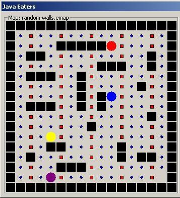

The Eaters world consists of a rectangular grid, 15 squares wide by 15
squares high. Walls bound all four sides. Interior wall sections are
randomly generated for each new game. No two walls will touch, so there
are no corners, except for exterior walls and no “dead ends” anywhere on
the board. Each eater starts at a random location. Food pellets are in
all other squares of the grid. There are two kinds of food: normal food
(blue circles and worth 5 points) and bonus food (red squares and worth
10 points). An eater consumes food by moving into a square. When an
eater moves out of a square it will be empty (unless another eater moves
into it).

An eater can sense the contents of cells (eater, normal food, bonus
food, and empty) up to 2 squares away in all directions. On each turn,
an eater can move one square north, south, east, or west. An eater can
also jump two squares north, south, east, or west. An eater can jump
over a wall or another eater. An eater does not consume any food in the
space it jumps over. A jump costs the eater 5 points.

Whenever two eaters try to occupy the same cell at the same time, they
collide. As a result of the collision, their scores are averaged and
they are teleported to new, random locations on the board.

### Creating an Eater

Start the Eaters environment:

Open the directory where you installed Eaters and launch the appropriate
script file (Eaters.bat on Windows, Eaters.sh on Mac or Linux)

Once Eaters has started, you will have a new window on your computer
screen. The configuration of the playing board, or map, may look
different than shown. You will use this window to create and destroyer
eaters and run the game.


Individual Eaters are controlled by Soar programs, which are
automatically loaded when an eater is created. Press the “New” button in
the “Agents” area of the Eaters game. A dialog will pop up.

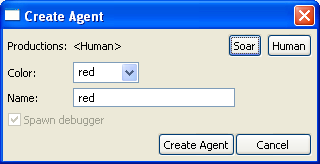

The first thing you must do is select the productions that will define
the behavior of the Eater. Pressing the button “Soar” will pop up a file
selection box:


Select the “Agents/Eaters/Tutorial” directory with the mouse, and then
Choose “Open” (or dbl-click on “Tutorial”). The dialog will display the
Soar production files that will be used in this tutorial. Each set of
production rules defines specific behaviors for an Eater. Select the
file “move-to-food.soar”


After you have selected the move-to-food eater, the Create Agent dialog
should look as follows:

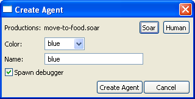

The productions in the file “move-to-food.soar” will now be loaded
whenever the “Create Agent” button is pressed. The production set can be
changed before creating another agent by pressing the “Soar” button to
choose a different file.

You can also pick a color for your eater by clicking on the button to
the right of “Color:” labeled “red”. The color does not affect on the
eater’s behavior, so pick your favorite color. Once you have selected
the productions file, and a color, you are ready to create your eater by
clicking on the Create Agent button.


After clicking on Create Agent, the agent’s Soar Debugger window will
appear. Arrange the Java Eaters window and the Soar Debugger windows so
that they do not overlap. You might need to resize the Soar Debugger
window to make it shorter. Don’t make it too narrow or it will be
difficult to view Soar’s output.

The Soar Debugger Window will look as shown above, although it may be
larger, and have additional panes. The eater is referred to by its
color, which is listed in the window title (remote red). Once you are
familiar with the Debugger, you can completely customize its appearance.
Across the top are a series of pull down menus, which are described
later. On the left side of the window is the Interaction Window where
trace and debugging information will be displayed. Just below it is the
Command Box where you can type in commands. The bottom of the window
contains buttons for single stepping, running, or stopping the eater,
setting Watch levels, and printing information. The layout of the
buttons may change depending on the size of the window and user
preferences. Features available in the Debugger will be described
throughout this document as they are needed. More details are provided
in [Intro to the Soar Debugger](../IntroSoarDebugger/index.md).

You should also see that the Java Eaters window has changed. The Red
Eater is shown on the map, and the Eater name and score are shown in the
Agent List. To the right of the Agent List is the sensor data for the
Eater, showing the contents of the map cells that surround the Eater.

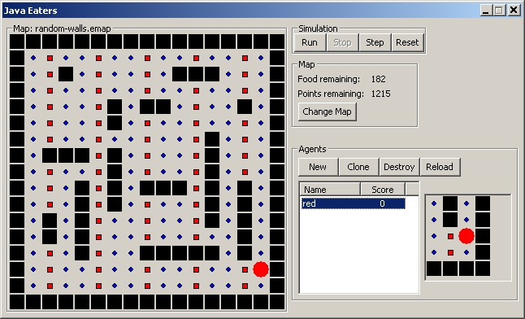

### Running an Eater

Your eater is now ready to start eating. Click the Run button on either
the Eater Control Panel (highlighted above) or the Soar Debugger Window.
The eater will start to move and consume food. After a few moves, click
the Stop button on either the Eater Control Panel (next to the “Run”
button) or the Interaction Window.

At this point, the Eaters Playing Board will look something like the one
below. Your board will look different because the walls and eater
starting position are different each time the game is played.

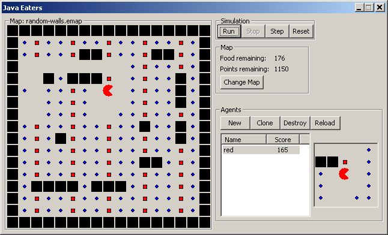

During the run, the Eaters Sensor window will change with each move,
showing the food pellets, walls, and empty squares that the eater
senses. As shown above, an eater can sense a 5x5 grid of cells, although
the _move-to-food_ rules consider only the four neighboring cells
(north, south, east and west).

The Interaction window (shown below) displays a trace of the eater’s
decisions.


The line starting with 1: O: O2 shows the first selection of the
move-to-food _operator_ This is followed by successive selections of
move-to-food operators*.* The move-to-food operator causes the eater to
move to a new cell. Some of the eaters will also jump; others will halt
when they cannot sense any food.

If the trace gets longer than the window can hold, the printing will
scroll up. You can look at decisions that scroll off the window by using
the scroll bar to the right of the window. You can search for
information in the trace by using the find function that is found under
Edit at the top of the Interaction window.

In Soar, a program consists of rules, and move-to-food has only three
simple rules that move the eater to a neighboring cell that contains
food. As your eaters get more sophisticated, more rules will be loaded.
If you let the eater run for a long time, it will eventually get to a
place where there is no food directly next to it. The move-to-food eater
does not have any rules to respond to this situation (although you could
easily add some) so the eater will stop moving. The trace will look as
follows:

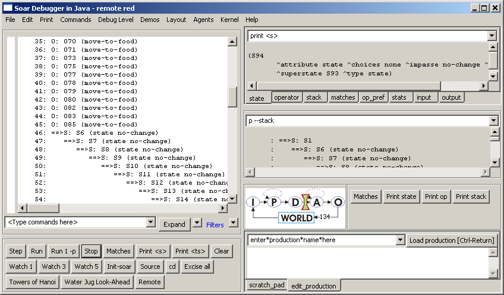

When an eater does not know how to respond to a situation, it will start
generating new states, such as S6, S7, S8, … in the above trace above.
In later sections of the tutorial you will learn how to write rules that
take advantage of these new states, but for now you just need to know
that when they arise, the eater does not know what to do.

At anytime you can create more eaters. You can create additional eaters
from the same or different files, so that you can create a set of
identical eaters (except for color), or sets of different eaters. Each
time a new eater is created, a new Interaction Window is created, and
the Eaters Agent List is expanded to include the new eater. To make a
new agent with the same set of rules as an existing agent, you can use
the “Clone” button. To create an eater with a different set of rules,
press “New” and use the dialog to select the desired rule set just as
you did when creating your first move-to-food eater.


From the Agent List, you can select which eater’s sensor data is displayed by
selecting the eater color with the mouse. When an eater is highlighted, it can
also be “cloned” or destroyed. To destroy an eater, click on the eater Name in
the Agent List (highlight it) and press the “Destroy” button.

To reload the production rules for the eater, you should use the reload button
(not implemented yet\!), or if you create an Eater using [VisualSoar][VSIDE] you can use
the runtime tab to reload the agent, reload a file, or change a single rule.
Reloading is useful if you have found a bug, modified the rules in the file, and
then wish to immediately test them on the current situation. Soar will replace
existing rules with new versions (a “\#” is printed in the Interaction Window
whenever a rule is replaced), as well as adding any new rules. This can be done
at any time as Soar will match new and modified rules against working memory.

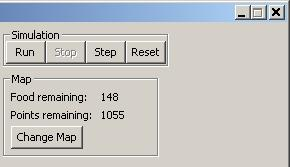

The upper right portion of the JavaEaters window has options for
controlling the Eaters “Simulation.”


Spend some time creating, running and destroying different eaters.
Notice how the eaters move around the board differently, some being much
more efficient at consuming food.

## Building a Simple Eater Using Rules

In contrast to the Water Jug, an Eater does not have to initialize the
state with an operator – the Eater will start with information about its
situation coming in through a structure called the input-link. We will
keep the Eater very simple, so all we will do initially is create
operators, which means creating operator proposal and application rules.

The first operator you will create moves an eater north one step. (It
might not even do that if there is a wall to its north when it is
created.)

### English Version

Here is one possible version of the move-north operator.

```Soar
# Propose*move-north:
# If I exist, then propose the move-north operator.
# Apply*move-north:
# If the move-north operator is selected, then generate an output command to
# move north.
```

To write the Soar rule for apply\*move-north, you have to know how to
get an eater to move. All external actions are issued by creating
working memory elements that are augmentations of the output-link. The
output-link is an augmentation of the io object, which in turn is an
augmentation of the state. In Eaters, a move command is issued by
creating a “move” augmentation on the output-link object, which in turn
has an augmentation called “direction” with a value of the direction to
move: “north”, “south”, “east”, or “west”. For each task in Soar, a set
of output commands is defined, and in Eaters there are two commands:
move and jump.

You should now try to write the Soar rules for the move-north operator.

To create your own agent for eaters, use your favorite text editor, and
save the file that you create with a .soar file extension. To create an
agent that loads the production that you have written, create an agent
as in section 1.1, but this time instead of loading “move-to-food.soar”,
load the file that you just created.

## Soar Version

Below is the proposal rule I wrote. You can find this rule in the file
“move-north.soar” in the “Agents\\ \\Eaters\\Tutorial” directory where
you found “move-to-food.soar”. The proposal rule is exactly the same as
the proposal rule for hello-world, except that the names of the rule and
the operator are changed.

```Soar
sp {propose*move-north
(state <s> ^type state)
-->
(<s> ^operator <o> +)
(<o> ^name move-north)}
```

The rule that applies the operator has more differences. Its action is
to add a move command to the output-link. This command will cause the
eater to move one cell to the north. In order to add the command to the
output-link, the rule must match the output-link identifier in its
conditions with a variable. Therefore, conditions are included that
match the io (`<io>`) object, and then the output-link (`<out>`).

```Soar
sp {apply*move-north
(state <s> ^operator <o>
^io <io>)
(<io> ^output-link <out>)
(<o> ^name move-north)
-->
(<out> ^move <move>)
(<move> ^direction north)}
```

The exact order of the conditions (and actions) does not matter, except
that the first condition must match the state identifier.

You should change your rules if they were significantly different than
these. Then create a move-north eater and type “watch 3” on the command
line so that you can watch the productions fire. Run the eater by
clicking on the “Step” button until your eater moves north. If your
eater doesn’t seem to be working, skip ahead to the Debugging Your Eater
section. Once your eater has moved north, your interaction window should
look like the following:


But what happened to your eater? After selecting move-north and taking
one step, the eater had nothing more to do and a new state is created
(s6 in the above Figure). Unfortunately, the rules you wrote are not
sufficient to get the eater to continually move north. In the next
section, you will modify your eater so that it continues to move north.

### Shortcuts

The apply\*move-north rule has lots of variables in it whose sole
purpose is to make connections between attributes. For example, `<o>` is
used to later match the name of the operator and `<io>` is used to later
match the output-link. Similarly, `<move>` is used in the action to
connect the output-link to the final direction. None of these variables
is used in both conditions and the actions.

```Soar
sp {apply*move-north
(state <s> ^operator <o>
^io <io>)
(<io> ^output-link <out>)
(<o> ^name move-north)
-->
(<out> ^move <move>)
(<move> ^direction north)}
```

To simplify the writing and reading of rules, Soar allows you to combine
conditions that are linked by variables. To do this, you can just string
together attributes, replacing the intermediate variables with a period,
“.”, to separate the attributes. In Soar, we call this “dot” or “path”
notation. Below is the same rule as before using dot notation.

```Soar
sp {apply*move-north
(state <s> ^operator.name move-north
^io.output-link <out>)
(<out> ^move.direction north)}
```

This rule is exactly the same as the original from Soar’s perspective.

One mistake you want to avoid making is to use dot notation in the
action when you are creating multiple sub-attributes of a new object.
This will create multiple objects, each with a single sub-attribute. For
example, if you want create a second augmentation of the move object
called speed (which is irrelevant in Eaters), you _do not_ want to do
the following:

```Soar
-->
(<out> ^move.direction north
  ^move.speed fast)
```

This is equivalent to:

```Soar
-->
(<out> ^move <move1>
  ^move <move2>)
(<move1> ^speed fast)
(<move2> ^direction north)
```

These actions will create _two_ move augmentations on the output-link,
each with a single attribute. The correct action is:

```Soar
-->
(<out> ^move <move>)
(<move> ^speed fast
  ^direction north)
```

## Move-North Operator: Multiple Moves

Although the move-north operator did move one step north, the eater
never takes a second step. In this section, you are going to find out
why it takes only one step and modify the eater so that it can take
multiple steps. This is one of the most complex sections of the
tutorial, so study it carefully.

### Operator Selection: Multiple Instances

In Soar, each action in the world, such as moving an eater, should be
performed by a separate operator _instance_. An operator instance is a
separate operator in working memory element created by the firing of an
operator proposal rule. Thus, each action should test for the creation
of a new operator object in working memory. Different instances of the
same operator will have the same name, and sometimes will have the same
augmentations, but a given instance will be used for only one move. Some
operator instances may include many actions, but they will be selected
and applied only once.

Therefore, new instances of the move-north operator should be created in
working memory for each new move. You should not attempt to have the
move-north operator selected once, and have it move an eater multiple
times. Instead, you should design you eater so that a new instance of
the move-north operator is created for each move. You can do this by
having the operator proposal rule fire each time the eater is to move.
How can you change propose\*move-north so that it fires after each move?
As the rule is currently written, it will fire only once because it only
tests ^type state, which stays in working memory forever. Your rule
needs to test working memory elements that change each time the eater
moves – those working memory elements that correspond to the eater’s
senses on the input-link. Soar is designed so that changes to the
input-link are made following output, just in time to affect operator
proposals.

The information that comes in on the input-link consists of objects with
attributes and values.

```soar
(I2 ^eater I4 ^my-location I5)
(I4 ^direction south ^name red ^score 25 ^x 1 ^y 10)
```

The input-link object, I2, has two augmentations. The first, ^eater, has
information about the eater: its current direction, its name, its
current score, and its x, y coordinates. The second, ^my-location, has
additional substructure (not shown) that includes the eater’s sensing of
nearby cells. Some of the ^eater information changes during the game:

-   The x location will change when the eater moves east or west.
-   The y location will change when the eater moves north or south.

Thus, whenever the eater moves, either the x or y location will change.
We can modify the conditions of our proposal rule to test both of these
working memory elements, and eliminate the test for ^type state.

```Soar
sp {propose*move-north
(state <s> ^io.input-link.eater <e>)
(<e> ^x <x> ^y <y>)
-->
(<s> ^operator <o> +)
(<o> ^name move-north)}
```

What will happen? First, when the original working memory elements for x
and y are removed from working memory, the original move-north operator
will be removed from working memory because the rule instantiation that
created it no longer matches – some of the working memory elements
responsible for the match are gone. We call this _retracting_ the rule
firing. Rules such as propose\*move-north maintain their actions in
working memory only as long as they match exactly the same working
memory elements.

Second, a new instance of the move-north operator will be created
because propose\*move-north will match the new values of x and y and
fire. To see these changes, modify your move-north operator as above and
then rerun it. This time, we are going to increase the tracing so that
we can see the individual changes to working memory. To do this, type
`watch 4 --timetags` in the interaction window.

The figure below shows the end of the trace. The trace is long because
it includes the addition and removal of all of the sensory data that
changes during a move (not shown below). In the trace, an addition to
working memory is shown preceded by an `=>`, while a removal from
working memory is preceded by an `<=`. Each working memory element also
contains a number, such as 119 for the top element in the trace below.
This is the _timetag_ of the working memory element – a unique number
generated when a working element is created. Soar sometimes displays
only timetags instead of the full working memory element, and the
timetag can be used in the print and wmes commands for displaying the
full working memory element (more details later).

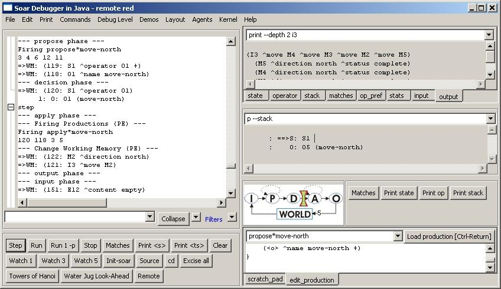

Your eater will now move north a second time (and a third, etc, if not
blocked) because the proposal matches against a new set of x and y
coordinates, apply\*move fires again, and a second move command is
created. But there are still problems. Step the eater a few more times
and then choose the “output” tab on the upper right section of the eater
Debugger window to see the eater’s ^output-link. You will notice that
the original move command (I3 ^move M2) is not removed from the
output-link, and the output-link will gradually accumulate stale
commands. The old move command is not removed because it is the action
of an operator application rule. Such actions are not automatically
removed when the rule no longer matches.

### Operator Application: Persistence

As noted above, proposing and selecting a second operator makes the
eater move a second time, but the accumulation of more and more move
commands will eventually become a problem. Why aren’t these commands
automatically removed like the preferences for operators? The reason is
that the rule that creates them is part of the application of an
operator, and operator applications create _persistent_ working memory
elements.

Persistence is necessary for creating memories of prior events, such as
the memory of something sensed in the environment. For example, if an
eater needed to remember the location of uneaten food so that it could
return to it later, the eater would have to create a persistent
structure in its working memory. Otherwise, as soon as it stopped
sensing the food, it would forget about it. In Soar, all working memory
elements created by an operator application rule are persistent. A rule
is an operator application rule if it tests a selected operator and
modifies the state. Persistent working memory elements are said to be
_operator-supported_, or _o-supported_, because they are created by
operators. For example, apply\*move-north is an operator application
rule and creates o-supported working memory elements.

```Soar
sp {apply*move-north
(state <s> ^operator.name move-north
^io.output-link <out>)
-->
(<out> ^move.direction north)}
```

Just as it is important to have persistent memories, it is also
important to have structures that are removed automatically when the
reason for creating them goes away. Actions of rules that test only the
state, or that test the operator and elaborate only the operator create
non-persistent preferences or working memory elements. Obvious examples
of non-persistent structures are the preferences for operators. These
are created by operator proposal rules, which retract the operators when
the proposal conditions change. Other examples include state elaboration
rules and operator elaboration rules. Non-persistent working memory
elements and preferences are called _instantiation-supported,_ or
_i-supported_, because they only persist as long as the rule
instantiation that created them. For example, propose*move-north is not
an operator application rule because it does not test a selected
operator. All of its actions are i-supported and they will be removed
from working memory when propose*move-north no longer matches.

```Soar
sp {propose*move-north
(state <s> ^io.input-link.eater <e>)
(<e> ^x <x> ^y <y>)
-->
(<s> ^operator <o> +)
(<o> ^name move-north)}
```

Returning to the problem of moving the eater, you need to add a rule
that removes old move commands from the output-link after the move is
finished. In Eaters, the output system creates an augmentation on the
move object after the action has executed: ^status complete. To remove a
structure from working memory, a rule “rejects” a working memory element
in its action. A reject must be part of an operator application rule
because it is a persistent change to working memory. Therefore, the
removal must test the move-north operator so that it is an operator
application rule. In English, the rule is:

```Soar
# Apply*move-north*remove-move:
# If the move-north operator is selected,
# and there is a completed move command on the output link,
# then remove that command.
```

In Soar, the action of a rule can remove a working memory element by
following it by a reject preference, which is designated with a minus
sign (“-“). The above rule is translated in to Soar as follows:

```Soar
sp {apply*move-north*remove-move
(state <s> ^operator.name move-north
^io.output-link <out>)
(<out> ^move <move>)
(<move> ^status complete)
-->
(<out> ^move <move> -)}
```

The action of this rule removes the working memory element specified by
`(<out> ^move <move>)`, which would be something like `(i3 ^move m1)`.
When this working memory element is removed, all of the augmentations of
m1 are automatically removed because they are no longer _linked_ to the
rest of working memory. In this case, `(m1 ^direction north)` and
`(m1 ^status complete)` are removed. These would not be removed if they
remained linked via another working memory element that had m1 as a
value.

This is an operator application rule, so it will not fire during the
following operator proposal phase. Instead, it will fire during the next
operator application phase, after a new move-north operator has been
selected. It will not interfere with other operator application rules
because rules fire (and retract) in _parallel_ as a wave. The
parallelism is only simulated, but the effect is as if all the rules
fire or retract at the same time. Once a wave of rules has fired, their
actions may cause additional rules to match or retract. Soar will
continue to fire or retract additional waves of rules until no more
rules match. Thus, within the phases of proposing and applying
operators, Soar fires all rules that match until _quiescence_, that is,
until no more rules match. During the propose phase, only rules that
have i-supported actions will fire. During the apply phase, both
o-supported and i-supported rules fire.

Returning to our diagram of the phases of Soar, both the propose
operator and apply operator phases can be expanded to show that multiple
rules fire and retract in parallel until quiescence.

### Running and Tracing

When running your new eater, it will go north until it hits a wall or
the border. When it can no longer move, it will start generating states
because it cannot successfully apply and terminate the move-north
operator. Below is a sample trace, with the `watch 3 --timetags` in use,
of the interaction window for the first two moves to the north by an
eater.


If you look closely at this trace, you see that two rules are firing at
the same time: apply\*move-north, and apply*move-north\*remove-move.
One is adding the new move command to the output-link at the same time
that the other is removing the previous move command. There are also
examples of rules firing and retracting at the same time where an
operator is being removed from working memory at the same time that a
new operator is being created.

Instead of letting Soar run free, you can step Soar through each
decision using the “Step” button on either the Soar Debugger or the Java
Eaters window. The default will stop each step before the application
phase, right after Soar has made an operator selection (decision phase).
It’s possible to change the location where Soar will stop when stepping,
using the Soar Cycle widget in the Debugger.

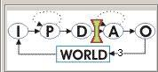
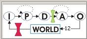

The red icon in the diagram shows the point where Soar will stop when
the Step button is used. The green icon shows where Soar is in its
execution cycle. Move the Stop Point to the location between “World” and
“Input” as shown above. This is just after the output commands have been
added to the output-link and just before the eaters are about to move.
In the following trace, the Watch level is 1, the step button has been
used, and then the output-link is examined. This is repeated twice.

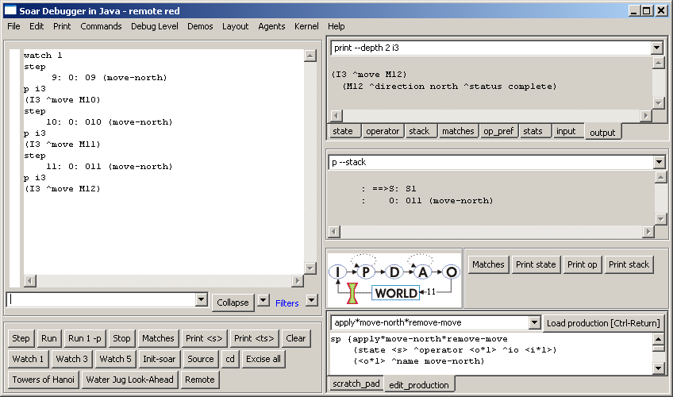

From prior runs, you know that I3 is the identifier of the output-link.
Although Soar does not guarantee that I3 will always be the identifier
of the output-link, it always is, just as I1 is the identifier of the io
object, I2 is the identifier of the input-link, and S1 is the identifier
of the first state.

When you print I3, you see that the move command is correctly added to
the output-link. You can see more than one level of augmentation by
using the `-d` flag on the print command as shown in the upper right
monitoring window.

You can also step through one phase at a time by using the
`run 1 –p` command.

## Move-To-Food Operator

In this section you will create an eater that greedily moves to any food
it senses. You will use the lessons you learned from the move-north
operator, and learn more about the structure of the input-link and
operator preferences.

Each eater can sense the food and walls that surround it, two steps in
each direction. The Eaters Info window shows what an eater can sense.
For this eater, you will write an operator that moves the eater to one
of the neighboring cells (north, east, south, or west) that contains
normalfood or bonusfood. Since food can be in more than one of the
neighboring cells, more than one operator may be proposed. Soar does not
automatically select randomly from among a set of proposed operators –
it will get a _tie impasse_ if there are multiple operators with only
acceptable preferences. To avoid ties, Soar has additional preferences.
For this exercise, it does not matter which food an eater consumes
first, so you can use a preference that makes the decision procedure
arbitrarily select one of the proposed operators.

Based on the above discussion, you will need four rules for the
move-to-food operator.

-   You need one rule to propose the operator when there is normal-food
    in a neighboring cell and a second rule to propose the operator when
    bonus-food is in a neighboring cell. Unlike the move-north operator,
    these proposal rules do not have to test the coordinates of the
    eater because the contents of the neighboring cells will change when
    the eater moves. The contents will change (the working memory
    elements for contents of all of the sensed cells are removed and
    re-added to working memory) even if the sensed object is the same
    type. The operator proposal rules can also create the indifferent
    preferences that lead to a random selection.

-   You need a third rule to apply the operator and move the eater in
    the correct direction.

-   You need a fourth rule to remove the move command from the
    output-link.

Now try to write English versions of the move-to-food operator. Use the
English versions of the move-north operator as a guide:

```soar
 Move-north operator
# Propose*move-north:
# If I am at a specific location, then propose the move-north operator.

# Apply*move-north:
# If the move-north operator is selected,
# generate an output command to move north.

# Apply*move-north*remove-move:
# If the move-north operator is selected,
# and there is a completed move command on the output link,
# then remove that command.
```

### English Version

Here is one possible set of rules for the move-to-food operator.

```soar
# Move-to-food operator
# Propose*move-to-food*normalfood
# If there is normalfood in an adjacent cell,
# propose move-to-food in the direction of that cell
# and indicate that this operator can be selected randomly.
#
# Propose*move-to-food*bonusfood
# If there is bonusfood in an adjacent cell,
# propose move-to-food in the direction of that cell
# and indicate that this operator can be selected randomly.
#
# Apply*move-to-food
# If the move-to-food operator for a direction is selected,
# generate an output command to move in that direction.
#
# Apply*move-to-food*remove-move:
# If the move-to-food operator is selected,
# and there is a completed move command on the output link,
# then remove that command.
```

Converting these rules to Soar requires a more detailed examination of
preferences and the input-link.

-   Preferences. To select randomly among the proposed operators, Soar
    has a preference called _indifferent_. The equal sign, “=”, is used
    to signify an indifferent preference for an operator, just as “+”
    signifies acceptable. The indifferent preference means that the
    decision procedure can randomly select among all operators with
    indifferent preferences, so it is important that all proposed
    operators have indifferent preferences. Even though we will create
    an indifferent preference for these operators, the acceptable
    preference is still necessary and an operator will not be selected
    if it does not have an acceptable preference.

-   Input-link representation. The input-link has two augmentations:
    eater and my-location. Remember that the value of the my-location
    augmentation is the eater’s current position and is a cell in middle
    of the 5x5 Eaters Info sensory field. On the next page there is a
    graphic depiction of this cell and all of the other cells in the
    sensory field. Adjacent cells are augmentations labeled north, east,
    south, and west. Every cell also has a ^content augmentation, whose
    value can be wall, empty, eater, normalfood, or bonusfood. If the
    cell has an eater in it, there will be additional augmentations (not
    shown in the figure) for the color of the eater (^eater-color), and
    the eater’s current score (^eater-score). Below the figure for the
    input-link structure is the corresponding Eaters Info window.

Based on the information in those figures, you should try to write a
Soar rule for propose\*move-to-normalfood. Two hints:

1.  Write down the sequence of attributes that go from the state to the
    value of the content of a cell, separating each attribute with a
    “.”.

2.  Use a variable to match the direction augmentations to a neighboring
    cell and then test that the content is normalfood. That variable in
    the attribute position will match any direction augmentation between
    cell: north, east, south, or west. You can write it: `^<variable>`


### Soar Version

Below is the proposal rule I wrote without dot notation so that it is
clear which working memory elements are being matched. The proposal rule
tests a sequence of linked identifier-attribute-values, and includes a
variable for the attribute that leads to an adjacent cell. The variable
will match north, east, south, or west if the final condition matches an
adjacent cell containing (has “^content”) normalfood.

```Soar
sp {propose*move-to-normalfood
(state <s> ^io <io>)
(<io> ^input-link <input-link>)
(<input-link> ^my-location <my-loc>)
(<my-loc> ^<direction> <cell>)
(<cell> ^content normalfood)
-->
(<s> ^operator <o> +)
(<s> ^operator <o> =)
(<o> ^name move-to-food
^direction <direction>)}
```

The indifferent preference tells Soar that a random selection can be
made between proposed operators. The `<direction>` in the action
augments the operator with the direction of an adjacent cell containing
normalfood. When an eater is surrounded by food, the `<direction>`
variable will match all directions, leading to four matches of the rule.
In Soar, all new matches fire in parallel, creating new operators, each
with a different ^direction augmentation. For example, if there was
normalfood to the south and west, two operators would be created, one
with ^direction south and one with ^direction west*.*

This rule can be written much more concisely using dot notation, and a
short cut for the preferences.

```Soar
sp {propose*move-to-normalfood
(state <s> ^io.input-link.my-location.<dir>.content normalfood)
-->
(<s> ^operator <o> + =)
(<o> ^name move-to-food
^direction <dir>)}
```

The rule that proposes the operator to move to consume bonusfood is very
similar.

```Soar
sp {propose*move-to-bonusfood
(state <s> ^io.input-link.my-location.<dir>.content bonusfood)
-->
(<s> ^operator <o> + =)
(<o> ^name move-to-food
^direction <dir>)}
```

The rule to create the move command on the output link is very similar
to the one used in move-north. The only difference is that instead of
always using “north” as the direction, it uses the direction created by
the operator proposal rule and matched by variable `<dir>`.

```Soar
sp {apply*move-to-food
(state <s> ^io.output-link <out>
^operator <o>)
(<o> ^name move-to-food
^direction <dir>)
-->
(<out> ^move.direction <dir>)}
```

The final rule removes the move command from the output-link when it has
completed.

```Soar
sp {apply*move-to-food*remove-move
(state <s> ^io.output-link <out>
^operator.name move-to-food)
(<out> ^move <move>)
(<move> ^status complete)
-->
(<out> ^move <move> -)}
```

### Shortcuts and Extensions

The rules propose*move-to-normalfood and propose*move-to-bonusfood
differ only in the tests for normalfood and bonusfood. Instead of
writing an individual rule for each of those values, it is possible to
write a single rule that tests for any one of a set of alternative
values. The alternative values are written in the same position as a
single value, but are surrounded by double angle brackets: <<
normalfood bonusfood >>. Any number of different values can be
included, but none of them can be a variable. Using this notation, the
two rules can be rewritten as the following rule:

```Soar
sp {propose*move-to-food
(state <s> ^io.input-link.my-location.<dir>.content << normalfood bonusfood >>)
-->
(<s> ^operator <o> + =)
(<o> ^name move-to-food
^direction <dir>)}
```

This notation can also be used for testing alternative values of
attributes.

Soar supports another shortcut, similar in spirit to dot notation that
allows you to eliminate variables in conditions whose sole purpose is to
link conditions. Dot notation works if there is a single augmentation.
However, if there are multiple augmentations, dot notation doesn’t help.
Grouping, using parentheses, handles this case. In place of where a
variable would go as an action, you can insert the augmentations of the
value. For example, the original apply\*move-to-food was:

```Soar
sp {apply*move-to-food
(state <s> ^io.output-link <out>
^operator <o>)
(<o> ^name move-to-food
^direction <dir>)
-->
(<out> ^move.direction <dir>)}
```

This can be replaced by

```Soar
sp {apply*move-to-food
(state <s> ^io.output-link <out>
^operator (^name move-to-food
^direction <dir>))
-->
(<out> ^move.direction <dir>)}
```

Although this does eliminate unnecessary variables, it often makes the
rules more difficult to read, so this notation will not be used in the
rest of the tutorial.

One more thing you might want to add is the ability to trace the
direction of the selected operator. You can do this with a rule that
tests that the operator is selected and uses the write action.

```Soar
sp {monitor*move-to-food
(state <s> ^operator <o>)
(<o> ^name move-to-food
^direction <direction>)
-->
(write |Direction: | <direction>)}
```

This rule will fire in parallel with apply\*move-to-food because it
matches a selected operator.

### Example Trace


## Debugging Soar Programs

In trying to write the operators in the previous section, you may have
made some mistakes. In this section, you will learn techniques for
finding and fixing bugs in Soar programs. The techniques are separated
based on the cause of the error:

-   When the rules for an eater are read into Soar, Soar checks to make
    sure that the rules are legal and displays messages when it finds
    errors. These types of errors are called _syntax errors_.
    Visual-Soar will also check for syntax errors in rules. I recommend
    using Visual-Soar to check for errors first.

-   If your rules load into Soar without any error messages, there can
    still be mistakes in the underlying logic of the rules. These are
    _semantic errors_.

This section starts with a subsection on Syntax Errors. Subsections
follow this on different techniques for monitoring and examining your
program while it is running. The last subsection is a walk through of
using these techniques to debug a program.

### Syntax Errors

There are many different types of syntactic errors that you can have in
your programs. The eight most common errors are:

1.  Missing comment character
1.  Missing {
1.  Missing )
1.  Extra )
1.  Missing }
1.  Missing state
1.  Missing ^
1.  Disconnected rhs action variable.

Fortunately, with the development of VisualSoar, locating and fixing
syntax errors in Soar productions has become relatively easy. Before
loading rules into the debugger to execute a Soar program, check for
syntax errors using VisualSoar. To do this, click Datamap | Check All
Productions for Syntax Errors.


[VisualSoar][VSIDE] will check all of your productions to make sure that they
conform to the standard syntax rules. The results of this check will
appear in the feedback window (which is located at the bottom of the
[VisualSoar][VSIDE] window). If an error is found, an informative error message
will appear in blue. The first part of the error message will be the
name of the file where the error was found and its line number in the
format `<file-name>(line number):` This is then followed by more output
which will include the specific path of the file the error was found in,
and why [VisualSoar][VSIDE] considers it a syntax error:


One of the best features of [VisualSoar][VSIDE] is that double-clicking on an
error message allows you to see exactly where the error occurred.
Double-clicking an error message automatically opens the window in which
the error was found, and highlights the illegal area in yellow. For
instance, double-clicking this error message would cause this window to
pop-up:


If no errors are found, “There were no errors detected in this project”
will be printed in the feedback window.

We suggest playing around with this tool. Delete brackets and braces, \#
signs and -->’s to see what errors [VisualSoar][VSIDE] gives you so that you are
able to quickly recognize what types of messages certain errors give.
This will make future debugging much easier.

### Write Statements

One of the oldest debugging techniques in traditional programming
languages is to add print statements throughout the program. Although
not the most effective technique, it can be easily used in Soar by
adding write statements in the action of rules. To make the output
readable, you want to have a linefeed before writing out any text, using
the (crlf) command, which stands for
<u>c</u>arriage-<u>r</u>eturn
and
<u>l</u>ine<u>f</u>eed.

For example, if you want to keep track of all of the move-to-food
operators that are proposed, including their direction and expected
food, you could take the original rule given below:

```Soar
sp {propose*move-to-food
(state <s> ^io.input-link.my-location.<dir>.content << normalfood bonusfood >>)
-->
(<s> ^operator <o> + =)
(<o> ^name move-to-food
^direction <dir>)}
```

and modify it by adding a write statement. To get the right values in
the action requires a variable for the food type in the condition.

```Soar
sp {propose*move-to-food
(state <s> ^io.input-link.my-location.<dir>.content
{ <type> << normalfood bonusfood >> })
-->
(write (crlf) | Propose move | <dir> |, for | <type>)
(<s> ^operator <o> + =)
(<o> ^name move-to-food
^direction <dir>)}
```

The write command concatenates all of its arguments, which can include
constants and variables.


### Runtime Debugging Commands

While Soar is running, there are many commands you can use to get
information on what the current state of the system is, what happened in
the past, and what is about to happen. This subsection is organized by
the different commands. To learn the details of all of these commands,
you should check the Soar User’s Manual.

#### print

You have already seen the print command, which is used to print out
working memory structures. Print can take a variety of arguments. One of
the most useful is to print to a given depth. This prints not only the
current identifier and all of its augmentations, but also all of their
augmentations recursively to a given depth. For example, you can print
out the current state to a depth of 2 by using the following command:

```soar
red> print -–depth 2 s1
```

The order is important and s1 must come at the end of the print
statement. The result is:

```soar
(S1 ^type state ^superstate nil ^io I1 ^operator O2 ^operator O4 +
^operator O3 + ^operator O2 + ^operator O1 +)
(I1 ^input-link I2 ^output-link I3)
(O2 ^name move-to-food ^direction south)
(O4 ^name move-to-food ^direction west)
(O3 ^name move-to-food ^direction north)
(O1 ^name move-to-food ^direction east)
```

You can also use the mouse to print working memory objects by right
clicking on an identifier. If you select the print option, you will see
that there a many other options for printing objects in working memory.

#### wmes

The wmes command can also be used to print out individual working memory
elements instead of complete objects. This command also prints out the
_timetag_ of an individual working memory element. This is a unique
number that Soar uses to keep track of each working memory element.

```soar
red> wmes o1
(120: o1 ^name move-to-food)
(121: o1 ^direction east)
```

Timetags can also be used as arguments in the print and wmes commands.
Print will display all of the working memory elements that have the
given timetag as their identifier, while wmes will display only the
specified working memory element.

```soar
red> print 120
(O1 ^name move-to-food ^direction east)
```

```soar
red> wmes 120
(120: o1 ^name move-to-food)
```

##### matches

One of the questions you will frequently want to ask is, “What rules are
about to fire?” The matches command will return a list of all rules that
are ready to fire, separated into those that will be operator
applications (O Assertions), those that are will create I-support
augmentations (I Assertions), and those that will remove I-supported
augmentations (Retractions).

```soar
red> matches

O Assertions:
I Assertions:
Retractions:
```

Matches also can be invoked through the “show” item on the menu list, or
by right clicking on the interaction window, then selecting the
production item on the menu that appears. Note; matches will not show
rules that completely match, but have _already fired._ Thus, if you stop
Soar after a rule has fired, matches alone will not show it.

Matches can also take as an argument the name of a rule. It will then
print out the rule, condition by condition, with information on how many
working memory elements match that condition and are consistent with all
of the variables in the previous conditions. When Soar loads in a rule,
it automatically reorders the conditions of the rule so that it can
efficiently match it, so the ordering of the conditions from matches
will not be the same as the ordering of the rule when you wrote it.

If a rule completely matches, then it has either already fired, or is
about to fire.

```soar
red> matches propose*move-to-food
1 (state <s> ^io <i*1>)
1 (<i*1> ^input-link <i*2>)
1 (<i*2> ^my-location <m*1>)
7 (<m*1> ^<dir> <d*1>)
3 (<d*1> ^content { << normalfood bonusfood >> <c*1> })
3 complete matches.
```

In this example, the first three conditions have a single match, and
then the fourth condition matches seven different working memory
elements. These are all of the augmentations of my-location. The final
condition then restricts the matches to be only those that have content
normalfood or bonusfood.

If a rule does not completely match, the condition that failed to match
will be preceded by `>>>>` as in:

```soar
red> matches apply*move-to-food*remove-move
1 (state <s> ^operator <o*1>)
1 (<o*1> ^name move-to-food)
1 (<s> ^io <i*1>)
1 (<i*1> ^output-link <out>)
1 (<out> ^move <move>)
>>>> (<move> ^status complete)
0 complete matches.
```

Matches can also print out working memory elements that match the
conditions by using the `--timetags` (for just the timetags) or `-–wmes` (for
complete working memory elements) arguments. Matches can be invoked by
clicking with the right mouse button on the name of a production and
then selecting “production” from the menu that appears.

##### preferences

There is a special command to print out the preferences for selecting an
operator. This command also works for any working memory element (prior
versions of Soar allowed preferences for all working memory elements and
there are still vestiges of them in the current version). To use the
preference command, you give an identifier and an attribute. Soar will
then print out all of the preferences for all values of that identifier
attribute pair. For example, to print out all of the preferences for the
operator attribute:

```soar
red> preferences s1 operator
Preferences for S1 ^operator:
acceptables:
O7 (move-to-food) +
O8 (move-to-food) +
O9 (move-to-food) +
unary indifferents:
O7 (move-to-food) =
O8 (move-to-food) =
O9 (move-to-food) =
```

This example shows that there are three operators proposed (O7, O8, O9),
and each one has an acceptable and indifferent preference.

The preferences command has another feature that makes it extremely
useful. Using the `--name` argument, it will tell you the name of the
production that created the preference. For example, if you want to
discover why there is the working memory element `(I3 move m3)`, you can
type:

```soar
red> preferences I3 move --names
Preferences for I3 ^move:
acceptables:
M3 +
From apply*move-to-food
```

This tells you that apply\*move-to-food creates this working memory
element. If you want to find out what working memory elements matched
apply*move-to-food when it created `(I3 move m3)`, you can type:

```soar
red> preferences I3 move --wmes
Preferences for I3 ^move:
acceptables:
M3 +
From apply*move-to-food
(212: S1 ^operator O8)
(205: O8 ^name move-to-food)
(206: O8 ^direction north)
(3: S1 ^io I1)
(5: I1 ^output-link I3)
```

You can also invoke preferences by clicking with the right mouse button
on an attribute of a working memory element in the interaction window.
Select the preferences command from the menu that appears and then
select the appropriate preferences command.

### Semantic Errors

In this section you will use the techniques from the prior section to
fix semantic errors. In a rule-based system, semantic errors have three
general results:

1.  A rule does not fire when it should.
1.  A rule fires when it shouldn’t.
1.  The action of the rule is incorrect.

Unfortunately, when you have an error, you don’t know which type it is.
Luckily, there are general techniques for finding all types of semantic
errors.

The first, and most important, step in finding semantic errors is
knowing what you think the program should be doing at each step. Only by
knowing what the program should do, will you be able to detect when it
does something wrong. Usually you will notice that the wrong operator is
selected, or that no operator is selected (a substate is created).

I’ve created a file called “semantic-errors.soar” in the
“Agents\\Eaters\\Tutorial” directory for move-to-food that has some
bugs. Create an eater with this file and also open the file in a text
editor so you can modify as we go along. You should expect that
propose\*move-to-food to fire during the first step, so be bold and
click on the step button and see what happens. You should get a trace
like:

```soar
red> ***
0: ==>S: S1
1: ==>S: S2 (state no-change)
```

This clearly indicates that propose*move-to-food did not fire. To find
out why, try matches propose*move-to-food.

```soar
red> matches propose*move-to-food
1 (state <s> ^io <i*1>)
1 (<i*1> ^input-link <i*2>)
1 (<i*2> ^my-location <m*1>)
7 (<m*1> ^<dir> <d*1>)
>>>> (<d*1> ^contant { << normalfood bonusfood >> <c*1> })
0 complete matches.
```

There is a problem with the last condition. You can examine working
memory to find out what it should be matching and after some
examination, you should realize that the name of the attribute should be
“content”, not “contant”. Change the rule in the file. If you have been
using Visual-Soar, it would have found this error while you were
creating the Eater. To avoid destroying and creating a new eater, you
can just reload the rules by clicking on the Commands menu of the
Interaction Window and selecting “Reload Productions”. Now you can try
going one step again. You should have the following in your interaction
window:

```soar
red> ***
0: ==>S: S1
1: O: O1 (move-to-food)
```

At this point, you can check which rules are about to fire by using the
matches command.

```soar
red> matches
O Assertions:
apply*move-to-food
I Assertions:
Retractions:
```

That looks fine, so take one more step. Unfortunately, the eater doesn’t
move. What’s the problem? You should examine the output-link to see if
the move command was correctly created:

```soar
red> print --depth 2 i3
(I3 ^moves M1)
(M1 ^direction east)
```

Unfortunately, you have to inspect this structure and realize that the
command it creates is “moves” not “move”. Correct this, reload, and take
another step. Now the eater moves and runs appropriately.

## Generalized Move Operator

The move-to-food operator you created in the last section would get
stuck when there was no food in the cells adjacent to the eater. It also
did not prefer bonusfood to normalfood. In this section, you will
generalize the move-to-food operator to be an operator that can move to
a cell with any type of content. Once you have created such a
generalized move operator, we will introduce additional preferences that
allow you to create a greedy eater that never gets stuck.

### Move Operator Proposal

The proposal for the move operator needs to test that there is an
adjacent square that it can move into. It should not propose moving into
a wall. There are two possible approaches to write this test. The first
is to test all of the content values that are ok to move into:
normalfood, bonusfood, eater, or empty. The second is to test that the
content does not equal wall. Taking the first approach gives us the
following English version of the proposal:

```Soar
# Propose*move*1:
# If there is normalfood, bonusfood, eater, or empty in an adjacent cell,
# propose move in the direction of that cell
# and indicate that this operator can be selected randomly.
```

It is straightforward to translate this into Soar based on the
move-to-food operator proposal:

```Soar
sp {propose*move*1
(state <s> ^io.input-link.my-location.<dir>.content

<< empty normalfood bonusfood eater >>)
-->
(<s> ^operator <o> + =)
(<o> ^name move
^direction <dir>)}
```

Although this is adequate, it will make future selection rules simpler
if the operator also contains the contents of the cell. Thus, an
alternative version is:

```Soar
# Propose*move*1a:
# If there is normalfood, bonusfood, eater, or empty in an adjacent cell,
# propose move in the direction of that cell, with the cell’s content,
# and indicate that this operator can be selected randomly.
```

To translate this into Soar requires matching the cell’s content to a
variable and then using that variable in the action as an augmentation
of the operator, such as `^content <content>`. However, the value is
already matched by << empty normalfood bonusfood eater >>. What is
needed is a way to match both a variable and the list at the same time.
In Soar this is done by surrounding the two (or more) things to match
against the same item with curly braces: “{ }”. Thus, the Soar version
of the proposal becomes:

```Soar
sp {propose*move*1a
(state <s> ^io.input-link.my-location.<dir>.content
{ <content> << empty normalfood bonusfood eater >> })
-->
(<s> ^operator <o> + =)
(<o> ^name move
^direction <dir>
^content <content>)}
```

Although this rule is adequate, it forces you to list all of the
contents except walls. This rule will have to be changed if we ever add
other types of food (e.g., superbonusfood). It might be better to write
a rule that tests that the content is _not equal_ to wall. This can be
done in Soar by using “<>”. The not equal test can also be combined
with the variable as in propose\*move\*1a, giving the following rule:

```Soar
sp {propose*move*2a
(state <s> ^io.input-link.my-location.<dir>.content
{ <content> <> wall })
-->
(<s> ^operator <o> + =)
(<o> ^name move
^direction <dir>
^content <content>)}
```

The “<>” must be placed directly _before_ the value it compares, and
in the example above, it is correctly before wall. The rule can also be
written with the variable _after_ the test that the content is not equal
to wall:

```Soar
sp {propose*move*2a
(state <s> ^io.input-link.my-location.<dir>.content
{ <> wall <content> })
-->
(<s> ^operator <o> + =)
(<o> ^name move
^direction <dir>
^content <content>)}
```

The not equal test can also be used with variables. For example, if you
want to test that the content of the cells to the north and south of the
eater are not equal, you could use the following conditions:

```Soar
(state <s> ^io.input-link.my-location <my-loc>)
(<my-loc> ^north.content <north>
^south.content <> <north>)
```

If you wanted to match the contents of both the north and south cells
for use in the action, you could use the following conditions:

```Soar
(state <s> ^io.input-link.my-location <my-loc>)
(<my-loc> ^north.content <north>
^south.content { <south> <> <north> })
```

Remember, the not equal test, “<>”, must directly precede the symbol
or variable it refers to. Soar also has tests for greater than (>),
less than (<), greater than or equal to (>=), and less than or equal
to (<=). These can be used when matching numbers and also precede the
value they refer to. For example, to test that the eater’s score is
greater than 25, the following condition can be used.
`(state <s> ^io.input-link.eater.score > 25)`

### Move Operator Application

This application rule for the move operator is a copy of the
move-to-food operator application. The English and Soar versions are the
same except for the name of the operator:

```Soar
# Apply*move
# If the move operator for a direction is selected,
# generate an output command to move in that direction.
```

```Soar
sp {apply*move
(state <s> ^io.output-link <out>
^operator <o>)
(<o> ^name move
^direction <dir>)
-->
(<out> ^move.direction <dir>)}
```

```Soar
# Apply*move*remove-move:
# If the move operator is selected,
# and there is a completed move command on the output link,
# then remove that command.
```

.

```Soar
sp {apply*move*remove-move
(state <s> ^io.output-link <out>
^operator.name move)
(<out> ^move <direction>)
(<direction> ^status complete)
-->
(<out> ^move <direction> -)}
```

The proposal rule together with these two rules will give you an eater
that randomly moves around, avoiding walls. We can greatly improve its
behavior by using more preferences.

### Move Operator Selection

To improve the performance of the eater, we can add rules that prefer
moving to bonusfood over normalfood or an empty cell and prefer moving
to normalfood over moving into an empty cell or a cell with another
eater. The preference language in Soar is rich enough to support a
variety of ways of ordering the choices and we will explore different
possibilities in this section.

To get started, you need to create a rule to prefer bonusfood to
normalfood or empty or an eater. The condition part of the rule must
match against operator proposals, while the action part must prefer the
operator that moves to the bonusfood. In English this would be:

````Soar
# Select*move*bonusfood-better-than-normalfood
# If there is a proposed operator to move to a cell with bonusfood and
# there is a second proposed operator to move to a cell that is empty or
# has normalfood or another eater
# prefer the first operator.
``

The conditions of this operator must match against proposed operators
before they have been selected. A proposed operator can be matched by
matching the acceptable preference for the operator, which is written in
the condition as the ^operator augmentation of the state, with a value
for the operator identifier, followed by a plus sign, “+”.
(state <s> ^operator <o> +)

Acceptable preferences are the only preferences that are added to
working memory. All of the other preferences (better, best, worse,
worst, and reject) are not added to working memory. They are held in
preference memory and persist as long as the rule instantiations that
created them still match. They are not in working memory because there
is little advantage to having them available for other rules to match
against, whereas the acceptable preferences must be in working memory
because they define what operators are candidates for selection.

An operator can be preferred by creating a *better* than preference and
the decision procedure will use that preference in determining which
operator to select – it will never select an operator if it is worse
than another candidate operator, unless that candidate is rejected. In
addition to the better preference, there is a *worse* preference that is
exactly the opposite. In an action, the better preference is the greater
than sign: “>”. It is used in the same place as an acceptable or
indifferent preference, except that a variable that matched the
identifier of the better operator is put before the greater than sign,
and the variable that matched the identifier of the worse operator is
put after the greater than sign. Therefore, the Soar rule is as follows:

```Soar
sp {select*move*bonusfood-better-than-normalfood-empty-eater
(state <s> ^operator <o1> +
^operator <o2> +)
(<o1> ^name move
^content bonusfood)
(<o2> ^name move
^content << normalfood empty eater >>)
-->
(<s> ^operator <o1> > <o2>)}
````

This rule will match two different proposed operators (operators with
acceptable preferences), `<o1>` and `<o2>`. Both have name move, while
one matches operators that move to bonusfood while the other will match
operators that move to normalfood, empty squares, or squares with
another eater.

If there are adjacent cells with both bonusfood and normalfood, this
rule will fire right after propose\*move creates acceptable preferences,
but during the same proposal phase so that it will influence the next
operator selection. It will fire multiple times if there are multiple
cells with bonusfood or normalfood. After these preferences are created,
the decision procedure will gather them up to make a decision.

You can use exactly the same approach to prefer moving to cells with
normalfood over moving to empty cells or cells with eaters. Soar
provides an alternative with the _worst_ preference, which means don’t
select the operator unless there are no other choices. In this case, you
can create worse preferences for operators that move the eater into an
empty cell or a cell with another eater. With these additional
preferences, operators that move into cells with bonusfood or normalfood
will always be selected if they exist, and otherwise the eater will
randomly select between moving into an empty cell or into a cell with
another eater. The new selection rule can be written in English as:

```Soar
# Select*move*avoid-empty-eater
# If there is a proposed operator to move to an empty cell or a cell with
# another eater,
# then avoid that operator.
```

Here we use the word avoid to mean that the operator will only be
selected if there is nothing worse. A worst preference is written as a
less than sign: “<”. This is similar to a worse preference, except that
there is no second variable that the first variable is compared to.

```Soar
sp {select*move*avoid-empty-eater
(state <s> ^operator <o> +)
(<o> ^name move
^content << empty eater >>)
-->
(<s> ^operator <o> <)}
```

Just as there is a worst preference, there is also a _best_ preference.
The best preference means that an operator should be selected as long as
there is no other operator better than it (or it is not worse than
another operator is). Thus the meaning of best is a bit odd in that
better preferences are more important than the best preferences and an
operator with a best preference will not be selected if another operator
is better than it.

You could have used a best preference for a move into a cell with
normalfood instead of using the worst preference. The move to normalfood
would then be selected over a move to an empty cell or a cell with an
eater. Select\*move\*bonusfood-better-than-normalfood-empty-eater will
ensure that bonusfood is preferred to normalfood.

```Soar
# Select*move*prefer-normalfood
# If there is a proposed operator to move to a cell with normalfood,
# prefer that operator.
```

```Soar
sp {select*move*prefer-normalfood
(state <s> ^operator <o> +)
(<o> ^name move
^content normalfood)
-->
(<s> ^operator <o> >)}
```

### Summary of Preferences

This section summarizes the meaning of the preferences presented
earlier. There are two additional preferences (require and prohibit)
that are only rarely used and are not covered in this tutorial, but are
described in the Soar 8 Manual. The preferences can be thought of as a
sequence of filters, processed in the following order.

-   **Acceptable (+)** An acceptable preference states that a value is a
    candidatefor selection. Only values with an acceptable preference
    have the potential of being selected. If there is only one value
    with an acceptable preference, that value will be selected if it
    does not also have a reject preference.

-   **Reject (-)** A reject preference states that the value is not a
    candidatefor selection. A value will not be selected if it has a
    reject preference.

-   **Better (>), Worse (<)** These preferences state that a value
    should not be selected if the better value is a candidate. If the
    better value does not have an acceptable preference, or is rejected,
    the better/worse preference is ignored. Otherwise, the worse value
    is removed from consideration. Better and worse are simple inverses
    of each other, so that A better than B is equivalent to B worse than
    A.

-   **Best (>)** A best preference states that the value should be
    selected if it is not rejected, or if there is no other value better
    than it. If a value is best (and not rejected, or worse than
    another),it will be selected over any other value that is not also
    best. If two values are best, then the remaining preferences (worst,
    indifferent) will be examined to determine the selection. If a value
    (that is not rejected) is better than a best value, the better value
    will be selected. (This result is counter-intuitive, but allows
    explicit knowledge about the relative worth of two values to
    dominate knowledge of only a single value.)

-   **Worst (<)** A worst preference states that the value should be
    selected only if there are no alternatives. A worst will only be
    considered if the above preferences have not filtered the choices to
    a single choice. In this case, any value with a worst preference
    will be discarded, unless all of the values have worst preferences.

-   **Indifferent (=)** An indifferent preference states that there is
    positive knowledge that it does not matter which value is selected.
    This may be a binary preference, to say that two values are mutually
    indifferent, or a unary preference, to say that a single value is as
    good or as bad a choice as other expected alternatives. Indifferent
    preferences are used to signal that it does not matter which
    operator is selected, which results in a random selection is made
    from among the alternatives.

### Example Run

The following trace shows how Soar fires and retracts many rules in
parallel, with operator proposals following selections.


## Advanced Move Operator

The eater you created in the last section will greedily consume food and
never get stuck. However, its behavior doesn’t always appear to be very
intelligent, especially if it is surrounded by empty cells. The specific
problem addressed in this section is that the eater will sometimes move
randomly back and forth when it is surrounded by empty cells. That is
clearly wasted effort and the eater should at least move to a cell
different from the one it just came from. There are other approaches to
improving the eater, such as having it test for food two spaces away,
but the point of this section is to avoid moving back to the same cell,
which will give you experience with creating persistent structures in
working memory.

In order for the eater to avoid moving back to the cell it just came
from, the eater must remember which direction it moved to get to the
current cell. That information is available as an augmentation of the
move operator while the eater is moving, but it disappears, along with
the operator, once the move is completed. What is needed is a persistent
augmentation of the state that records the direction of the last
operator. This direction can then be used to avoid moving in the
opposite direction. You will need to change the operator proposal to
avoid moving back to the prior cell and the operator application to
record the direction of the prior cell. A further change is needed to
initialize some data structures in working memory that will make it easy
to determine the opposite of each direction, which is needed to avoid
moving back to the last cell.

In this section we start with the initialization rules, and then cover
the operator application rules and operator proposals.

### Initialization: Opposite Directions

The rules that you will write for operator application and selection
need to determine the opposite of the direction the eater moved last,
because that is the direction that needs to be avoided. The easiest way
to do this is to create a structure in working memory that contains each
direction, and each direction has an attribute that is its opposite
direction. This structure can be on the state and the following rule
creates one possible structure that encodes this information:

```Soar
sp {initialize*state*directions
(state <ss> ^type state)
-->
(<ss> ^directions <n> <e> <s> <w>)
(<n> ^value north ^opposite south)
(<e> ^value east ^opposite west)
(<s> ^value south ^opposite north)
(<w> ^value west ^opposite east)}
```

This is the first rule you’ve seen where there is an action with
multiple values `(<n> <e> <s> <w>)` for a single attribute
(^direction). Each value can be written as individual actions; however,
as a shortcut, all of the values can be listed following their common
attribute.

One might be tempted to have the values of ^direction be the symbols
north, east, south, and west. However, these values cannot be further
augmented with their opposites; only identifiers can have augmentations.
It is not legal to have augmentations of the form: (north ^opposite
south).

Rules such as initialize*state*directions are quite common in Soar
program because they create fixed working memory structures. These
structures simplify operators by making it possible to directly match
relations such as opposite instead of having to write rules that are
specific to each of the directions. This rule will fire during the first
cycle when (s1 ^type state) is added to working memory. The structures
it creates will have i-support because the rule conditions do not test
an operator. However, the structures will never be removed because the
conditions match throughout the life of the eater.

### Advanced Move Operator Application

Our planned extension to the move operator does not require any changes
to the existing application rules. However, you must add two rules to
maintain a memory of the last direction moved. One of the rules must
create the memory by adding the persistent (o-supported) structure when
an operator is applied, and one must remove the old value when the next
operator is selected. (You may think that you could write a single rule
that both creates the last-direction and removes any old value for
last-direction, but then a second rule would have to be written to cover
the initial situation when there is no existing last-direction.) Try to
write the English and Soar versions of these two rules.

```Soar
# Apply*move*create*last-direction
# If the move operator for a direction is selected,
# create an augmentation called last-direction with that direction.

sp {apply*move*create*last-direction
(state <s> ^operator <o>)
(<o> ^name move
^direction <direction>)
-->
(<s> ^last-direction <direction>)}
```

```Soar
# Apply*move*remove*last-direction
# If the move operator for a direction is selected,
# and the last-direction is not equal to that direction,
# then remove the last-direction.

sp {apply*move*remove*last-direction
(state <s> ^operator <o>
^last-direction <direction>)
(<o> ^direction <> <direction>
^name move)
-->
(<s> ^last-direction <direction> -)}
```

Since both of these rules test the current operator, their actions are
persistent. The first rule creates an augmentation of the state with
attribute ^last-direction. This augmentation will always contain the
direction of the last operator applied by copying the direction from the
move operator. The next rule removes the ^last-direction attribute if it
does not equal the direction on the current operator by using a reject
preference. These rules will fire during the operator application phase.

Why can’t you use an i-supported rule? Conceptually, you need the
`^last-direction` augmentation to persist after the operator is no longer
selected because it is going to be tested to select and apply the next
operator. More pragmatically, Soar will automatically make the
augmentation o-supported because it is created as part of an operator
application.

This section and the previous one demonstrate two different ways to
create persistent structures in working memory. If the structure can
persist throughout the life of the eater, you can use a rule that tests
that the state exists and then creates the structure in working memory
in the action. Whenever the structure must change during the life of the
eater, you must use a pair of rules that are part of the application of
an operator – one to add the structure when appropriate, and one to
remove the structure when it is no longer appropriate.

### Advanced Move Operator Proposal

There are two ways to modify the proposal and selection rules so that
the eater does not move backward. One requires modifying the proposal
rule so that the operator is never proposed, and the second is to create
a new selection rule that creates a preference that prevents the
operator from being selected. We will look at both possibilities.

In order to modify the proposal rule, recall the final move proposal:

```Soar
# Propose*move:
# If the content of an adjacent cell is not a wall,
# propose move in the direction of that cell, with the cell’s content,
# and indicate that this operator can be selected randomly.
```

A condition can easily be added that tests that the direction of the
adjacent cell (`<d>`) is not equal to the opposite of the direction of
the last move. However, this will not work for the first move when there
is no direction for the last move because no operator has applied to
create the memory of a previous move. An alternative is test that there
does not exist an opposite of last direction that is equal to the
direction of the adjacent cell. How is that different? The first tests
that there does exist in working memory an augmentation of the state,
but its value is not equal. The second tests that there does not exist
in working memory an augmentation that is equal. The second one will be
correct for the first move. Thus the revised English description is:

```Soar
# Propose*move*no-backward:
# If there is normalfood, bonusfood, eater, or empty in an adjacent cell,
# and there is no last direction equal to the opposite direction for that cell,
# propose move in the direction of that cell, with the cell’s content,
# and indicate that this operator can be selected randomly.
```

To test for the absence of an augmentation, Soar uses a dash, “-“. The
dash, called negation, precedes the augmentation that must not be in
working memory for the rule to match. The new proposal rule is as
follows:

```Soar
sp {propose*move*no-backward
(state <s> ^io.input-link.my-location.<dir>.content { <co> <>
wall }
^directions <d>

-^last-direction <o-dir>)
(<d> ^value <dir>
^opposite <o-dir>)
-->
(<s> ^operator <o> + =)
(<o> ^name move
^direction <dir>
^content <co>)}
```

A negation can also precede a complete object, where the identifier is
followed by multiple attribute-values. In that case, its is a test that
there is no object with all of those attributes in working memory. The
semantics of using negation can be a bit tricky and the details of it
are spelled out in the manual.

### Advanced Move Operator Selection

The alternative to modifying the proposal rule is to add a rule that
eliminates from consideration any operator that moves opposite to the
last direction. This requires a new preference, called reject,
represented by a dash, “-“. This is different from the operator
application action that is also called rejection because that rejection
removes a working memory element. When a reject preference is created
for an operator, the decision procedure will not select that operator,
no matter which other preferences have been created. However, the reject
preference will be retracted when the rule that creates it no longer
fires, allowing the rejected operator to be selected when the situation
changes. Reject is used when an operator should not be selected for the
current situation even if there are no other options. In contrast, a
worst preference is used when an operator can be selected, but only if
there are no better options.

One side effect of reject is that it disables better/worse preferences
where the rejected operator is better than some other operator.
Normally, that other operator would not be selected, but if the better
operator is rejected, the better/worse preference is ignored.

Try writing both English and Soar versions of this rule.

```Soar
# Select*move*reject*backward
# If there is a proposed operator to move in the direction
# opposite the last move,
# reject that operator.

sp {select*move*reject*backward
(state <s> ^operator <o> +
^directions <d>
^last-direction <dir>)
(<d> ^value <dir>
^opposite <o-dir>)
(<o> ^name move
^direction <o-dir>)
-->
(<s> ^operator <o> -)}
```

Note that this rule will not reject the proposed operator for the first
move because the attribute ^last-direction will not initially exist.

## Jump Operator

All of the eaters you’ve created so far have a single type of operator:
move. In many situations, more than one instance of the operator is
created, but still, there was only one operator. Adding operators does
not change the way Soar operates, but it does give you a chance to use
what you’ve learned on a slightly different problem. In this section,
you are going to write the jump operator. An eater can jump over a cell
to a cell two moves away; however, a jump costs the eater 5 points (the
same as it gains from a normalfood). The eater can jump over a wall, but
it cannot jump into a cell with a wall.

In writing the jump operator, you should write and test the proposal and
application rules without including the move operator. This will let you
debug the jump rules first, without getting things mixed up with the
rules for the move operator. You should then write operator selection
rules and combine your jump operator with the move operator. In writing
the jump operator, you will want to use the initialization rule for
directions from the previous section, so you will want to copy that to
your file in which you are writing the jump operator.

The rest of this section goes through the rules for jump. If you feel
confident in your knowledge of the aspects of Soar that have been
presented so far, you should try to write your own jump operator before
reading this section. As you are writing your own jump operator, you
should try to reuse or generalize some of the rules you wrote for the
move operator. You might find it is a bit tricky for your eater to
correctly keep track of the previous direction it moved or jumped. If
you get stuck, or are unsure about what to do, you should read these
sections.

After you finish this section, you can try your own strategies by
creating different eaters with different control knowledge. You can even
have contests between them to see which strategies work best.

### Jump Operator Proposal

There are only two differences between the proposal for the move
operator and the jump operator.

-   The first difference is that the name of the operator should be
    jump, not move.

-   The second is that instead of testing that an adjacent cell does not
    contain a wall, the jump operator needs to test that a cell two
    moves away in a direction does not contain a wall. This is easy to
    add because every cell has the same four directional pointers, so
    the desired cell can be tested via the direction augmentation on the
    adjacent cell: instead of just `<dir>` use `<dir>`.`<dir>` which
    tests two steps in the same direction because the same directional
    pointer must match both uses of `<dir>`.

In these examples, we will use the proposal that does not test for the
absence of backward moves. We will include that in the selection
knowledge. Thus the English version is:

```Soar
# Propose*jump:
# If the content of a cell two steps away in a direction is not a wall,
# propose jump in the direction of that cell, with the cell’s content,
# and indicate that this operator can be selected randomly.

sp {propose*jump
(state <s> ^io.input-link.my-location.<dir>.<dir>.content
{ <content> <> wall })
-->
(<s> ^operator <o> + =)
(<o> ^name jump
^direction <dir>
^content <content>)}
```

### Jump Operator Application

The application of jump is exactly the same as the application of move,
except that the jump name must be issued instead of a move. Instead of
creating a new rule for each operator, you can reuse and generalize the
original operator application rules by allowing them to match an
operator named either move or jump, and then copying the operator name
to the output link.

```Soar
# Apply*move*jump
# If the move or jump operator for a direction is selected,
# generate an output name to move in that direction.

sp {apply*move
(state <s> ^io.output-link <out>
^operator <o>)
(<o> ^name { <name> << move jump >> }
^direction <dir>)
-->
(<out> ^<name>.direction <dir>)}
```

```Soar
# Apply*move*jump*remove-name:
# If the move or jump operator is selected,
# and there is a completed action (<name>) on the output link,
# then remove that name.

sp {apply*move*remove-move
(state <s> ^io.output-link <out>
^operator.name <name>)
(<out> ^<name> <direction>)
(<direction> ^status complete)
-->
(<out> ^<name> <direction> -)}
```

### Simplified Operators

In writing the operator application rules for the jump operator, you
have probably noticed that both operators include a rule to create the
action command (move or jump) on the output-link, and then remove that
command when it has completed. You can simplify the writing of future
operators by writing two general rules that perform these functions for
every operator that performs external actions.

The first rule creates the action command on the output-link. To make
this a completely general rule, you need to have a standard way of
representing action commands on operators so that a single rule can
create the commands on the output-link. The simplest convention is to
have the action command be an augmentation of the operator, such as:
`^jump.direction <direction>`. Another possibility would be to have a
specific augmentation on the operator, say ^actions, that had the
commands as subobjects:

```Soar
(<o> ^actions.jump.direction <direction1>)
```

You probably want to adopt this second approach because it makes it
possible to write a single rule that copies the action commands to the
output-link without risk of copying other augmentations. Under that
convention, the general command creation rule is:

```Soar
sp {apply*operator*create-action-command
(state <s> ^operator.actions.<att> <value>
^io.output-link <out>)
-->
(<out> ^<att> <value>)}
```

The `<att>` variable will match jump and the value will match the
identifier of the object that has direction as an augmentation. It
copies ^jump and that identifier on to the output-link.

The second general rule removes a completed action command.

```Soar
sp {apply*operator*remove-command
(state <s> ^operator.actions
^io.output-link <out>)
(<out> ^<att> <value>)
(<value> ^status complete)
-->
(<out> ^<att> <value> -)}
```

With these rules included in an Eater, both the move and the jump
operator require only proposals (except when other actions are
performed, such as remembering prior moves). To use both of these rules,
you need to modify the proposal rules so that they create the actions
structure. Below is an example of the jump operator proposal.

```Soar
sp {propose*jump
(state <s> ^io.input-link.my-location.<dir>.<dir>.content
{ <content> <> wall })
-->
(<s> ^operator <o> + =)
(<o> ^name jump
^actions.jump.direction <dir>
^content <content>)}
```

Rules like this simplify the writing of Soar programs by creating
conventions; however these conventions also restrict what can be written
in a Soar program. For example, if this rule is used in a Soar program,
then the status complete augmentation will always be removed and will
not be available for other rules to test. For this domain, it doesn’t
seem like that will be a problem, and it might not be for others as
well. It is just that before creating a rule that applies to all
operators, you should be careful. Throughout this tutorial you will see
additional rules that are used to simplify the writing of programs. We
have tried to be careful in selecting these types of rules.

### Jump Operator Selection

There are many strategies for selecting jump operators. One simple
strategy is to prefer operators that jump into cells with bonusfood to
operators that move into empty cells, while rejecting operators that
jump into empty cells. We can generalize some of the rules for move to
cover both jump and move.

```Soar
sp {select*move*bonusfood-better-than-normalfood-empty-eater
(state <s> ^operator <o1> +
^operator <o2> +)
(<o1> ^name { << jump move >> <name> }
^content bonusfood)
(<o2> ^name <name>
^content << normalfood empty eater >>)
-->
(<s> ^operator <o1> > <o2>)}
```

```Soar
sp {select*jump*bonusfood-better-than*move*empty
(state <s> ^operator <o1> +
^operator <o2> +)
(<o1> ^name jump
^content bonusfood)
(<o2> ^name move
^content empty)
-->
(<s> ^operator <o1> > <o2>)}
```

### Jump and Move Operator Selection

In order to cover all of the cases of move and jump operators for all of
the different cell contents, you would need to write lots of rules. Is
there an easier way? One way is to translate the different names and
contents into numbers that correspond to the number of points the eater
will get. A rule could then compare the numbers and create better
preferences for operators with higher numbers. You can translate the
names and contents into numbers by writing one rule for each name and
content pair; however, it is much easier to create a structure in
working memory with the information and have a general rule match
against it and do the translation. This is similar to the way opposite
directions were computed.

The first rule to write is the one that creates the structure in working
memory. It needs to include an object for each pair of name and content,
and for each pair, the expected value to the eater.

```Soar
sp {init*elaborate*name-content-value
(state <s> ^type state)
-->
(<s> ^name-content-value <c1> <c2> <c3> <c4>

<c5> <c6> <c7> <c8>)
(<c1> ^name move ^content empty ^value 0)
(<c2> ^name move ^content eater ^value 0)
(<c3> ^name move ^content normalfood ^value 5)
(<c4> ^name move ^content bonusfood ^value 10)
(<c5> ^name jump ^content empty ^value -5)
(<c6> ^name jump ^content eater ^value -5)
(<c7> ^name jump ^content normalfood ^value 0)
(<c8> ^name jump ^content bonusfood ^value 5)}
```

To compare two operators, you can write a rule that matches the
operators and the name-content-value structure, but it is easier to
understand the reasoning if you break it into two rules. The first rule
matches each operator and the appropriate name-content-value and copies
the value onto the operator.

```Soar
sp {elaborate*operator*value
(state <s> ^operator <o> +
^name-content-value <ccv>)
(<o> ^name <name> ^content <content>)
(<ccv> ^name <name> ^content <content> ^value <value>)
-->
(<o> ^value <value>)}
```

Now you can write a rule that compares the values associated with each
operator and then creates a better preference for the operators with
higher values.

```Soar
sp {select*compare*best*value
(state <s> ^operator <o1> +
^operator <o2> +)
(<o1> ^value <v>)
(<o2> ^value < <v>)
-->
(<s> ^operator <o1> > <o2>)}
```

During a run, the first rule will fire for every proposed operator, and
the second rule will fire for every pair of operators with different
values. All of these firings, including the proposals of the operators,
happen during the proposal phase.

## Advanced Eaters

If you want to build more complex eaters, here are a few ideas. You will
find it easier to build some of these after you complete the next part
of the tutorial.

1.  An eater that chases another eater.
2.  An eater that tries to stay away from other eaters.
3.  An eater that systematically searches for food when empty cells
    surround it.
4.  An eater that looks ahead to see what move would be better based on
    what surrounds the cell it is going to move into.
5.  An eater that takes advantage of the fact that bonus food comes in
    vertical lines, each 4 cells apart.

## Top-state Structure

This page has a summary of the structure of the top-state for every
eater. It is a useful reference when you build your own eaters and you
will probably want to make a copy of it. All of the attributes of an
object appear below it in outline form, with indentation used to signify
sub-objects. Possible values are listed on the same line as the
attribute.

```soar
^io
^input-link
^eater
^direction east/north/south/west
^name red/blue/yellow/green/purple/black
^score 0-1000
^x 1-15
^y 1-15
^my-location
^content bonusfood/normalfood/eater/empty/wall
^east
^content bonusfood/normalfood/eater/empty/wall

...
^north
^content bonusfood/normalfood/eater/empty/wall

...
^south
^content bonusfood/normalfood/eater/empty/wall

...
^west
^content bonusfood/normalfood/eater/empty/wall

...
^output-link
^move
^direction east/north/south/west
^status complete - created by Soar as feedback
^jump
^direction east/north/south/west
^status complete - created by Soar as feedback
^superstate nil
^type state
```

[VSIDE]: ../../downloads/agent_development_tools/visualsoar.md
