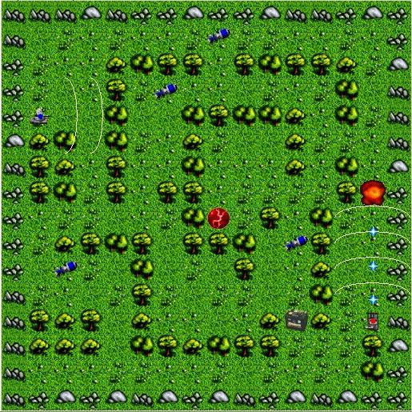
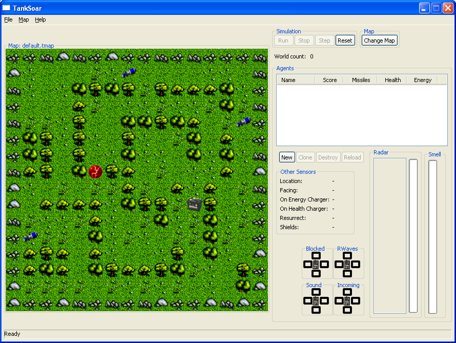
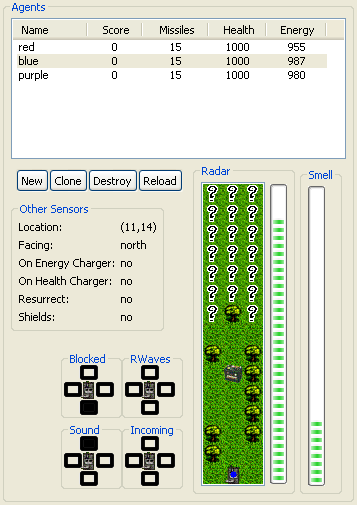
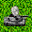
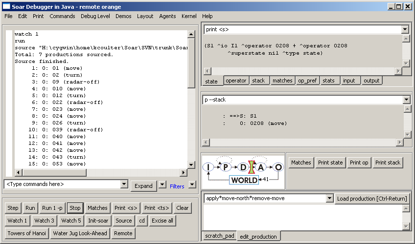
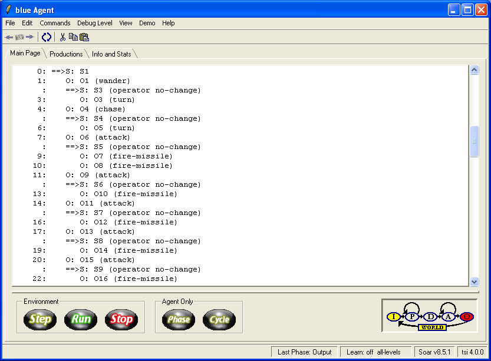

# Part III: Subgoals

This part of the tutorial will teach you to build Soar programs that use
subgoals to dynamically decompose complex problems into simpler
problems. This part starts with a description of TankSoar. This is
followed by an exercise where you will build a simple tank that wanders
about. From there, subgoals and high-level operators are developed. The
intermediate sections teach you to write high-level operators. The end
concentrates on refinements of these operators so that your tank is more
effective.

You should use VisualSoar in developing your tank. The release includes
default datamaps for the input and output links so that you do not have
to define them yourself. You use them by opening the default project and
then using the SAVE AS feature in Visual Soar to save the project under
a new name. You will need to modify the datamap and included rules to
use the new name of your tank (if you desire).

## TankSoar

TankSoar is similar to Eaters in that your Soar program will control a
tank in a grid-based world with walls. However, in TankSoar, your tank
has many more sensors and many more actions than the eaters did. There
are also more interactions between tanks (they shoot at each other), and
all of these factors mean that the TankSoar programs can be much more
complicated than those you developed for Eaters.



Below is an example of the main map in TankSoar.

### Installing and Playing TankSoar

To launch TankSoar, open the directory where you installed it and launch
the appropriate script file (TankSoar.bat on Windows, TankSoar.sh on Mac
or Linux)

Within the top level folder, there will be an
“Agents\\TankSoar\\Tutorial” directory, which is where you will
create directories and files for Soar tanks. (If you installed the
stand-alone version of TankSoar rather than the full tutorial, this
directory will simply be “Agents\\Tutorial”).

After starting TankSoar, you will have a new window on your computer
screen:



This is the TankSoar environment for creating tanks and controlling the
game.

Tanks are created, modified and destroyed much as the Eaters were in
Part 2 of this Tutorial: Press the “New” button in the “Agents” area of
the TankSoar game and follow the dialogs to select productions that will
be loaded when a Tank is created.

## Tank Resources

Each tank has three resources. A summary of these is shown, along with a
score, for each tank to the right of the Map window.

-   _Health_  
    A tank has a maximum of 1000 health points, and dies when its health
    goes to 0. When a tank dies, it is resurrected at a random open
    square with the initial values of all of its resources (health=1000,
    energy=1000, missiles=15). When created, a tank has 1000 health
    points. If a missile hits a tank while its shields are down, its
    health decreases by 400. A tank's health is increased when it sits
    on a healthcharger at a rate of 150 per turn.

-   _Energy_  
    A tank has a maximum of 1000 energy points. A tank's energy is
    decreased when it uses its radar (proportional to the range it has
    set the radar) or when it uses its shields (20 units per turn). A
    tank's energy is increased when it sits on an energycharger at a
    rate of 250 per turn. A tank's energy is decreased by 250 if it is
    hit by a missile while its shields are up. If a tank’s energy goes
    to 0, it will not be able to use its radar or shields until it
    recharges (or dies).

-   _Missiles_  
    A tank starts off with 15 missiles. A tank's supply of missiles is
    increased by 7 when it picks up a pack of missiles. A tank's supply
    of missiles is decreased by one each time it fires a missile.


### Tank Primary Sensors

A tank has six primary sensors for perceiving its world. All of these
sensors are always active, except the radar sensor, which must be turned
on to use. The information from these sensors is made available to a
tank on the input-link. The structure of the input-link augmentation is
shown for each sensor.

-   _Blocked sensor_  
    The blocked sensor detects whether the squares immediately adjacent
    to a tank are blocked or open (yes=blocked, no=open). A square can
    be blocked by an obstacle or by another tank, but the blocked sensor
    gives no information to distinguish between these cases. The blocked
    sensor will be updated on the input link (“blink”) even if the tank
    doesn’t move or if the sensor does not otherwise change.

    ```Soar
    ^blocked
    ^backward yes/no
    ^forward yes/no
    ^left yes/no
    ^right yes/no
    ```

-   _Incoming sensor_  
    The incoming sensor detects whether there is a missile approaching a
    tank at any distance, unless the missile is on the other side of an
    obstacle or tank. It does not detect a tank's own missiles.

    ```Soar
    ^incoming
    ^backward yes/no
    ^forward yes/no
    ^left yes/no
    ^right yes/no
    ```

-   _Radar sensor_

    The radar is functional when a tank has turned the radar on and has
    enough energy to power it. This sensor detects objects in front of
    the tank in a column that is three squares wide. The distance _d_
    which the radar can see is either the current radar setting or the
    number of squares between the tank and the closest blocking object
    (i.e. tank or obstacle) in front of it, whichever is lower. The
    objects visible on the radar are those that are a distance of _d_
    squares or less away from the tank directly in front of it, directly
    in front of one square to the left of it, and directly in front of
    one square to the right of it. Radar also picks up any objects
    directly to the right or left of the tank. Additionally, if the
    effective distance is greater than _d_, i.e. the radar is being
    blocked by an object, then the object(s) _d+1_ squares directly in
    front of this tank is also visible on the radar. Multiple objects in
    the same square are visible if their square is visible. The
    information returned about visible objects is their type and where
    they were seen (e.g. an obstacle 5 squares in front on the left). If
    an object is a tank, then its color is also given.

    ```Soar
    ^radar
    ^energy
    ^distance 0-d
    ^position left/center/right
    ^health
    ^distance 0-d
    ^position left/center/right
    ^missiles
    ^distance 0-d
    ^position left/center/right
    ^obstacle
    ^distance 0-d
    ^position left/center/right
    ^open
    ^distance 0-d
    ^position left/center/right
    ^tank
    ^distance 0-d
    ^position left/center/right
    ^color red/blue/purple/…
    ```

-   _Rwaves sensor_  
     The rwave sensor detects if the radar of another tank is detecting
    the tank from the four directions.

    ```Soar
    ^rwaves
    ^backward yes/no
    ^forward yes/no
    ^left yes/no
    ^right yes/no
    ```

-   _Smell sensor_  
     The smell sensors detects the closest tank, and provides information
    on how close that tank is and what its color is. If there are two or
    more tanks equally close, then one of them is chosen at random. The
    distance is the number of cells in x and y between the two tanks
    (Manhattan distance). Smell penetrates obstacles, so the smelled
    tank may not be the tank that is closest to move to. If there are no
    other tanks, the value of both color and distance will be _none_.

    ```Soar
    ^smell
    ^color none/red/blue/purple/…
    ^distance none/0-28
    ```

-   _Sound sensor_  
     The sound sensor detects the closest tank that moved during the last
    decision, as long as that tank is currently 7 or less squares away.
    If two or more tanks moved during the last decision and are equally
    close, then the sensor chooses one randomly. If a tank is within 7
    squares but did not move during the last decision, it will not make
    a noise and will not be picked up by this sensor. The information
    returned about the closest tank is the direction to move on the
    shortest path toward the sensed tank. If there is more than one
    possible direction, then the sensor chooses one randomly. If there
    is no tank within 7 squares that moved, the sound sensor will have
    value _silent_.

    ```Soar
    ^sound silent/left/right/forward/backward
    ```

You can select a tank by clicking on the tank in the Main Map Window.
The sensors of the selected tank are shown to the right of the Map.



### Tank Secondary Sensors

In addition to the primary sensors, a tank has additional sensors that
give it information about its own state. These sensors are available via
the input-link and are always functional.

-   _Clock_

    Clock is initialized to 1 and is incremented each decision. It is a
    global counter for all tanks and thus, if a tank is created after others
    have run for a while, the initial value will not be 1.
    ^clock 1-N

-   _Direction_

    The direction that the tank is facing: north, east, south, or west. It
    changes when the tank turns.

    ```Soar
    ^direction north/east/south/west
    ```

-   _Energy_

    The current energy level. If energy is 0, the tank will not be able to
    use its radar or shields.

    ```
    ^energy 0-1000
    ```

-   _Energy recharger_

    If a tank is on an energy recharger (battery), this has value yes.
    Otherwise it is no.

    ```
    ^energyrecharger no/yes
    ```

-   _Health_

    The current health level. If health is 0, the tank dies and is
    resurrected at a random square.

    ```
    ^health 0-1000
    ```

-   _Health recharger_

    If a tank is on a health recharger, this has value yes. Otherwise it is no.

    ```
    ^healthrecharger no/yes
    ```

-   _Missiles_

    The number of missiles the tank currently has.

    ```
    ^missiles 0-N
    ```

-   _My-color_

    The color of the tank.

    ```
    ^my-color blue/red/purple/…
    ```

-   _Radar-distance_

    The effective distance of the radar the last time it was used. This is
    the distance that the radar reached before it was blocked. If there were
    no obstacles, it will be the same as the radar-setting.

    ```
    ^radar-distance 1-14
    ```

-   _Radar-setting_

    Radar-setting is the distance that the radar has been set to using the
    radar-power output command.

    ```
    ^radar-setting 1-14
    ```

-   _Radar-status_

    Radar-status tells whether the radar is turned on or not.

    ```
    ^radar-status on/off
    ```

-   _Random_

    A random real number between 0 and 1. It changes every decision.

    ```Soar
    ^random 0.0-1.0
    ```

-   _Resurrected_

    Whenever a tank dies and is resurrected, this has value yes.

    ```Soar
    ^resurrected no/yes
    ```

-   _Shield-status_

    Shield-status tells whether the shields are turned on or not.

    ```Soar
    ^shield-status on/off
    ```

-   _X_

    X is the x location on the map. X goes from 1 (left side) to 14 (right
    side).

    ```Soar
    ^x 1-14
    ```

-   _Y_

    Y is the y location on the map. Y goes from 1 (top) to 14 (bottom).

    ```Soar
    ^y 1-14
    ```

### Tank Actions

A tank has several actions it can perform. All actions are performed by
augmenting the output-link. All actions can be performed in parallel
except for move and rotate.

-   _Move_  
     A tank can move forward, backward, left, or right. Moving is
    mutually exclusive with rotating. If a tank tries to move but is
    blocked, it remains where it is and loses 100 health units. A tank
    may also move in no direction, which indicates a wait action.

    ```Soar
    ^move.direction left/right/forward/backward/none
    ```

-   _Rotate_  
     A tank can rotate left or right. Rotating is mutually exclusive with
    moving. A rotate will never fail (assuming the tank is neither
    killed nor tries to simultaneously move).

    ```Soar
    ^rotate.direction left/right
    ```

-   _Fire_  
     A tank can fire one missile per decision. Firing can be done in
    conjunction with any other action. The missile is fired straight
    ahead in the direction the tank is facing. Firing a missile
    decreases a tank's missile supply by one, and it will fail if a tank
    has no missiles. This failure will be reflected by the tank's
    missile supply remaining zero.

§ `Soar
    ^fire.weapon missile.
    `

-   _Radar_  
     A tank can turn its radar on and off. Turning the radar on will fail
    if a tank does not have enough energy to supply the radar. This
    failure will be reflected in that ^radar-distance will adjust itself
    to the highest actually attainable level.

    ```Soar
    ^radar.switch on/off
    ```

-   _Radar Range_

    A tank can change the range of its radar by using the radar-power
    command. The value can be from 1 to 14. The higher the power setting of
    the radar, the more energy is used.

    ```Soar
    ^radar-power.setting 1-14
    ```

-   _Shields_

    A tank can turn its shields on and off, and this can be done in
    conjunction with any other action. Turning shields on uses 20 energy
    units per decision. It will fail if a tank does not have enough
    energy. The failure will be reflected in that ^shield-status will be
    off.

    ```Soar
    ^shields.switch on/off
    ```

### Types of Game Objects

The following are the objects that can appear on the map:

-   _Obstacles_  
    Obstacles look like trees and they are there to get in the way. They
    never move and they cannot be blown up. There will not be any part
    of the playing field that is inaccessible purely due to wall
    placement. (Part of the playing field could be temporarily
    inaccessible due to a tank blocking the way.)

-   _Healthcharger_  
    There is one healthcharger per map. The healthcharger never moves.
    For each decision a tank stays on a healthcharger, its health is
    increased by 150 minus and any damage it may incur by bumping into
    something.

-   _Energycharger_
    There is one energycharger (battery) per map. The energycharger
    never moves. For each decision that a tank stays on an
    energycharger, its energy is increased by 250 units minus whatever
    energy it uses for its shields and/or radar.

-   _Packs of
    missiles_  
    Packs of missiles are scattered around in random squares. They never
    move of their own accord nor can they be moved. Missiles flying
    through squares with packs of missiles do not hit those packs. Packs
    of missiles are created at random locations and times. A tank can
    pick up a pack of missiles by moving to its square. The pack of
    missiles disappears and the tank's missile supply is increased by 7.

-   _Tanks_  
    Tanks are controlled by TankSoar agents. They do fun stuff like fire
    missiles and move around, as described above.

All objects take up only one square. Obstacles cannot exist in the same
square as any other object. Both chargers will never be in the same
square. A tank cannot be in the same square as a pack of missiles
because it will pick up that pack. All other combinations of objects are
allowed together in a square.

Tanks will never spawn on top of energychargers, healthchargers, or
missile packs.

## Summary of Input-link and Output-link

```Soar
^io
^input-link
^blocked
^backward yes/no
^forward yes/no
^left yes/no
^right yes/no
^incoming
^backward yes/no
^forward yes/no
^left yes/no
^right yes/no
^radar
^energy
^distance 0-13
^position left/center/right
^health
^distance 0-13
^position left/center/right
^missiles
^distance 0-13
^position left/center/right
^obstacle
^distance 0-13
^position left/center/right
^open
^distance 0-13
^position left/center/right
^tank
^distance 0-13
^position left/center/right
^io
^input-link
^rwaves
^backward yes/no
^forward yes/no
^left yes/no
^right yes/no
^smell
^color none/red/blue/purple/…
^distance none/0-28
^sound silent/left/right/

forward/backward
^clock 1-N
^direction north/east/south/west
^energy 0-1000
^energyrecharger no/yes
^health 0-1000
^healthrecharger no/yes
^missiles 0-N
^my-color blue/red/purple/…
^radar-distance 1-14
^radar-setting 1-14
^radar-status on/off
^random 0.0-1.0
^resurrect no/yes
^shield-status on/off
^x 1-14
^y 1-14
^io
^output-link
^move.direction left/right/forward/backward/none
^rotate.direction left/right
^fire.weapon missile
^radar.switch on/off
^radar-power.setting 1-14
^shields.switch on/off
```

### Tank Combat

A tank destroys another tank by hitting it with missiles. A missile can
damage any tank it hits, even the tank that fired it (in the rare case a
tank is killed and recreated in the path of its own missile). Missiles
fly at about 1.3 times as fast as tanks move. A tank that is hit by a
missile while its shields are down has its health decreased by 400
units. If a tank is hit while its shields are up, the tank will not lose
any health but will lose 250 energy units. If a tank is sitting on a
healthcharger or an energycharger when a missile hits it, the tank dies
instantly, no matter what its health level or shield status. This is to
discourage camping out on the chargers during a battle. When a tank is
killed, it is resurrected at a random, unoccupied square on the next
decision.

The scoring of a game is as follows: a tank gets two points for each of
its missiles that hits another tank while its shields are down and three
points for every tank it kills. A tank loses one point for each missile
that hits it while its shields are down, and two points each time it is
killed. This is to encourage aggressive, but not fanatical tactics.
Tanks have an unlimited number of lives. The game ends when one of the
tanks gets 50 points.

If 100 game cycles elapse without any tank firing a missile, then all
tanks are reset as if they had been killed to avoid endless cycles in
agents’ behavior. No tanks incur a penalty for this respawning.

## Tank Scheduler

In Eaters, a new operator was selected on every decision, and every
operator performed an external action, either a move or a jump. In
TankSoar, some of the decisions will not result in new operators being
selected and some operators will perform only internal actions. If we
continue to use the scheduling approach in Eaters in TankSoar, where
each tank would get only one decision before the simulation world is
updated, tanks that are not performing external actions will appear to
just sit in place. This can be quite a disadvantage if a tank is under
attack. To avoid penalizing tanks that are “thinking” a bit, TankSoar
provides an alternative scheduler. With this scheduler, every tank is
run until it generates output commands. Usually this will be a single
decision, but sometimes will be many decisions. To handle cases where a
tank does not attempt to perform an external action given the current
situation, the tank will be run a maximum of fifteen decisions. This
parameter is set by the TankSoar environment.

From this point on, each of your tanks will run until it has produced
new output on the output-link before another tank will run (but the
simulator will not run and change the inputs for other tanks until all
tanks have run). Below is a graphic depiction of how everything works
under this approach with three tanks.

## Simple Wandering Tank

In this section, you will create a tank that wanders around the board
looking for objects. This will help you to get familiar with the
TankSoar software. This tank will be the basis for a more complex tank
you will build later.

Wandering consists of moving around the map, using sensors to avoid
bumping into obstacles and to detect other objects. A tank’s main sensor
for seeing other objects is its radar, which works from the front of the
tank. Therefore, even though a tank can move in all four directions, it
is best to move forward and turn to avoid obstacles. The radar uses up
energy, so it is best to use it sparingly. The simplest thing to do is
to turn on the radar when the tank turns, and turn it off if there is
nothing interesting to see (such as tanks, missiles, the energy
recharger, or the health recharger). One interesting issue is how much
power should be used with the radar. To simplify things, you can always
turn it on to 13, the maximum distance it can see. You will get a chance
to improve your tank later, but for now it is best if it is simple.

This analysis leads to the three operators and the search control
described below:

-   Move: move forward if not blocked.
-   Turn: if front is blocked, rotate and turn on the radar with power 13.
-   Radar-off: if the radar is on and there are no objects visible, turn
    off the radar.
-   If radar-off is proposed, then prefer it to move.

This set of knowledge for wandering is just the start of a more complex
tank, and you will have to add attacking other tanks, picking up
missiles, and recharging later.

The rest of this section goes through the creation of these operator and
search control, step by step. If you feel confident that you can write
these three operators and associated search control by yourself, go
ahead and do it. All of the rules necessary to write the tanks in the
tutorial are in the directory named Agents\\TankSoar\\Tutorial.

Throughout the development of operators for TankSoar, you will use the
general rules that were created in Eaters for copying actions from
operators to the output-link. If you use these rules, many of the
operators will have only proposals.

To get started, create a new agent in Visual-Soar by loading in the
default agent provided in the release and then saving it as a new
project. The default agent includes the general output rules you created
for the Eaters as well as a full data map for the TankSoar input-link
and output-link. It also includes an initialization operator. This
operator adds a name to the top state as the task name, which you should
rename (probably along with the operator itself). For the rest of this
part of the tutorial, we will assume the name of the top state is
tanksoar.

### Move Operator

This operator is very similar to the move operator in Eaters, except
that the sensors for detecting open spaces in front of the tank are in a
different structure than the one in Eaters.

To write the move operator, you should first write comments for operator
proposal. The application of this operator is handled by the general
rules from Eaters section 10.4. You should type these comments into your
file as documentation.

Below is one possible version:

```Soar
# Move Operator Proposal
# If the task is tanksoar and the tank is not blocked in the forward
# direction, propose the move operator.
```

For brevity, we will not include “if the task is tanksoar” in future
English descriptions, although the test for ^name tanksoar will be
included in the rules.

In writing the Soar version of the operator proposal, you can reuse
parts of the rules you wrote in Eaters. One part of those operators that
was a bit tricky was the termination of the operator. In Eaters, we had
to make sure that the proposal would retract after the operator applied.
For Eaters that tested the cells surrounding them, no additional
conditions were required because the contents of these cells changed on
every move. The same holds true in TankSoar. Whenever the tank moves,
the working memory elements that are the attributes of the blocked
sensor change, even if the value is exactly the same. Thus, the proposal
will retract and rematch each time a tank moves.

After writing the proposal rule, you can test it, together with the
general rules, by creating a tank with just those rules. The tank should
move forward until it is blocked.

```Soar
sp {tanksoar*propose*move
(state <s> ^name tanksoar
^io.input-link.blocked.forward no)
-->
(<s> ^operator <o> +)
(<o> ^name move
^actions.move.direction forward)}
```

### Turn Operator

The original definition of the turn operator was:

-   If the front is blocked, rotate and turn on the radar to power 13.

Which direction should the tank turn? A reasonable approach is to turn
left or right only if that direction is not blocked. If both directions
are blocked, the tank can turn in either direction. Once the tank has
turned, it will detect that it should turn again, so that the tank would
turn completely around. Try to write the comments for the proposals. The
turn operators should be indifferent because it is possible to have both
a left and right turn proposed at the same time, and it doesn’t matter
which direction the tank turns.

```Soar
## Turn Operator Proposal
#  If the tank is blocked in the forward direction, and not blocked in the
#  right or left directions, then propose the turn operator for the unblocked
#  direction. Also create an indifferent preference for the operator.
#  This operator will also turn on the radar and set the radar-power to 13.
#  If the tank is blocked in the forward direction, and in both the right or
#  left directions, then propose the turn operator left.
```

After the comments are written, try to write the Soar rules. Once they
are written and debugged, your tank should wander around the map
indefinitely, although it will never turn off its radar and will quickly
run out of energy.

Below are possible rules for proposing the turns.

```Soar
sp {propose\*turn
(state <s> ^name tanksoar
^io.input-link.blocked <b>)
(<b> ^forward yes
^ { << left right >> <direction> } no)
-->
(<s> ^operator <o> + =)
(<o> ^name turn
^actions <a>)
(<a> ^rotate.direction <direction>
^radar.switch on
^radar-power.setting 13)}
```

The propose\*turn rule uses a variable (`<direction>`) to match a
blocked direction with value no, meaning that there is not an object in
the square. That attribute is restricted to match only left and right
because those are the only two directions a tank can rotate. The actions
of the rule are more complex than other rules you’ve written. The action
of this rule creates three different action commands that will be copied
in parallel to the output-link by
apply\*operator\*create-action-command. As a result, the tank rotates,
turns on its radar, and sets the radar-power all at the same time.

Propose\*turn handles the cases where there is an open square to the
left or right. The following rule handles the case when the three
forward directions are blocked. I arbitrarily decided to have the tank
turn left to start turning around. After it rotates left once, the
propose\*turn rule will match and propose a further turn to the left.

```Soar
sp {propose\*turn\*backward
(state <s> ^name tanksoar
^io.input-link.blocked <b>)
(<b> ^forward yes ^left yes ^right yes)
-->
(<s> ^operator <o> +)
(<o> ^name turn
^actions.rotate.direction left)}
```

### Radar-off Operator

In addition to moving and turning, your tank needs to turn off its radar
to conserve energy. You should write a proposal for radar-off, and some
search control so that radar-off is preferred to move.

-   Radar-off: if the radar is on and there are no interesting objects
    visible, turn off the radar. The radar is left on for energy,
    health, missiles, so that the tank can either pick up the object. It
    is left on for tanks so they can be attacked.
-   If radar-off is proposed, then prefer it to move and turn.

The English versions of the rules for this operator are straightforward:

```Soar
## Radar-off Operator Proposal
#  If the radar is on but no energy, health, missiles and tanks visible,
#  then propose the radar-off operator
## Radar-off Search Control
#  If radar-off is proposed, then prefer it to move and turn.
```

The only tricky part of this operator is that there must be a condition
in the proposal that tests that there are not any objects on radar.
Remember that the radar’s input structures are attributes of the radar
augmentation. For every object on radar, there is an augmentation of the
radar object, where the value of the attribute is the type of object:
energy, health, missiles, obstacle, open, and tank. For example, if
there is a tank on radar, the following condition could match it:
`(<s> ^io.input-link.radar.tank)`. You need to write a single condition that
detects if radar _does not_ detect a tank, missiles, energy, or health.
You need to include a test that the radar is on (otherwise, your rule
will turn the radar off when it is already off).

```Soar
sp {propose\*radar-off
(state <s> ^name tanksoar
^io.input-link <il>)
(<il> ^radar-status on

-^radar.<< energy health missiles tank >>)
-->
(<s> ^operator <o> +)
(<o> ^name radar-off
^actions.radar.switch off)}
```

```Soar
sp {select\*radar-off*move
(state <s> ^name tanksoar
^operator <o1> +
^operator <o2> +)
(<o1> ^name radar-off)
(<o2> ^name << turn move >>)
-->
(<s> ^operator <o1> > <o2>)}
```

A different approach is to turn off the radar as part of the move
operator. Turning the radar off can happen in parallel with moving and
turning. It is implemented as an additional action of those operators.

```Soar
sp {apply*move*radar-off
(state <s> ^name tanksoar
^operator <o>
^io.input-link <il>)
(<il> ^radar-status on
-^radar.<< energy health missiles tank >>)
(<o> ^name << turn move >>
^actions <a>)
-->
(<a> ^radar.switch off)}
```

This rule is included in the all folder/directory instead of the
operator rules because it will fire in parallel with other actions.

### Wander Trace

If you create a tank with your wander rules and the radar-off operator
and run it, the trace will look something like this.



Usually turn is followed by radar-off, but whenever there is an object
on radar, the radar will not be turned off until after the tank has
passed that object.

## Wander Operator - Subgoals

The rules you wrote for the previous section could be extended and rules
for chasing and attacking enemy tanks, recharging, and picking up
missiles could be added to make a more complete tank. However, you would
either have to add many more search control rules to keep the wandering
rules from firing during these other activities, or you’d have to modify
the operator proposals. Both approaches are not very appealing. It would
be better if you could package the wander rules and operators into a
unit that can be used when the tank should wander. An alternative but
related problem is that there are high-level activities that a tank can
perform involving complex combinations of low-level actions. One such
set of high-level activities consists of wandering, chasing, attacking,
and retreating. Although these are high-level activities, a tank should
be able to use its knowledge to select between these activities based on
the current situation, just as it selects between different operators.
Both of these problems are handled in Soar by allowing abstract
high-level operators to be implemented in subgoals where a new state is
created that allows low-level operators to be selected in pursuit of the
high-level operators.

The hierarchy of operators you will build looks like the following:

In addition to this hierarchical structure, there will be additional
rules for turning the shields on and off, and remembering sounds. These
rules are independent of the hierarchy – they will be proposed and
applied in any active goal.

This section introduces subgoals by tracing through the proposal,
selection, and application of the high-level operator for wander. In
later sections, you will add other high-level operators for chase,
attack, and retreat.

Visual-Soar makes this easy to do. It allows you to create the abstract
operators, such as wander and chase, and then create suboperators that
are embedded within the abstract operators. See the documentation for
Visual-Soar for details.

The tank you will create will not be the best or smartest tank, but
building it will teach you many new things about Soar.

### Wander Operator Proposal

If you think of wandering as an operator, then in Soar it consists of
rules to propose it and then apply it. When should a tank wander? When
it is not attacking, chasing, or under attack by another tank. Thus,
wandering is an activity to be performed when no other tanks are
detected, or at least threatening. A tank has many senses by which it
can detect other tanks.

-   Blocked: does not tell if an obstacle is a tank, so it not useful
    for deciding to wander.
-   Incoming: indicates that a missile is approaching the tank.
-   Radar: detects exactly where another tank is. However it is limited
    to seeing in front of the tank and can be blocked by obstacles.
-   Rwaves: indicates that another tank can detect the tank from a given
    direction.
-   Smell: detects the closest tank, but that tank may be on the other
    side of a wall.
-   Sound: gives the direction to another tank that is close (seven
    square or less); however it does not work if the other tank has
    stopped moving.

Although rwaves is a very useful sensor in this case, in order to keep
the examples simple it is not included. You will want to add it to your
tank later on. The other sensors for detecting a nearby tank are
incoming, radar, and sound.

```Soar
## Wander Operator Proposal
#  If there is no tank detected on radar, and the sound is silent, and there
#  is no incoming, then propose the wander operator.
```

Translating this into Soar is a bit tricky because there are two tests
for negations (no tank on radar, no incoming), but you should give it a
try.

```Soar
sp {propose\*wander
(state <s> ^name tanksoar
^io.input-link <io>)
(<io> ^sound silent
-^radar.tank
-^incoming.<dir> yes)
-->
(<s> ^operator <o> +)
(<o> ^name wander)}
```

### Impasses and State Creation

All of the previous operators you’ve written have had rules to apply
them. However, wandering is not an activity that is easily represented
by individual rules – it is better represented as the repeated selection
and application of the operators you wrote in Section 2. How does Soar
make it possible to use operators, such as move and turn, to apply a
higher level operator such as wander? To find out, create a tank with
only your wander operator proposal rule. Run it for two steps.


What happens is that Soar detects that there are no rules that match and
can fire when the wander operator is selected, which means that Soar
cannot make progress. In Soar, this is called an _operator no-change
impasse_, because an operator has been selected and there is no new
decision to be made. There are three other types of impasses in Soar.

-   A state no-change impasse is when no operators are proposed for the
    current state.
-   An operator tie impasse is when there are multiple operators
    proposed, but insufficient preferences to select between them.
-   An operator conflict impasse is when there are multiple operators
    proposed, and the preferences conflict.

Whenever an impasse arises, Soar automatically creates a new state (S3
in the trace above). The purpose of this state is to provide a context
for selecting and applying operators to resolve the impasse (in the
case, moving to a state where wander is no longer selected).

Once a substate is created, operators can be selected and applied just
as they are in the original state. These operators can change the local
state, but they can also change the contents of original state (S1) by
modifying the original state directly or by performing external actions
that indirectly lead to changes in sensors, which in turn change the
state. An impasse can also arise in the substate, which then leads to a
stack of states. In the trace above, no operator is proposed in state
S3, so another substate, S4, is created.

To see all of the selected operators and their states, use the
print-stack command. When a substate is created, it has some initial
augmentations that distinguish it from other states. Take a look at the
augmentations for state S3 above by printing S3.


The most important of these is the superstate augmentation, which has as
its value the identifier of the state in which the impasse arose (S2).
You will use this augmentation to match the wander operator and other
structures, such as the input-link and output-link.

The processing in a substate can lead to the creation of structures that
are part of the original state (the superstate). These are called
_results_. In this example, the only results will be output commands for
controlling the tank, but results can be any structure including
operator acceptable preferences, other operator preferences,
elaborations of the state, or changes to the state that are part of an
operator application.

All of the states in working memory are “active” in that rules can fire
for any level – it is not the case that processing in the top state
comes to a halt while the processing goes on in the substate. In fact,
it is the ability of the processing in the original state to start up
that often resolves the impasse and leads to the termination of the
subgoal. For example, in the substate for wander, we will add the
operators for moving and turning. At some point, this may cause the tank
to see and enemy tank, and fire a rule (in the top state) to propose the
attack operator; while at the same time retract the rule that proposed
the wander operator.

Operator no-change impasses are resolved when the current operator is no
longer preferred in the original state (S1 in the trace above). That can
be because either the proposal for the current operator is retracted
(the rule creating the proposal no longer matches), or because of the
set of operator preferences changes so that another operator is
preferred. State no-change impasses are resolved when an operator has
been proposed (with an acceptable preference), so that there is at least
one candidate operator. Tie and conflict impasses are resolved when
sufficient preferences have been created so that the decision procedure
can select an operator.

When the impasse is resolved, the substate is automatically removed from
working memory – it has served its purpose and is no longer needed.
However, all of the results that were created in the subgoal can still
persist. This is important because the results are changes to the
superstate and are usually responsible for eliminating the impasse.
Sometimes the results directly resolve the impasses, such as when a new
preference is created that makes one of the tied operators best, but
sometimes a result only indirectly resolves an impasse, such as a motor
command to a tank that causes it to turn on its radar so it sees an
enemy and decides to attack.

Just as with all other working memory elements, the persistence of
results must be determined by Soar. This is tricky because the rule for
creating a result usually tests structures in a substate that will be
removed once the impasse is resolved. If the result is an operator
proposal, we don’t want to remove the operator when the rule that
created it no longer fires – that would defeat the purpose of the
subgoal. Instead, Soar analyzes what structures had to exist in the
superstate for that result to be produced by recursively _backtracing_
through the conditions of the rule that created the result, finding the
rules that fired in the subgoal that created the working memory elements
that caused the rule to fire, until it finds all of the structures in
the superstate that the result depended on. It collects these together
and forms a _justification_ that is essentially a fully instantiated
rule. It then analyzes the rule to determine the persistence of the
result (i-support or o-support). If it is i-support, then the
justification is maintained until one of its conditions is no longer in
working memory and then the result is retracted. If the justification
gives o-support, then the result is maintained in working memory until
it is explicitly deleted (or removed because it becomes disconnected
from the state).

### Wander Operator Suboperators

As mentioned in the previous section, the wander operator is applied by
selecting and applying operators in the substate. The original rules you
wrote for wander need to be changed because they now need to apply only
if the wander operator is selected. Consider the original move operator:

```Soar
## Move Operator Proposal
#  If the state is named tanksoar and tank is not blocked in the forward
# direction, propose the move operator.

sp {propose*move
(state <s> ^name tanksoar
^io.input-link.blocked.forward no)
-->
(<s> ^operator <o> + =)
(<o> ^name move
^actions.move.direction forward)}
```

This must be modified to include tests for the wander operator as the
superoperator.

```Soar
## Wander: Move Operator Proposal
#  If the wander operator is selected as the superoperator, and tank is not
#  blocked in the forward direction, then propose the move operator.
```

Using what you know about the superstate augmentation, here is what you
might have come up with:

```Soar
sp {wander*propose*move
(state <s> ^superstate.operator.name wander
^io.input-link.blocked.forward no)
-->
(<s> ^operator <o> + =)
(<o> ^name move
^actions.move.direction forward)}
```

Unfortunately, this rule will not match because there is no ^io
augmentation of the substate. Further, the missing io means that the
general rules you wrote to perform the action of this operator by
creating and removing the move action command on the output-link won’t
fire. One approach would be to rewrite this rule so that instead of
testing ^io.input-link… it tested ^superstate.io.input-link… However,
that doesn’t solve the other problem and if there were a deeper
hierarchy, you would have to know exactly how many levels of superstates
there were. An alternative is to copy the io augmentation down to the
state. A simple, general rule can do this and solve both problems.

```Soar
sp {elaborate*state*io
(state <s> ^superstate.io <io>)
-->
(<s> ^io <io>)}
```

This rule copies the io pointer to each new substate. You should add
this rule to your set of general rules.

With this rule, the only change that has to be made to your operator
proposals is to add a test for:
^superstate.operator.name wander. This tests that the _selected_
superoperator is wander. It will not match against any other _proposed_
operators because they will have only acceptable preferences (+). An
alternative approach, which simplifies these operator proposals, and is
consistent with the convention adopted earlier for naming the top state,
is to create a rule that copies the name of the superoperator to the
state, so that your rules can directly test the name on the state:

```Soar
sp {elaborate*state*name
(state <s> ^superstate.operator.name <name>)
-->
(<s> ^name <name>)}
```

This rule is always created by VisualSoar and is in the default set of
rules, so you don’t have to add it. With these two changes, the new rule
is essentially the original, but with the name of the state being tested
changed to wander.

Based on the analysis above, you can now rewrite the proposal rules for
the operators that apply as part of the wander operator. In order to
keep better track of your rules, you should also adopt the convention of
including the name of the state (wander) at the beginning of the name of
the rules.

```Soar
sp {wander*propose*move
(state <s> ^name wander
^io.input-link.blocked.forward no)
-->
(<s> ^operator <o> + =)
(<o> ^name move
^actions.move.direction forward)}
```

```Soar
sp {wander*propose*turn
(state <s> ^name wander
^io.input-link.blocked <b>)
(<b> ^forward yes
^ { << left right >> <dir> } no)
-->
(<s> ^operator <o> + =)
(<o> ^name turn
^actions <a>)
(<a> ^rotate.direction <dir>
^radar.switch on
^radar-power.setting 13)}
```

```Soar
sp {wander*propose*turn\*backward
(state <s> ^name wander
^io.input-link.blocked <b>)
(<b> ^forward yes
^left yes
^right yes)
-->
(<s> ^operator <o> +)
(<o> ^name turn
^actions.rotate.direction left)}
```

### General Rule Summary

Using the rules you’ve written in this section so far, together with the
general rules, your tank should wander around until it encounters
another tank. Below is the complete set of general rules you should have
in your tank. The appropriate place to put them is in the elaborations
folder/directory.

```Soar
sp {apply\*operator\*create-action-command
(state <s> ^operator <o>
^io.output-link <out>)
(<o> ^actions <act>)
(<act> ^<att> <value>)
(<value> ^<att2> <value2>)
-->
(<out> ^<att> <value3>)
(<value3> ^<att2> <value2>)}
```

```Soar
sp {apply\*operator\*remove-command
(state <s> ^operator.actions
^io.output-link <out>)
(<out> ^<att> <value>)
(<value> ^status complete)
-->
(<out> ^<att> <value> -)}
```

```Soar
sp {elaborate*state*io
(state <s> ^superstate.io <io>)
-->
(<s> ^io <io>)}
```

```Soar
sp {elaborate*state*name
(state <s> ^superstate.operator.name <name>)
-->
(<s> ^name <name>)}
```

The trace of your tank should look something like the following, where
wander is selected, and then the move and turn operators are selected
for the substate.


## Chase, Attack, and Retreat

Remember that the hierarchy of operators that you build will look like
the following:

In this section you will write the rules for Chase, Attack, and Retreat.
By now you should know Soar well enough to try to write these on your
own. However, some tricky issues will come up and the rest of this
section will lead you through writing them step-by-step. Even if you do
write the operators yourself, you will find it valuable to go through
the tutorial sections because they introduce a few new ideas in how to
write Soar programs.

### Chase Operator Proposal

The chase operator should be selected when a tank senses that another
tank is close, but it doesn’t know exactly where the other tank is. As
discussed earlier, the sound sensor gives a good indication of whether
another tank is close (if the other tank is moving), but it is not
sufficient for attacking the other tank. If a tank has another tank on
radar, it can attack and need not chase. However, if the tank has no
missiles, or is very low on energy (so it cannot use shields or radar),
it should not chase another tank. Finally, the chase operator should
only be proposed for the top state. If you put all of these together,
you will come up with the conditions for proposing the chase operator.

```Soar
## Propose Chase Operator
#  If the task is tanksoar, and sound sensor is not silent, and there
#  is no tank on radar, and energy or missiles is not low, then propose the
#  chase operator.
```

To write a Soar rule that tests these conditions requires coming up with
a definition of low health and low missiles. You could just pick a
number, such as 100, and test that the energy is not below that number,
but you will have to remember that number when you write other
operators, such as retreat, that handle the cases when the energy is
below that number. You will also include two conditions, one to test
energy and one to test missiles in every rule. A more general approach
is to create rules that test for either the energy levels being low or
no missiles, and create a structure in working memory that can be tested
in the future.

Rules for generating these classifications should be restricted to
firing only in the top state. Otherwise, these rules will fire every
time a new state is created, because the ^io attribute is copied to all
states. It is easy to restrict this to firing only in the top state by
adding the condition: ^name tanksoar.

```Soar
sp {elaborate*state*missiles\*low
(state <s> ^name tanksoar
^io.input-link.missiles 0)
-->
(<s> ^missiles-energy low)}
```

```Soar
sp {elaborate*state*energy\*low
(state <s> ^name tanksoar
^io.input-link.energy <= 200)
-->
(<s> ^missiles-energy low)}
```

These rules have exactly the same action – the same identifier,
attribute, and value. What happens when both rules fire at the same
time? Soar never allows duplicate working memory elements, so although
both rules fire, only one working memory element is created.

The chase proposal then is:

```Soar
sp {propose\*chase
(state <s> ^name tanksoar
^io.input-link <io>

-^missiles-energy low)
(<io> ^sound <> silent

-^radar.tank)
-->
(<s> ^operator <o> +)
(<o> ^name chase)}
```

### Chase Operator Application

The chase operator is applied through the selection of the move and turn
operators. Both operators test the direction of the sound, which can be
accessed directly from the input-link, or to simplify the rules, you can
add an elaboration rule that copies the sound to the local state. For
example, you can add the rule:

```Soar
sp {chase*elaborate*state\*sound-direction
(state <s> ^name chase
^io.input-link.sound <sound>)
-->
(<s> ^sound-direction <sound>)}
```

One advantage of this approach is that if you later change the way in
which the sound direction is computed, only this rule needs to be
modified, and not the ones that test sound-direction. This is exactly
what is going to happen later when we add operators to remember sounds
in Section 5.2.

Since the goal of the chase operator is to get a radar contact with the
enemy tank, the radar should be turned on if it is off, which can be
done in parallel with the other operators. The following rule elaborates
a selected operator with commands to turn on the radar if it is off.

```Soar
sp {chase*elaborate*radar
(state <s> ^name chase
^operator.actions <a>
^io.input-link.radar-status off)
-->
(<a> ^radar.switch on
^radar-power.setting 13)}
```

```Soar
## Propose Move Operator
# If the state is named chase and the sound is coming from the
# forward position, propose move forward.

sp {chase*propose*move
(state <s> ^name chase
^sound-direction forward
^io.input-link.blocked.forward no)
-->
(<s> ^operator <o> +)
(<o> ^name move
^actions.move.direction forward)}
```

```Soar
## Propose Turn Operator
# If the state is named chase and the sound is coming from left or
# right, turn that direction.

sp {chase*propose*turn
(state <s> ^name chase
^sound-direction {<< left right >> <direction>})
-->
(<s> ^operator <o> + =)
(<o> ^name turn
^actions.rotate.direction <direction>)}
```

```Soar
## Propose Turn Operator Backward
## If the state is named chase and the sound is coming from backward, turn left.
sp {chase*propose*backward
(state <s> ^name chase
^sound-direction backward)
-->
(<s> ^operator <o> +)
(<o> ^name turn
^actions.rotate.direction left)}
```

### Attack Operator Proposal

The purpose of the attack operator is to shoot missiles and hit the
other tank. Thus, the attack operator should be selected when a tank can
see another tank on radar. However, if a tank is low on health or
energy, it may be better to retreat instead of attack. As with chase,
the attack operator should only be proposed for the top state. If you
put all of these together, you will come up with the conditions for
proposing the attack operator.

```Soar
## Propose Attack Operator
#  If the state is tanksoar, and there is a tank on radar, and health and energy are not low, then
#  propose the attack operator.
```

The above proposal can be written as a single rule. There should be an
indifferent preference for the operator because there can be more than
one tank on the radar and thus, more than one operator instantiation
created.

```Soar
sp {propose\*attack
(state <s> ^name tanksoar
^io.input-link.radar.tank

-^missiles-energy low)
-->
(<s> ^operator <o> + =)
(<o> ^name attack)}
```

An alternative approach that avoids the possibility of multiple
instantiations is to have an elaboration rule that detects when there is
a tank on radar and creates and augmentation of the top-state, something
like ^tank detected. Even if there are multiple tanks, only one
augmentation will be created (working memory is a set). Then a proposal
rule can be written that test that augmentation and proposes a single
attack operator.

### Attack Operator Application

The attack operator is applied through the selection of the move, turn,
and fire operators.

-   If an enemy is on radar in the center, the tank can just fire a
    missile.
-   If an enemy is off center and in front, the tank should move to the
    left or right to get an open shot.
-   If it can’t slide because it is blocked, the tank should move
    forward.
-   If the enemy is right next to the tank, it should turn.

If you want your tank to be aggressive, it could move and shoot in one
operator.

```Soar
## Propose Fire-missile Operator
# If the state is attack and there is a tank on radar in the center, then propose the fire missile operator.

sp {attack*propose*fire-missile
(state <s> ^name attack
^io.input-link <il>)
(<il> ^radar.tank.position center
^missiles > 0)
-->
(<s> ^operator <o> + >)
(<o> ^name fire-missile
^actions.fire.weapon missile)}
```

The number of missiles is tested so that the action will be attempted
only if there are missiles available. This operator needs a best
preference so that is preferred to the following operators.

```Soar

## Propose Slide Operator If the state is attack and there is a tank on radar
# that is not in the center, and there is not a tank in the center, and there is
# an open spot in the direction of the tank, then propose the slide operator in
# the direction of the tank.

sp {attack*propose*slide
(state <s> ^name attack
^io.input-link <input>)
(<input> ^blocked.<dir> no
^radar <r>)
(<r> ^tank.position { << left right >> <dir> }
-^tank.position center)
-->
(<s> ^operator <o> + =)
(<o> ^name slide
^actions.move.direction <dir>)}
```

This operator must be indifferent in case there is more than one tank on
radar.

```Soar
## Propose Move-Forward Operator
#  If the state is attack and there is a tank on radar that is not in the center, and there is not a tank in the
#  center, and the tank is blocked in that direction then propose move-forward.

sp {attack*propose*move-forward
(state <s> ^name attack
^io.input-link <input>)
(<input> ^blocked.<dir> yes
^radar <r>)
(<r> ^tank <t>
-^tank.position center)
(<t> ^position { << left right >> <dir> }
^distance <> 0)
-->
(<s> ^operator <o> + =)
(<o> ^name move-forward
^actions.move.direction forward)}
```

The final condition tests that the opposing tank is not at distance 0,
which would be true if the opposing tank were immediately next to the
tank under control. In that case, the tank should turn and fire on the
enemy tank. That operator is proposed in the next rule.

```Soar
### Propose Turn Operator
## If the state is attack and there is a tank on radar that right next to the tank, then propose turning in that
## direction and firing.

sp {attack*propose*turn
(state <s> ^name attack
^io.input-link.radar.tank <tank>)
(<tank> ^distance 0
^position { << left right >> <dir> })
-->
(<s> ^operator <o> + =)
(<o> ^name turn
^actions <a>)
(<a> ^rotate.direction <dir>
^fire.weapon missile)}
```

This rule has two actions: rotating and firing a missile. In TankSoar,
both actions will happen during the same decision, but the rotate will
occur first, followed by firing the missile. This has nothing to do with
the order of the actions, but is a feature of TankSoar.

### Retreat Operator Proposal

The purpose of the retreat operator is to get the tank out of harm’s way
when it is low on missiles or energy. Thus, the retreat operator should
be selected when a tank has low missiles or energy and it senses that
there is another tank near. As discussed earlier, the sound and radar
indicates if another tank is close, while the incoming sensor tells if
the tank is under attack. Another situation in which the tank can
retreat is when it is under attack, but does not detect the enemy tank
so that it can attack or chase it. As with chase, the retreat operator
should only be proposed for the top state. If you put all of these
together, you will come up with these conditions for proposing the
retreat operator.

````Soar
# Propose Retreat Operator
# If the state is tanksoar and the sound sensor is not silent or there is a tank on radar or there is an
# incoming missile, and health is low or the energy is low, then propose the retreat operator.
```Soar

The above proposal cannot easily be written as a single rule, but can be
written as three rules. Since more than one of these conditions can be
true at a given time, these proposals should be indifferent.

```Soar
sp {propose\*retreat\*sound
(state <s> ^name tanksoar
^missiles-energy low
^io.input-link.sound {<direction> <> silent})
-->
(<s> ^operator <o> + =)
(<o> ^name retreat)}
````

```Soar
sp {propose\*retreat\*radar
(state <s> ^name tanksoar
^missiles-energy low
^io.input-link.radar.tank)
-->
(<s> ^operator <o> + =)
(<o> ^name retreat)}
```

```Soar
sp {propose\*retreat\*incoming
(state <s> ^name tanksoar
^missiles-energy low
^io.input-link.incoming.<dir> yes)
-->
(<s> ^operator <o> + =)
(<o> ^name retreat)}
```

```Soar
# Propose Retreat Operator
# If the state is tanksoar and the tank is under attack but cannot not directly sense the other tank, then
# propose the retreat operator.

sp {propose\*retreat\*incoming\*not-sensed
(state <s> ^name tanksoar
^io.input-link <io>)
(<io> ^incoming.<dir> yes
-^radar.tank
^sound silent)
-->
(<s> ^operator <o> + =)
(<o> ^name retreat)}
```

### Retreat Operator Application: State Elaboration

In applying the retreat operator, the direction of the enemy is
important in deciding which way to move. That is, the tank should
attempt to move out of the line of possible fire from another tank
(side-step), or if that cannot be done, move away until a sidestep
action is possible. It is easy to determine the direction for sound, but
is subtle for radar. In radar, the general direction of the enemy is
forward, but if the enemy is off center, the tank should not move in
that direction, because that is probably right in the line of fire. In
addition, there might be multiple tanks around, some detected via sound,
some via radar, so that multiple directions need to be avoided. To
handle this, you can add rules that elaborate the substate that has been
created with the directions that enemies are detected, and directions
that should be avoided (if an enemy is off center on radar).

In this case the following operator elaborations would be useful.

```Soar
# Retreat Operator Elaboration
# If there is a retreat state and there is a sound coming in a given direction, record that direction.
# If there is a retreat state and there is radar contact with a tank, record forward direction.
# If there is a retreat state and there is an incoming, record the direction.
# If there is a retreat state and there is radar contact with a tank that is not in the center, record
# that direction as a direction to avoid moving.

sp {elaborate\*retreat\*sound\*direction
(state <s> ^name retreat
^io.input-link.sound { <> silent <direction> })
-->
(<s> ^direction <direction>)}
```

```Soar
sp {elaborate\*retreat\*radar\*front
(state <s> ^name retreat
^io.input-link.radar.tank)
-->
(<s> ^direction forward)}
```

```Soar
sp {elaborate\*retreat\*incoming\*direction
(state <s> ^name retreat
^io.input-link.incoming.<dir> yes)
-->
(<s> ^direction <dir>)}
```

```Soar
sp {elaborate\*retreat\*radar\*direction
(state <s> ^name retreat
^io.input-link.radar.tank.position { <dir> <> center })
-->
(<s> ^avoid-direction <dir>)}
```

Many of these rules may fire at the same time, and in some cases,
attempt to create exactly the same working memory element, such as if
sound is coming from the front and there is a tank on radar in the
front. As mentioned earlier, only a single copy of an identifier,
attribute, and value will be added to working memory. However, if the
values will be different, such as if there is sound coming from the
right when a tank is on radar in front, all elements with different
values will be added to working memory.

An important component of Soar is that if changes to working memory make
these rules no longer match, the structures they create will be removed
and recomputed as new sensor information becomes available.

### Retreat Operator Application

The retreat operator is applied through the selection of the move
operators. Since the goal of the retreat operator is to get away from
another tank, the move operator is selected to be a sidestep from the
direction of any sensed tank. The direction of the sidestep should not
be toward another tank, or in a direction that was recorded to avoid. If
there are no good choices available, there are a few possibilities, but
to keep things simple, just have the tank wait and be silent, and hope
the other tank goes away.

```Soar
# Propose Move Sidestep Operator
# If the state is named retreat then propose sidestep from the direction of a detected enemy, as
# long as that direction is not blocked, is not the direction of another enemy or is a direction to avoid.
#
# Propose Wait
# If the state is named retreat then propose wait, and make a worst preference for it.
```

Calculating the direction for the sidestep operator is similar to some
of the calculations that needed to be performed in the Eater. As before,
you can add a data structure to working memory. This data structure has
to contain each direction, and then the two directions that are adjacent
to it. For example, the forward direction would have left and right. You
have a choice of creating this data structure for the top-level state
when the tank is created, or creating it each time that a retreat state
is generated. It is more efficient to generate it only once for the top
state; however that means you need to access it via the ^superstate
augmentation.

```Soar
sp {elaborate\*sidestep-directions
(state <s> ^name tanksoar)
-->
(<s> ^side-direction <sd>)
(<sd> ^forward right left ^backward right left
^right forward backward ^left forward backward)}
```

The actions of this rule have multiple values for a single attribute.
This can be written in a shorthand form without repeating the attribute.

```Soar
sp {retreat*propose*move
(state <s> ^name retreat
^direction <dir>
^superstate.side-direction.<dir> <ndir>
-^direction <ndir>
-^avoid-direction <ndir>
^io.input-link.blocked.<ndir> no)
-->
(<s> ^operator <o> + =)
(<o> ^name move
^actions.move.direction <ndir>)}
```

### Shield Control Rules

Turning on shields is the main defensive mechanism available to a tank.
However, it is quite expensive in terms of energy, so it should be used
only if under attack or when the risk of attack is high. To simplify
things, you will only turn on your shields when under attack, and will
turn off the shields if not under attack. Therefore turning on the
shields is a reflex action that should happen as soon as possible. It
does not have to be open to deliberate consideration, and therefore can
be encoded as a rule instead of an operator. In a later section, you
will learn how to use Soar’s learning mechanism so that these can be
written as operators, but then be compiled into rules.

How should the rule for turning the shields on be written? The obvious
choice is to test the incoming sensor and directly modify the
output-link; however, adding directly to the output link can cause a
subtle problem. The problem arises when tanks are used in competitive
tournaments with the “Run Until Output Generated” flag set. This flag is
set in the Tank Control Window, under the Tanks menu item. When set,
each tank is run until it has generated output (with a limit of fifteen
decisions). Usually a tank will run only a single decision, but if the
tank is changing between wandering and attacking, a few decisions might
be made before output is generated. However, if shields are turned on
and off via actions directly to the output-link, output will be
available during the first decision. In some cases, such as changing
from wander to attack, another action could have been generated if the
shield command waited until other output was ready. The simplest way to
do this is have the shield commands piggyback on other operators that
have actions. Each rule tests that the operator has an ^actions
augmentation and adds its command.

```Soar
sp {elaborate\*shields-on
(state <s> ^operator.actions <a>
^io.input-link <il>)
(<il> ^incoming.<dir> yes
^shield-status off)
-->
(<a> ^shields.switch on)}
```

```Soar
sp {elaborate\*shields-off
(state <s> ^operator.actions <a>
^io.input-link <il>)
(<il> -^incoming.<dir> yes
^shield-status on)
-->
(<a> ^shields.switch off)}
```

### Wait Operator

There is one more operator that is included in the simple tank. This is
the wait operator that is in the all folder/directory, and is useful in
almost every task, not just controlling toy tanks. The wait operator is
proposed whenever there is a state no-change impasse. A state no-change
impasse arises when no operators are proposed. This can happen because
of a bug in your program. If there were no wait operator, Soar would
generate a cascade of state no-change impasses. The wait operator is
proposed whenever there is a state no-change.

```Soar
# Propose wait for a state-no-change

sp {top-state*propose*wait
(state <s> ^attribute state
^choices none
-^operator.name wait)
-->
(<s> ^operator <o> +)
(<o> ^name wait)}
```

This proposal tests that the state has ^attribute state and ^choices
none. Those attributes on the state are created when no operator can be
selected for a state – a state no-change impasse. The key to the wait
operator is that it tests to see that a wait operator is not selected.
Thus, once one is selected, the proposal no longer matches and retracts,
but then will get reproposed during the next proposal cycle.

### Review of Simple Tank

After writing your tank, it is a good idea to take a step back and do a
little analysis to make sure that your have operators to cover all of
the situations your tank can get into. In this section, we will examine
the high-level operators, but you should also examine the sets of
operators used to implement each of these operators. Here is a list of
all of the conditions covered by the different operator proposals

Wander: 1. sound silent, no tanks on radar, no incoming missile
Attack: 2. not missiles-energy low, tank on radar
Chase: 3. not missiles-energy low, not sound silent, no tank on radar
Retreat: 4. missiles-energy low, not sound silent
5\. missiles-energy low, tank on radar
6\. missiles-energy low, incoming missile
7\. sound silent, no tanks on radar, incoming missile

We can map these on to a decision tree that successively splits on
different conditions and see if all of the leaves of the tree are
covered. This is a brute-force approach and is not practical when there
are a large number of different condition elements being tested.

The conditions include: sound, tanks on radar, incoming missiles, and
missiles-energy low. Therefore we expect to have a four-level tree with
sixteen leaves. Although we have only seven rules, these may cover all
sixteen leaves because many rules don’t test all four conditions. To
build the tree, I picked the following condition ordering:
missile-energy, sound silent, tank on radar, and incoming missiles. Each
branch in the tree is labeled with the rules that can potentially match
it. The letters in the nodes signify which operator will be selected
(a=attack, c=chase, r=retreat, w=wander). The complete tree does not
have to be generated if all of the remaining rules for a node propose
the same operator and one of them does not test any additional features.
For example, (missiles-energy low, not-sound silent) is covered by rules
4, 5, and 6, and rule 4 does not test any additional conditions.

### Trace of a Simple Tank

When all of the rules have been put together, you will have a tank that
can wander, chase, attack, and retreat. If you have two of these fight
against each other, you might get a trace like the following:

One of the things you immediately notice is that when the tank decides
to chase another tank it gives up on the next decision and goes back to
wander. This is because the other tank is probably doing the same thing
and stops moving for one decision, and so the sound sensor goes to
silent. However, once a tank does see another, it fires a lot of
missiles. Both of these should give you ideas for improving your tank.
The next section explores how to avoid the problem with the disappearing
sound.



## Improving Sound Detection

The most obvious problem with your tank is that it loses track of other
tanks whenever the other tanks stop moving. To eliminate this problem,
you can modify the rules in your tank so that when there is a sound, the
tank creates a persistent memory of the direction of that sound so that
it can chase the other tank, even if the other tank stops moving. Adding
the persistent data structure requires adding new operators and changing
all of the rules that test for sound directly from the input-link.
Because of these extensive changes, you probably want to save you
current tank and create a copy of it to modify. All of the changes in
this section are incorporated in the Tutorial/simple-sound-bot agent.

Even if you are not interested in improving your tank, you should read
this section because it covers some of the complexities in Soar that
arise when creating persistent data structures in subgoals.

To create and remove the sound data structure requires at least two new
operators.

-   Record-sound: create the sound data structure when a new sound is
    heard.
-   Remove-sound: remove the sound data structure if the direction of
    sound changes or if the recorded sound has expired.

You can write an operator to directly update the sound data structure if
it changes, instead of removing it and adding a new one, but the
approach taken here will minimize the number of rules you need to write.

The first step in adding these operators is to determine where sound is
used and when it needs to be recorded. Sound affects the selection of
the wander, retreat, and chase operators, so any persistent structure
must be available on the top state. Sound needs to be recorded during
wander, where it triggers a shift to chase. Thus you should add
record-sound to the wander operator. Remove-sound should be selected if
a sound changes directions or becomes out of date, no matter which
top-level operator is selected. Thus, you should create
remove-sound.soar in the all folder/directory.

### Record-sound Operator

Proposing the record operator must test that there is a sound on the
input-link.

```Soar
sp {wander*propose*record-sound
(state <s> ^name wander
^io.input-link.sound <> silent)
-->
(<s> ^operator <o> + > =)
(<o> ^name record-sound)}
```

A best preference is used so that it will be immediately selected so the
sound can be recorded.

The rule to apply the operator must test that record-sound is the
current operator and the direction of the sound. It should also test the
current clock so that it can compute a time at which the sound
“expires”, meaning that the sound should be removed. I use 5 because
it is long enough for the tank to turn around and get its radar on to
hunt for the other tank. Finally, the rule needs to match the superstate
because sound data structure is going to be added to it. The sound
structure must be added to the superstate because the substate may
disappear, destroying all structures attached to it. Below is an initial
version of the apply rule.

```Soar
sp {wander*apply*record-sound
(state <s> ^operator.name record-sound
^io.input-link <il>
^superstate <ss>)
(<il> ^sound <direction>
^clock <clock>)
-->
(<ss> ^sound <sd>)
(<sd> ^direction <direction>
^expire-time (+ <clock> 5))}
```

One problem with this rule is that it records the direction of the sound
in terms of forward, left, right, or backward (that is what the sound
sensor gives). This becomes a problem if the tank decides to turn and
face in the direction of the sound (the tank will seem to chase its
tail). A better approach is to record the absolute direction of the
sound: north, east, south, or west. You can add an elaboration rule that
computes the relative direction of the sound (forward, right, backward,
left) in chase where it is needed.

To compute the absolute direction requires creating a data structure in
working memory that maps relative to absolute directions. This can be
matched using the tanks current absolute direction (given on the
direction input-link structure), and the relative direction from the
sound input-link structure.

```Soar
sp {elaborate\*directions
(state <s> ^superstate nil)
-->
(<s> ^direction-map <dm>)
(<dm> ^north <north>
^south <south>
^west <west>
^east <east>)
(<north> ^right east ^left west ^backward south ^forward north)
(<south> ^right west ^left east ^backward north ^forward south)
(<west> ^right north ^left south ^backward east ^forward west)
(<east> ^right south ^left north ^backward west ^forward east)}
```

The direction-map structure provides a mapping between the current
absolute direction, a relative direction, and a new absolution
direction. For example, if a tank is facing north and the relative
direction is left, then ^direction-map.north.left has value west.

```Soar
sp {wander*apply*record-sound
(state <s> ^operator.name record-sound
^io.input-link <il>
^superstate <ss>)
(<il> ^sound <rel-sound>
^direction <direction>
^clock <clock>)
(<ss> ^direction-map.<direction>.<rel-sound> <abs-sound>)
-->
(<ss> ^sound <sd>)
(<sd> ^absolute-direction <abs-sound>
^expire-time (+ <clock> 5))}
```

Although the absolute direction of the sound is recorded, when chasing a
tank, the relative direction of the sound is more useful. Since it is
only needed in the implementation of chase, it only needs to be computed
there. You may remember that all of the rules that propose operators to
apply chase do not directly test the direction of the sound on the
input-link. Instead, the input-link.sound was copied onto the chase
state. Thus, to use the recorded sound, all you have to do is replace
the elaboration rule in chase/elaborations.soar with one that computes
the relative direction of the sound instead of copying the sound from
the input-link. The direction-map structure can be used to do this
calculation, which involves going from the current absolute direction of
the tank, the absolute direction of the sound, to a relative direction
of the sound. For example, if the tank is facing north, and the sound is
known to be west, you can match: `direction-map.north.<rel-sound> west`,
where `<rel-sound>` would match left.

```Soar
sp {chase*elaborate*state\*sound-direction
(state <s> ^name chase
^superstate <ss>)
(<ss> ^sound.absolute-direction <abs-sound>
^direction-map.<direction>.<rel-sound> <abs-sound>
^io.input-link.direction <direction>)
-->
(<s> ^sound-direction <rel-sound>)}
```

### Remove-sound Operator

The sound data structure will persist on the top-state until it is
removed; therefore, another operator must be created to remove it. This
operator should be proposed whenever the time has expired. This could
happen in almost any substate, so it is wise to store this operator in
the all directory.

Testing that the time has expired requires comparing the time stored on
the sound data structure to the current clock. The proposal is simply:

```Soar
sp {all*propose*remove-sound
(state <s> ^name << wander chase retreat attack >>
^superstate.sound.expire-time <clock>
^io.input-link.clock > <clock>)
-->
(<s> ^operator <o> + =, >)
(<o> ^name remove-sound)}
```

One might be tempted to not even test for the name of the state in the
proposal given that it can apply in every state. However, testing the
substate name indirectly influences the persistence of the result of the
substate. This is a complex explanation that starts with the action of
remove-sound, which is to create a reject preference for the sound data
structure _on the top-state._ Although this action is part of the
remove-sound operator, it is also a result of the substate/impasse
created when a high-level operator was selected (wander, chase, retreat,
or attack). When results are created, Soar computes their persistence
(o-support or i-support) based on how they contribute to problem solving
_at the level to which they are returned._ In Soar, this involves
determining if the result is part of applying an operator at that level,
which requires determining if an operator at that level was tested in
generating the result.

Soar determines which working memory elements were tested by recursively
tracing back from the result, through all of the rules that fired in the
subgoal and created structures that were tested in generating the
results. The figure below shows a trace of the problem solving in the
subgoal where elaborate*state*operator\*name tests (S1 ^operator O7)
and (O7 ^name chase) in creating (S8 ^name chase). Additional rules
fire, testing the working memory elements, some of which exist in the
superstate, and some which exist in the substate. Finally (S1 ^sound S5
-) is generated as a result. The trace starts with the result and
proceeds backward, picking up all of the working memory elements from
the superstate that were tested along the way. These are all underlined
in the figure. If additional rules fired in the substate, but did not
create results that contributed to the creation of (S1 ^sound S5 -),
they would not be included in the trace.

<span class="underline">(S1 ^operator O7)</span>

<span class="underline">(O7 ^name chase)</span>
(S8 ^name chase)

From this trace, Soar generates a _justification_, which is essentially
a rule that tests data structures that were in working memory before the
impasse arose, and whose action is the result. The justification does
not have any variables and includes tests for specific identifiers in
working memory. (Soar’s chunking mechanism replaces the identifiers in
justifications with constants to build new rules.) In this case the
justification would be:

```Soar
(S1 ^operator O7)
(O7 ^name chase)
(S1 ^sound S5)
(S5 ^expire-time 20)
(S1 ^io I1)
(I1 ^input-link I2)
(I2 ^clock 21)
-->
(S1 ^sound S5 -)
```

The justification is analyzed to determine if the result should get
o-support or i-support. If the justification tests the operator, as it
does in this case, then the result gets o-support. If the justification
does not test the operator, the result gets i-support. If a result gets
i-support, it is removed from working memory when any of the elements
tested in the conditions of the justification are removed from working
memory.

Getting back to remove-sound, if the proposal for remove-sound does not
test the name of the substate, the test for the operator in the
superstate would not be included, making it independent of any operator
application and the result would get i-support. However, if the proposal
for remove-sound tests the name of the substate, the result is dependent
on the selection of the operator, and the result will get o-support.

This aspect of Soar is pretty complex and might have you wondering if
you will be able to figure out how to create results with the right
persistence. In general, you will find that all of the results you
create in operator application substates should be o-supported, and they
will as long as all of the rules that propose operators in the substate
test the name of the substate. If you ever have an operator that should
apply in a subgoal, but create an i-supported result, all you need to do
is not test the name of the substate.

Applying remove-sound is pretty straightforward. All that needs to be
done is remove the sound data structure from the top-state, which in
this case is the superstate.

```Soar
sp {all*apply*remove-sound
(state <s> ^operator.name remove-sound
^superstate <ss>)
(<ss> ^sound <sd>)
-->
(<ss> ^sound <sd> -)}
```

With just the record-sound and remove-sound operators, your tank will
now correctly maintain sound even when another tank stops moving. To
take advantage of this requires modifying the proposal conditions for
wander, retreat, and chase. For example, the original proposal for chase
was:

```Soar
sp {propose\*chase
(state <s> ^name tanksoar
^io.input-link <io>
-^missiles-energy low)
(<io> ^sound <> silent

-^radar.tank)
-->
(<s> ^operator.name chase)}
```

The test for sound not being silent on the input-link is replaced for a
test that the sound data structure exists, which involves just testing
that the sound attribute is on the state.

```Soar
sp {propose\*chase
(state <s> ^name tanksoar
^sound
-^io.input-link.radar.tank
-^missiles-energy low)
-->
(<s> ^operator.name chase)}
```

You may wish to refine the management of the sound data structure so
that if the direction changes on the input-link, the sound data
structure is removed. This is done by adding another proposal rule for
remove-sound. This rule needs to match against the current sound
direction, which is relative, and the saved sound direction, which is
absolute, so some conversion is necessary.

```Soar
sp {all*propose*remove-sound\*changed-direction
(state <s> ^name << wander chase retreat attack >>
^superstate <ss>
^io.input-link <il>)
(<ss> ^sound.absolute-direction <abs-sound>
^direction-map.<direction>.<rel-sound> <abs-sound>)
(<il> ^sound { <> silent <> <rel-sound> }
^direction <direction>)
-->
(<s> ^operator <o> + =, >)
(<o> ^name remove-sound)}
```

A further refinement you can make is to add an operator that updates the
direction of the sound instead of removing the sound data structure.

## Creating a Map

As your tank wanders around, it can build a map of its world that it can
later use to find the chargers or better control its radar. In this
section, you will learn how to create a map. This section is less of a
tutorial than an explanation of the code in the mapping-bot. The
mapping-bot continually builds up the map no matter which operator is
selected at the top level. The mapping-bot is the same as the
simple-sound-bot, but with additional code.

### The Map Data Structure and Initialization

The map is a structure that must be stored and updated while the tank is
playing the game. In the mapping-bot the map is stored in working memory
as large graph structure off the top state. This approach is not the one
to take to model human processing, but it is a straightforward approach
for building a tank. The map consists of a 16 x 16 grid of squares. The
size is 16 x 16 instead of 14 x 14 because it includes the borders as
well as the spaces where the tank can move. The map is generated by the
init-map operator, which is proposed and selected at the beginning of a
run. It is proposed with a _best_ preference, so that it will be
preferred over the other operators. Once init-map is selected, it
creates the map structure:

```Soar
sp {apply\*init-map
(state <s> ^operator.name init-map)
-->
(<s> ^map <m>)
(<m> ^square <s0-0> <s0-1> <s0-2> …)
(<s0-0> ^x 0 ^y 0)
(<s0-1> ^x 0 ^y 1)
(<s0-2> ^x 0 ^y 2)

…}
```

Each square is initialized with its x and y location, which is the
minimal information required to distinguish between the squares.
Additional information and structure is required so that it is easy to
access squares that are adjacent to the current square, and so it is
easy to add information to the squares, such as that a square contains a
recharger, tank, missile, or an obstacle, or that the square is clear.
To make access of adjacent squares easier, we need to compute which
squares are adjacent and then add augmentations between squares. The
north and south adjacent squares have the same x value, but differ in y
by one. Similarly the west and east adjacent squares have the same y
value but differ in x by one. Thus, by adding one to the x value of
every square we can find the square to the east, and by adding one to
the y value, we can find the square to the south (we assume 0, 0 is in
the upper left (north west) corner). We can then create east-west and
north-south links between pairs of states. That is exactly what the
following two rules do for east-west (there is a similar pair for
north-south).

```Soar
sp {top-ps*apply*init-map\*add-adjacencies\*east
(state <s> ^operator.name init-map
^map.square <sq>)
(<sq> ^x { < 15 <x> })
-->
(<sq> ^east-x (+ <x> 1))}
```

```Soar
sp {top-ps*apply*init-map\*add-adjacent\*link\*east
(state <s> ^operator.name init-map
^map.square <sq1> <sq2>)
(<sq1> ^y <y> ^east-x <x>)
(<sq2> ^y <y> ^x <x>)
-->
(<sq1> ^east <sq2>)
(<sq2> ^west <sq1>)}
```

Another initialization that is done at this time is to mark all of the
squares that are on the border as obstacles. This is done by matching
all squares with x or y coordinates of 0 or 15 and then adding the
obstacle \*yes\* augmentation to them. Below is an example for the x
with value 15:

```Soar
sp {map\*mark-obstacle\*x15
(state <s> ^operator.name init-map
^map.square <sq>)
(<sq> ^x 15)
-->
(<sq> ^obstacle \*yes\*)}
```

So during init-map, the map is created and then all of the squares are
linked via north, south, east, and west attributes. Needless to say,
there are a large number of additions to working memory during the
application of init-map.

### Updating the Map

In order to use and update the map, the agent must know which square on
the map it is at. The easiest way to do this is to match the agent’s
current x, y location from the input-link to all of the squares and then
create a link (named ^square) off the top state to the one that matches.
This is a simple elaboration that is retracted and refired each time the
agent moves.

```Soar
sp {all\*map\*current-square
(state <s> ^name tanksoar
^io.input-link <il>
^map.square <cs>)
(<il> ^x <x>
^y <y>)
(<cs> ^x <x>
^y <y>)
-->
(<s> ^square <cs>)}
```

Once there is a current square, the next step is to update the internal
map with any information that is available from the radar. This is a bit
tricky because the radar gives information relative to the agent and
does not give the absolute x, y coordinates of objects that are seen.
For example, if there is a tank detected on radar, its position will be
given as a distance (in the direction the agent is facing), and either
left, right, or center, meaning that it is either in line (center) or
one space left or right of center. A rule must translate from that type
of information into x, y. This can be done by creating a data structure
in working memory that contains the right information for changes in x
and y for each possible heading of the agent. In the mapping-bot, it is
the radar-map data structure and it is created in elaborations/top-state
as part of the elaborate\*directions rule. Below is the structures that
are created as part of radar-map:

```Soar
-->
(<s> ^radar-map <dirp>)
(<dirp> ^north <northp>
^south <southp>
^west <westp>
^east <eastp>)
(<northp> ^center <cr> ^right <nr> ^left <nl> ^sx 0 ^sy -1)
(<southp> ^center <cr> ^right <sr> ^left <sl> ^sx 0 ^sy 1)
(<westp> ^center <cr> ^right <wr> ^left <wl> ^sx -1 ^sy 0)
(<eastp> ^center <cr> ^right <er> ^left <el> ^sx 1 ^sy 0)
(<cr> ^x 0 ^y 0)
(<nr> ^x 1 ^y 0)
(<nl> ^x -1 ^y 0)
(<sr> ^x -1 ^y 0)
(<sl> ^x 1 ^y 0)
(<wr> ^x 0 ^y -1)
(<wl> ^x 0 ^y 1)
(<er> ^x 0 ^y 1)
(<el> ^x 0 ^y -1)}
```

For each direction, there is a substructure. For that substructure,
there are center, left, and right objects, each of which contains
displacements for x and y so that the coordinate can be computed
correctly. In addition, get direction object contains an sx and sy
augmentation that is used via multiplication to determine the
displacement of the distance from the agent’s current position. If the
agent is facing north or south, sx is 0, so there is no x component to
the distance, and the sy is either 1 or –1 depending on whether the
agent is facing south or north.

This structure is then used in rules that compute the x, y location of
objects seen on radar.

```Soar
sp {map\*mark-object
(state <s> ^name tanksoar
^map <m>
^io.input-link <io>
^square <cs>
^radar-map.<dir> <dirr>)
(<dirr> ^<pos> <pss>
^sx <sx>
^sy <sy>)
(<pss> ^x <dx>
^y <dy>)
(<io> ^radar.{ <type>

<< health energy obstacle open missiles tank >> } <ob>
^direction <dir>)
(<ob> ^distance <d>
^position <pos>)
(<cs> ^x <x>
^y <y>)
-->
(<m> ^<type> <obs>)
(<obs> ^x (+ (+ <x> (\* <sx> <d>)) <dx>)
^y (+ (+ <y> (\* <sy> <d>)) <dy>))}
```

This creates a temporary (I-supported) structure on the map for each
object seen on radar along with the x, y location.

Following this, an additional rule can then match this structure with
the squares in the map and update the map structure. This rule must make
a persistent change to the map, and thus must either be part of an
operator, or must use the special notation of :o-support following the
name of the rule. In the rules below, :o-support is used just to
illustrate its use. You could also include a test that an operator is
selected `(^operator.name <name>)`, because this should be done no
matter which operator is selected. In general, using the :o-support is
not a good idea and it is easy to get carried away with it, so use it
with caution.

```Soar
sp {map\*record-object

:o-support
(state <s> ^name tanksoar
^map <m>)
(<m> ^{<type> << obstacle health energy open tank missiles >>}
<obs>
^square <sq>)
(<sq> ^x <x> ^y <y>)
(<obs> ^x <x> ^y <y>)
-(<sq> ^<type> \*yes\*)
-->
(<sq> ^<type> \*yes\*)}
```

This marks squares with augmentations such as ^health \*yes\*, meaning
there is a health charger on that square.

Although obstacles and chargers are permanent, the missiles and tanks
are not. Therefore, rules must be added that remove these when a square
is detected to be open but not have missiles on them. The test for open
is included to make sure that the radar is on and that there is
something detected in that location. Otherwise, the missile would be
removed whenever no missiles are detected for that square, even if it is
impossible for the tank to see the square at the current time.

```Soar
sp {map\*clean\*missiles
:o-support
(state <s> ^name tanksoar
^map <m>)
(<m> ^square <sq>
^open <obs>)
(<sq> ^x <x>
^y <y>
^missiles \*yes\*)

-{(<m> ^missiles <mi>)
(<mi> ^x <x>
^y <y>)}
(<obs> ^x <x>
^y <y>)
-->
(<sq> ^missiles \*yes\* -)}
```

```Soar
sp {map\*clean\*tank
:o-support
(state <s> ^name tanksoar
^map <m>)
(<m> ^square <sq>
^open <obs>)
(<sq> ^x <x>
^y <y>
^tank \*yes\*)

-{(<m> ^tank <mi>)
(<mi> ^x <x>
^y <y>)}
(<obs> ^x <x>
^y <y>)
-->
(<sq> ^tank \*yes\* -)}
```

Furthermore, even if the tank doesn’t have its radar on, it can remove
tanks and missiles from the square that the tank occupies:

```Soar
sp {map\*clean\*missile\*occupied
:o-support
(state <s> ^name tanksoar
^square <cs>)
(<cs> ^missiles \*yes\*)
-->
(<cs> ^missiles \*yes\* -)}
```

```Soar
sp {map\*clean\*tank\*occupied
:o-support
(state <s> ^name tanksoar
^square <cs>)
(<cs> ^tank \*yes\*)
-->
(<cs> ^tank \*yes\* -)}
```

We can also mark the current square to be open, as well as mark it with
a charger if one is detected.

```Soar
sp {map\*record-open\*there
:o-support
(state <s> ^name tanksoar
^square <sq>)
(<sq> -^open \*yes\*)
-->
(<sq> ^open \*yes\*)}
```

```Soar
sp {map\*record-energy\*there
:o-support
(state <s> ^name tanksoar
^io.input-link.energyrecharger yes
^square <sq>)
(<sq> -^energy \*yes\*)
-->
(<sq> ^energy \*yes\*)}
```

```Soar
sp {map\*record-health\*there
:o-support
(state <s> ^name tanksoar
^io.input-link.healthrecharger yes
^square <sq>)
(<sq> -^health \*yes\*)
-->
(<sq> ^health \*yes\*)}
```

### Using the Map

The map can be used in a variety of ways. The most obvious is to control
the tank from the map instead of from radar, so that the tank only moves
to squares that are open on the map and it tries to pick up missiles
from the map. Thus, it can turn off the radar as soon as it sees some
missiles.

A more complex use of the map is to store in each square the distance in
each direction to the first obstacle that would block the radar. In the
future, this value can be used to control radar-power, thus minimizing
the energy drain of the radar.

The map can also be used to create paths to the chargers so that when a
tank is low on health or energy, and has previously seen a charger, it
can return to the charger. This can be a bit more challenging to
implement, but it can be done.

## Improving Your Tank

There are many ways you can modify your tank to improve its performance.
The best way to do this is to watch its behavior very carefully and
continually ask yourself, “What would I do if I were the tank?”

### Possible Extensions

There are many possible extensions to your tank. Here are the ones that
I’ve thought of, in increasing order of difficulty:

1.  The tank picks up missiles that it sees on radar.

2.  The tank recharges at the health or energy chargers when it sees one
    on radar and is low on health or energy.

3.  Radar-power is set to be only as far as the border.

4.  The tank uses different attack tactics based on how many missiles it
    has (aggressive if it has lots of missiles, more conservative if it
    is low on missiles).

5.  The tank uses the rwaves sensor better.

6.  The tank has more sophisticated wandering.

    1.  Turns toward the length of hall before it moves into hall so it
        does not expose itself to possible attack while turning.

    2.  Avoids getting stuck inside of rooms.

    3.  Takes more advantage of the structure of the maps.

7.  The tank has more sophisticated attacking

    1.  Tries to draw enemy fire and then get out of the way.

    2.  Better attacking when radar isn’t on.

    3.  Better movement to attack when there are obstacles between your
        tank and the enemy.

8.  The tank uses the map to:

    1.  Move directly to chargers when low.

    2.  Find places to hide when retreating or attacking.

    3.  Turn on radar so that it will reach only as far as any blocking
        obstacle.

You will find that a tank that fights well and can keep moving even when
it runs out of energy will do much better than a complex tank that does
mapping and has other tactics but sometimes “goes dumb” (starts to
thrash between operators or gets a tie between operators).

### Final Thoughts

There are some other important aspects of substates in Soar not covered
in this tutorial, and you should study the Soar 8 manual to learn about
them. For example, Soar automatically terminates a substate if there are
o-supported structures in the substate whose bases for creation in the
superstate changes. Also, Soar has a learning mechanism, called
chunking, that can be used to automatically learn new rules.

Some general advice to keep you out of trouble is:

-   Never combine different problem solving functions in a single rule.
    For example, do not create a rule that both applies one operator and
    simultaneously proposes another operator.
-   Don’t propose two operators in a single rule.
-   Don’t combine operators that create internal persistent structures.
    This isn’t as important as the other two; however, by keeping each
    operator separate, it will be much easier to debug your code.
