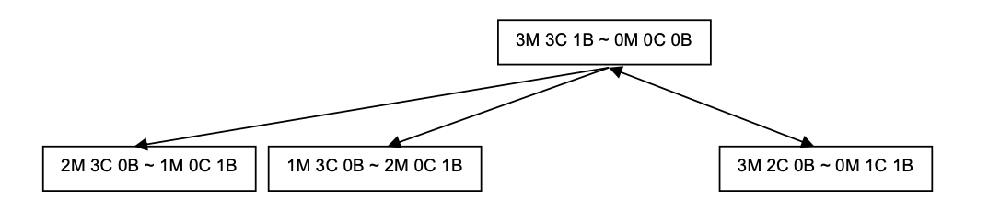

{{tutorial_wip_warning("Soar.Tutorial.Part.4.-.Simple.Problem-Solving.pdf")}}

## Part IV: More Simple Problem Solving

This part of the tutorial returns to problems that are solved through
internal search. You will build Soar programs for a classic AI problem:
Missionaries and Cannibals. Other classic AI problems, including Blocks
World, the Eight Puzzle, and Towers of Hanoi are included in the set of
demonstration programs that comes with the Soar release. This is very
similar to the water jug problem you did initially, but has a few
interesting extensions. You will start by building the operators, state
descriptions, and goal tests that are required to define each problem.
You will also be introduced to more of the theory of problem solving
based on search in problem spaces. In Part V, you will learn how to
modify and extend programs so that they use planning and learning to
solve problems.

This problem is challenging in a different way than playing games such
as Eaters and TankSoar. Eaters and TankSoar are competitive games and
they require fast intelligent responses to the current situation, which
can change quickly. This problem does not have dynamic environments.
However, solving this problem requires selecting the one appropriate
operator from a set of many at each decision point. Selecting the
correct operator is not easy given the knowledge available from the
problem description. The problem can be solved only through trial and
error, which involves searching through the space of possible states.

### Missionaries and Cannibals Definition

Problem Statement:

> Three missionaries and three cannibals come to a river. There is a boat
> on their bank of the river that can be used by either one or two persons
> at a time. This boat must be used to cross the river in such a way that
> cannibals never outnumber missionaries on either bank of the river
> (although cannibals can be alone on one bank). How do the missionaries
> and cannibals successfully cross the river?

Once again, the first step to creating a Soar program to solve this
problem is to decompose it into the problem space (state representation
and operators) and the problem (initial state and desired state). One
interesting aspect of this problem is that it also includes failure
states. If the cannibals ever outnumber the missionaries, then you have
failed. Below is a partial graph (it doesn’t show the last four steps)
of the problem space, which shows that there are many illegal states
that need to be avoided along the way to a solution.


Below is a list of the aspects of the problem space and problem that you
will define for this problem:

1. The state representation. For this problem this will include the
   positions of the missionaries, cannibals, and boat, relative to the
   river.
1. The initial state creation rule. In this problem, all the
   missionaries, cannibals and the boat are on one bank of the river.
1. The operator proposal rules. For this problem the operators move up
   to two of the missionaries and/or cannibals across the river with
   the boat.
1. The operator application rules.
1. The operator and state monitoring rules.
1. The goal recognition rule. In this problem, the desired state is
   achieved when all missionaries and cannibals have crossed the river.
1. The failure recognition rule. These are rules that detect when a
   state is created in which the goal cannot be achieved. In this
   problem, the failure states are whenever the cannibals outnumber the
   missionaries on one bank of the river.
1. The search control rules.

It may be tempting to try to incorporate the avoidance of failure states
into the operators, so that operators are never proposed that lead to
failure states. However that is moving an aspect of the problem into the
problem space and requires some problem solving to determine what the
conditions of the proposal should be. We will see in Part V how Soar can
learn to rules that avoid proposing operators when they will lead to
failure.

As in the Water Jug problem, this program does not create a plan to
solve the problem. Instead, when the program finishes, all of the
missionaries and cannibals will have been moved across the river.

### State Representation

What are the parts of the problem that must be represented on the state?
Everything in the problem description is important (there are no
irrelevant objects are characteristics of the objects), so an initial
list of objects includes three missionaries, three cannibals, a river,
and the boat.

At any point in solving the problem, it is necessary to represent which
bank of the river the boat is and the banks that the missionaries and
cannibals are on. One important observation is that it is not necessary
to keep track of each missionary and cannibal individually. All that is
important is the _number_ of missionaries and cannibals on each bank of
the river. For the purposes of this problem all cannibals are the same
and all missionaries are the same. Therefore, it is not necessary to
have a separate representation of each missionary or cannibal and its
current position. Another observation is that you never have to
represent a state where the boat has missionaries and cannibals in it –
that happens only during the application of an operator. The only states
that need to be represented are those with the boat on one bank of the
river or the other. Therefore the important aspects of the states that
need to be represented are:

-   The number of missionaries on each bank of the river.
-   The number of cannibals on each bank of the river.
-   The bank of the river that the boat is on.

There are many possible ways to represent this information using Soar’s
attributes and values. Try to come up with one on your own before
looking at the representations listed below.

In creating the representations below, the two banks of the river are
named left and right, with left being the bank of the river the
missionaries and cannibals start out on.

Here is one possible representation:

```Soar
(state <s> ^right-bank-missionaries 0-3
  ^left-bank-missionaries 0-3
  ^right-bank-cannibals 0-3
  ^left-bank-cannibals 0-3
  ^right-bank-boat 0/1
  ^left-bank-boat 0/1)
```

Although this representation is adequate for solving the problem, it
doesn’t allow you to write general rules for proposing and applying
operators. Using this representation, you would have to write separate
proposal and application rules for when the boat is on each bank of the
river. You would also have to write separate rules for moving cannibals
and missionaries. When you have an attribute like right-bank-boat, the
rules in Soar cannot match the different substructures, such as
right-bank and boat. By representing each aspect separately using
structured objects, you will find that it is possible to write very
general operator proposal and application rules.

There are two obvious structured representations to choose from. One
state representation has objects on the state for the two banks of the
river, with subobjects for the missionaries, cannibals, and boat on that
bank. To simplify later processing, an additional attribute (other-bank)
can be added to the subobjects so that opposite bank can be matched
easily. Below is a representation for the initial state:

```Soar
(state <s> ^left-bank <l>
  ^right-bank <r>)
  ^cannibals 3
  ^boat 1
  ^other-bank <r>)
  ^cannibals 0
  ^boat 0
  ^other-bank <l>)
```


An alternative is to make the missionaries, cannibals, and boat the
primary way of structuring the data, with the number of entities on each
bank of the river as secondary.

```Soar
(state <s> ^missionaries <m>
  ^cannibals <c>
  ^boat <b>)
(<m> ^left 3
  ^right 0)
  ^right 0)
(<b> ^left 1
  ^right 0)
```


For this problem, both of these representations are sufficient and they
are similar in terms of the ease of writing the operators and goal
tests. Soar programs for both are included as demonstration programs
with the Soar release. For the remainder of this section, the first
representation will be used because it is closer to the physical
structure of the problem.

### Initial State Creation: Initialize-mac

Just as in the Water Jug problem, you should create an initialization
operator that names the state and creates all of the initial features on
the state.

````Soar
```Soar
sp {mac*propose*initialize-mac
  (state <s> ^superstate nil
    -^name)
-->
  (<s> ^operator <o> +)
  (<o> ^name initialize-mac)}
````

```Soar
sp {mac*apply*initialize-mac
  (state <s> ^operator.name initialize-mac)
-->
  (<s> ^name mac
  ^left-bank <l>
  ^right-bank <r>
  ^desired <d>)
  (<r> ^missionaries 0
  ^cannibals 0
  ^boat 0
  ^other-bank <l>)
  (<l> ^missionaries 3
  ^cannibals 3
  ^boat 1
  ^other-bank <r>)
  (<d> ^right-bank <dr>)
  (<dr> ^missionaries 3
  ^cannibals 3
  ^boat 1)}
```

### Operator Proposal

The operators for this task move 1 to 2 individuals (missionaries or
cannibals) across the river. In writing the proposal rules, it is
easiest to break the operators into three classes:

-   move one missionary or cannibal to the other bank
-   test that there is at least one of the given type on the bank with
    the boat
-   move two missionaries or two cannibals
-   test that there is at least two of the given type on the bank with
    the boat
-   move one missionary and one cannibal together
-   test that there is at least one of each type on the bank with the
    boat

Try to write an English description of the proposal for first operator.

```
mac*propose*move-mac-boat*1
```

If the name of the state is mac and there is one or more cannibal or
missionary on the same bank of the river as the boat, then propose
moving that cannibal or missionary across the river.

The other operator proposals are very similar:

```
mac*propose*move-mac-boat*2
```

If the name of the state is mac and there are two or more cannibals or
missionaries on the same bank of the river as the boat, then propose
moving two of that type across the river.

```
mac*propose*move-mac-boat*1
```

If the name of the state is mac and there is one or more cannibal and
one or more missionaries on the same bank of the river as the boat, then
propose moving one cannibal and one missionary across the river.

As in the Water Jug problem, you need to decide on a representation of
the operator and its parameters. For this task, the operator parameters
that make sense are:

-   The name of the operator: move-mac-boat.
-   The type of entities being moved: cannibal or missionary.
-   The number of each type of entity being moved: 1 or 2.

The second two can be combined as a single attribute-value pair, with
the type of entity being the attribute and the number being the value.
This makes it easy to represent moving one or two entities of the same
type as well as moving one missionary and one cannibal. To simplify
later matching, you can also include the bank of the river that the boat
is on. Also, for some of the reasoning, it will be useful to also
represent how many different types of people are being moved, usually
just one, but two when moving one missionaries and one cannibal. It is
not necessary to include the bank of the river that the boat is on
because it is represented in the current state.

The operator representation for moving one cannibal (with the boat) from
the bank with object l3 would be:

```
(<o> ^name move-mac-boat
  ^cannibal 1
  ^boat 1
  ^bank l3
  ^types 1)
```

Now try to write the first proposal as a Soar rule. To make it easier, a
good approach is to initially write a very specific rule for one type of
operator, and then attempt to generalize it by adding variables. To get
started, you can try writing a proposal rule for just cannibals on the
left bank of the river. That would be:

````Soar
```Soar
sp {mac*propose*move-mac-boat1
  (state <s> ^name mac
    ^left-bank <bank>)
  (<bank> ^cannibals > 0
    ^boat 1)
-->
  (<s> ^operator <o> + =)
  (<o> ^name move-mac-boat
    ^bank <bank>
    ^boat 1
    ^cannibals 1
    ^types 1)}
````

The operator is created with both an acceptable and a indifferent
preference. In a later section you will explore adding search control.

You can generalize this rule by using a variable for the bank of the
river, making it so that the proposal applies no matter which bank the
boat is on. To be safe, this requires introducing a disjunctive
`(<< left-bank right-bank >>)` test for the attribute.

````Soar
```Soar
sp {mac*propose*move-mac-boat*1
  (state <s> ^name mac
    ^<< right-bank left-bank >> <bank>)
  (<bank> ^cannibals > 0
    ^boat 1)
-->
  (<s> ^operator <o> + =)
  (<o> ^name move-mac-boat
    ^bank <bank>
    ^boat 1
    ^cannibals 1
    ^types 1)}
````

You can then further generalize the rule so that it can match against
both cannibals and missionaries (but not the boat). This requires
introducing a disjunctive `(<< cannibals missionaries >>)` test for
the attribute of the bank object, and also a surrounding conjunctive
test `({ << cannibals missionaries >> <type> })` to match the entity
type to the variable `<type>`, which can then be used in the action. The
final rule is:

````Soar
```Soar
sp {mac*propose*operator*move-mac-boat1
  (state <s> ^name mac
    ^<< right-bank left-bank >> <bank>)
  (<bank> ^{ << cannibals missionaries >> <type> } > 0
    ^boat 1)
-->
(<s> ^operator <o> + =)
(<o> ^name move-mac-boat
  ^bank <bank>
  ^<type> 1
  ^boat 1
  ^types 1)}
````

Now try to write the second proposal that moves two missionaries or two
cannibals as a Soar rule. This requires only minimal changes to the
first. The only changes are to test for more than one missionary or
cannibal, and to increase the number being moved to 2.

````Soar
```Soar
sp {mac*propose*operator*move-mac-boat2
  (state <s> ^name mac
    ^ << right-bank left-bank >> <bank>)
  (<bank> ^{ << cannibals missionaries >> <type> } > 1
    ^boat 1)
-->
(<s> ^operator <o> + =)
(<o> ^name move-mac-boat
^bank <bank>
^<type> 2
^boat 1
^types 1)}
````

Now try to write the third proposal for moving one missionary and one
cannibal.

```Soar
sp {mac*propose*operator*move-mac-boat11
  (state <s> ^name mac
    ^ << right-bank left-bank >> <bank>)
  (<bank> ^missionaries > 0
    ^cannibals > 0
    ^boat 1)
-->
  (<s> ^operator <o> + =)
  (<o> ^name move-mac-boat
    ^bank <bank>
    ^missionaries 1
    ^cannibals 1
    ^boat 1
    ^types 2)}
```

### Operator Application

The operator application rules must change the state to reflect the
movement of the boat and the missionaries and cannibals that cross the
river. As part of applying the operators, it is not necessary to
represent that the missionaries and cannibals are in the boat, only that
they change banks of the river. The changes that need to be made to the
state are to decrease the number of missionaries and cannibals that are
moving from the bank of the river that the boat is on, and increase the
number on the bank the boat is moving to. Similarly, the count of the
boat (0 or 1) must be changed. You might try to come up with a set of
rules to do this, but because of the operator representation, a single
rule can make changes for moving cannibals, missionaries and the boat
from either bank of the river to the other. The rule must test for an
augmentation of the operator, such as `^boat`, `^cannibals`, or
`^missionaries`, and then change the corresponding subobject on the state.
The rule will fire in parallel for all entities being moved, including
the boat.

Below is an English version of the required rule.

```Soar
## mac*apply*move-mac-boat
## If there is a move-mac-boat operator selected for a type and number, then
## subtract the values of that type on the current bank and add those values
## to the other bank.
```

Converting this to a Soar rule is a bit tricky because of all of the
variables. To simplify the conversion, we will start with a rule that
applies the operator for moving one cannibal. Try to write this rule
yourself.

```Soar
## mac*apply*move-mac-boat*one*cannibal
## If there is a move-mac-boat operator selected for one cannibal, then
## subtract one from cannibal object on the left bank and add one to the
## cannibal object on the other bank.
```

```Soar
sp {apply*move-mac-boat*one*cannibal
  (state <s> ^operator <o>)
  (<o> ^name move-mac-boat
    ^cannibals 1
    ^bank <bank>)
  (<bank> ^cannibals <bank-num>
    ^other-bank <obank>)
  (<obank> ^cannibals <obank-num>)
-->
  (<bank> ^cannibals <bank-num> -
    (- <bank-num> 1))
  (<obank> ^cannibals <obank-num> -
    (+ <obank-num> 1))}
```

The above rule tests the operator to ensure that one cannibal is being
moved `(<o> ^cannibals 1)` and to detect the bank of the operator. It
then matches the number of cannibals on that bank, matching
`<bank-num>`, via the other-bank attribute, matching `<obank-num>`. The
actions of the rule modify the number of cannibals on the left bank by
rejecting the current value `(^cannibals <bank-num> -)`, and by
asserting the new value which is the original value minus one
`(^cannibals (- <bank-num> 1))`. Arithmetic operations such as addition,
subtraction, and multiplication are done in Soar using prefix notation
where the operation is given first followed by the operands.

One concern you might have about the above rule is that it will apply
multiple times if there is more than one cannibal on the left bank of
the river, moving each cannibal, one by one to the other bank. However,
that will not happen because immediately after this rule fires (multiple
times in parallel for each entity being moved) the rule that proposed
the operator will no longer match, causing the operator to be removed.
The operator proposal rule will no longer match because it tested the
number of cannibals on the left bank of the river, which is changed by
the rule. In addition, the boat will move from one bank to another at
the same time, providing a second reason for the proposal rule not to
match. Thus, the operator will terminate immediately after the above
rule fires.

The next step is to generalize this rule so it can apply to moving 1 or
2 cannibals. This requires replacing the test for ^cannibals 1 on the
operator to `^cannibals <number>` and then using `<number>` in the
actions to subtract from the current

```Soar
sp {apply*move-mac-boat*cannibal
  (state <s> ^operator <o>)
  (<o> ^name move-mac-boat
    ^cannibals <number>
    ^bank <bank>)
  (<bank> ^cannibals <bank-num>
    ^other-bank <obank>)
  (<obank> ^cannibals <obank-num>)
-->
  (<bank> ^cannibals <bank-num> -
    (- <bank-num> <number>))
  (<obank> ^cannibals <obank-num> -
    (+ <obank-num> <number>))}
```

The final generalization is to replace the test for the `^cannibals`
attribute of the operator with a more general test that matches
cannibals, missionaries, or the boat to a variable `<type>`. That
variable is used to match the appropriate object on the state. This rule
will now fire multiple times to move the boat as well as any cannibals
or missionaries that are moving.

```Soar
sp {apply*move-mac-boat
  (state <s> ^operator <o>)
  (<o> ^name move-mac-boat
    ^{ << missionaries cannibals boat >> <type> } <number>
    ^bank <bank>)
  (<bank> ^<type> <bank-num>
    ^other-bank <obank>)
  (<obank> ^<type> <obank-num>)
-->
  (<bank> ^<type> <bank-num> -
    (- <bank-num> <number>))
  (<obank> ^<type> <obank-num> -
    (+ <obank-num> <number>))}
```

### State and Operator Monitoring

Below are three rules that monitor the selected operator and the state
(one rule for each bank that the boat is on).

```Soar
sp {monitor*move-mac-boat
  (state <s> ^operator <o>)
  (<o> ^name move-mac-boat
    ^{ << cannibals missionaries >> <type> } <number>)
-->
  (write | Move | <number> | | <type>)}
```

```Soar
sp {monitor*state*left
  (state <s> ^name mac
    ^left-bank <l>
    ^right-bank <r>)
  (<l> ^missionaries <ml>
    ^cannibals <cl>
    ^boat 1)
  (<r> ^missionaries <mr>
    ^cannibals <cr>
    ^boat 0)
-->
  (write (crlf) | M: | <ml> |, C: | <cl> | B ~~~ |
    | M: | <mr> |, C: | <cr> | |)}
```

```Soar
  sp {monitor*state*right
  (state <s> ^name mac
    ^left-bank <l>
    ^right-bank <r>)
  (<l> ^missionaries <ml>
    ^cannibals <cl>
    ^boat 0)
  (<r> ^missionaries <mr>
    ^cannibals <cr>
    ^boat 1)
-->
  (write (crlf) | M: | <ml> |, C: | <cl> | ~~~ B |
    | M: | <mr> |, C: | <cr> | |)}
```

When you run your program, you will observe that your program runs
forever and also sometimes visits states that are illegal according to
the problem statement.

### Desired State Recognition

The next step in creating a program to solve missionaries and cannibals
is creating a rule that recognizes when a desired state has been
achieved. Although a rule specific to the given problem can easily be
written, it might be better to write one that is more general. For
example, you might assume that the desired state will always have some
number of missionaries, cannibals, on one bank of the river.

The action of the rule should be to print out a message that the problem
has been solved and halt.

Write an English version of this rule.

````Soar
## mac*detect*goal*achieved
## If the name of the state is mac and the number of missionaries and
## cannibals on one bank of the river in the desired state matches the number
## of missionaries and cannibals on the same bank in the current state, write
## that the problem has been solved and halt.
```Soar

Translating this into Soar is relatively straightforward. Try to write
your own before looking below.

```Soar
sp {mac*detect*state*success
  (state <s> ^desired <d>
    ^<side> <ls>)
  (<ls> ^missionaries <m>
    ^cannibals <c>)
  (<d> ^{ << right-bank left-bank >> <side> } <dls>)
  (<dls> ^missionaries <m>
    ^cannibals <c>)
-->
  (write (crlf) |The problem has been solved.|)
  (halt)}
````

If you run this with the earlier rules, the program should halt at some
point; however, it is likely that it will visit a failure state and thus
solved the problem incorrectly.

### State Failure Detection

The next step is creating a rule that recognizes when a failure state
has been encountered. According to the problem statement, a failure
state is one where the cannibals out number the missionaries on one bank
of the river. One condition that is often forgotten is to test that the
number of missionaries is greater than zero. The action for this rule is
to print out a message that the problem has failed to be solved, and
then halt. Write an English version of this rule.

```Soar
## mac*detect*goal*failure
## If the name of the state is mac and there are more cannibals than
## missionaries, and there is at least one missionary, on one bank of the
## river, then write that the problem has failed to be solved, and halt.
```

Translating this into Soar is relatively straightforward. Try to write
your own before looking below.

```Soar
sp {mac*evaluate*state*failure*more*cannibals
  (state <s> ^desired <d>
    ^<< right-bank left-bank >> <bank>)
  (<bank> ^missionaries { <n> > 0 }
    ^cannibals > <n>)
-->
  (write (crlf) |The problem has failed.|)
  (halt)}
```

Try running your complete program. Invariably the program will halt with
failure because of the high likelihood of encountering a failure state.

### Search Control: Undoing the Last Operator

In the current problem, when a failure is reached, the program halts.
One possibility is to have the program start over again from the initial
state. But if you were working on the problem, you would probably notice
that you reached an illegal state, and you would go back one step by
undoing the last operator and try to find another path. In order to undo
the last operator, you must remember what it was. You can use some of
the work you did on the Water Jug where you created a memory to _avoid_
undoing the last operator to _prefer_ to undo an operator when a failure
state is achieved.

Given the representation of the move-mac-boat operator in working
memory, you will have to write two rules to record the last operator,
one that handles instances of the operator that move a single type of
entity, and a second that handles instances of the operator that move
one missionary and one cannibal. The action of these rules should create
an augmentation of the state with information on the operator that is
being applied. Try to write English versions of these rules.

```Soar
mac*apply*move-mac-boat*record*last-operator*types*1
```

If an operator is selected to move one type of entity, then create an
augmentation of the state (last-operator) with the bank of the boat, the
type of entity being moved, the number, and that there is one type being
moved.

```Soar
mac*apply*move-mac-boat*record*last-operator*types*2
```

If an operator is selected to move two types of entity, then create an
augmentation of the state (last-operator) with the bank of the boat and
that there is two types being moved.

These can then be converted into Soar rules:

```Soar
sp {mac*apply*move-mac-boat*record*last-operator*types*1
  (state <s> ^name mac
    ^operator <o>)
  (<o> ^name move-mac-boat
    ^bank <bank>
    ^{ << missionaries cannibals >> <type> } <n>
    ^types 1)
-->
  (<s> ^last-operator <o1>)
  (<o1> ^types 1
    ^bank <bank>
    ^type <type>
    ^number <n>)}
```

```Soar
sp {mac*apply*move-mac-boat*record*last-operator*types*2
  (state <s> ^name mac
    ^operator <o>)
  (<o> ^name move-mac-boat
    ^bank <bank>
    ^types 2)
-->
  (<s> ^last-operator <o1>)
  (<o1> ^types 2
    ^bank <bank>)}
```

The rule to remove old records only has to test if the bank of the boat
in the record of the last operator does not match the current bank that
the boat is on because each time an operator is applied the boat changes
banks.

```Soar
mac*apply*move-mac-boat*remove*old*last-operator
```

If the move-mac-boat operator is selected and the bank in the
last-operator is not equal to the bank of the current boat, remove the
last-operator structure.

This can then be converted into Soar a rule:

```Soar
sp {mac*apply*move-mac-boat*remove*old*last-operator
  (state <s> ^name mac
    ^operator <o>
    ^<lr-bank>.other-bank <o-bank>
    ^last-operator <lo>)
  (<lo> ^bank <o-bank>)
-->
  (<s> ^last-operator <lo> -)}
```

Once you add these rules, you can now add rules that undo an operator
whenever one leads to a failure state. However, you must first modify
the rule that detects failure so that it doesn’t halt the program, but
just augments the state with failure:

```Soar
## mac*detect*goal*failure
## If the name of the state is mac and there are more cannibals than
## missionaries, and there is at least one missionary, on one bank of the
## river, then augment the state with failure true.
```

Translating this into Soar is relatively straightforward.

```Soar
sp {mac*evaluate*state*failure*more*cannibals
  (state <s> ^desired <d>
    ^<< right-bank left-bank >> <bank>)
  (<bank> ^missionaries { <n> > 0 }
    ^cannibals > <n>)
-->
  (<s> ^failure <d>)}
```

Note that this rule only fires when there is an illegal state and it is
not part of the application of an operator. Thus, it will retract and
remove the failure augmentation automatically if the state changes and
there is no longer an illegal state.

Now you can write rules that prefer operators that undo the last
operator when there is failure. Just as before, this will require two
rules, one for moving a single type of entity, and one that moves one
missionary and one cannibal. Below is a general English version for both
rules.

```Soar
## mac*select*operator*prefer*inverse*failure
## If the name of the state is mac and the current state is a failure state
## and the last operator is the inverse of a proposed operator, then prefer
## that operator.
```

```Soar
sp {mac*select*operator*prefer*inverse*failure*types*2
  (state <s> ^name mac
    ^operator <o> +
    ^failure <d>
    ^last-operator <lo>)
  (<o> ^name move-mac-boat
    ^<type> <number>
    ^types 1)
  (<lo> ^types 1
    ^type <type>
    ^number <number>)
-->
  (<s> ^operator <o> >)}
```

```Soar
sp {mac*select*operator*prefer*inverse*failure*types*1
  (state <s> ^name mac
    ^operator <o> +
    ^failure true
    ^last-operator.types 2)
  (<o> ^types 2)
-->
  (<s> ^operator <o> >)}
```

After you have added these rules, your program will be able to solve the
problem; however it will probably take a very indirect path to the
solution. One reason is that after an operator has been successfully
applied and generated a valid state, the inverse of that operator will
often be selected, undoing the operator and wasting both operator
applications. To avoid this, you can add two more rules that _avoid_
undoing the last operator when the state is not a failure state.

```Soar
## mac*select*operator*avoid*inverse*not*failure
## If the name of the state is mac and the current state is not a failure
## state and the last operator is the inverse of a proposed operator, then
## avoid that operator.
```

```Soar
sp {mac*select*operator*avoid*inverse*not*failure*1
  (state <s> ^name mac
    ^operator <o> +
    -^failure true
    ^last-operator <lo>)
  (<o> ^types 1
    ^<type> <number>)
  (<lo> ^types 1
    ^type <type>
    ^number <number>)
-->
  (<s> ^operator <o> < )}
```

```Soar
sp {mac*select*operator*avoid*inverse*not*failure*2
  (state <s> ^name mac
    ^operator <o> +
    -^failure true
    ^last-operator <lo>)
  (<o> ^types 2)
  (<lo> ^types 2)
-->
  (<s> ^operator <o> < )}
```

After you have added these final rules, your program should solve the
problem much quicker. However, you will notice that there is still some
inefficiency. For example, at the initial state, it is possible for the
program to attempt to apply the same operator to the state after it has
failed with moving one or both the other missionaries. The figure below
shows the initial state and the three successive states that it can
cycle among. The problem is that only the most recent operator for a
current state is recorded. It is not possible to associate all prior
operators that applied to a state because the state is continually
changing.



In the next Part of the tutorial, you will learn how to use
impasses and substates so that your programs can use look-ahead planning
and solve this type of problem more directly.
