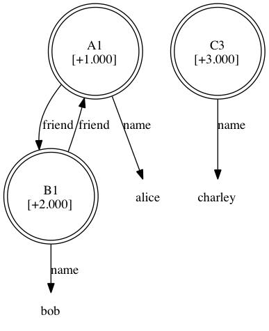

<!-- markdownlint-disable MD041 -->
{{tutorial_wip_warning("Soar.Tutorial.Part.7.-.SMem.pdf")}}

## Part VII: Semantic Memory

Semantic memory (SMem) in Soar is a mechanism that allows agents to
deliberately store and retrieve objects that are persistent. This
information supplements what is contained in short-term working memory
and other long-term memories, such as rules in procedural memory.

### The Semantic Store

Before we delve into how an agent can use semantic memory, let’s see an
example of preloading knowledge and viewing the contents of the memory.

First, open the Soar Debugger. Then, execute the following command (this
can be loaded from a source file just as any other Soar command):

```shell
smem --add {
    (<a> ^name alice ^friend <b>)
    (<b> ^name bob ^friend <a>)
    (<c> ^name charley)
}
```

As we shall see in a moment, executing this command adds three objects
to semantic memory. In general, the _smem --add_ command is useful to
preload the contents of large knowledge bases in Soar.

We can view the contents of semantic memory using the following command:

```shell
print @
```

Which will output the following result:

```Soar
(@1 ^friend @2 ^name alice [+0.000])
(@2 ^friend @1 ^name bob [+0.000])
(@3 ^name charley [+0.000])
```

Note first that the variables from the _smem --add_ command have been
instantiated as specific identifiers (`<a>` as `@1`, `<b>` as `@2`, and
`<c>` as `@3`). All identifiers in semantic memory are persistent, and
thus we call them _long-term identifiers_ (or LTIs), in contrast to all
other identifiers, which are short-term. When printed, long-term
identifiers are prefixed by the `@` symbol and, when depicted, are shown
using a double circle. The number in square brackets is the bias value
of the object, used to break ties during retrievals, a topic to which we
shall return later. Finally, unlike working memory and rules, the
knowledge in semantic memory need not be connected, nor linked directly
or indirectly, to a state.

To pictorially view the contents of semantic memory, we can use the
visualize command to render the contents of semantic memory to an image.
For example, execute the following command:

```shell
visualize smem
```

If you have [graphviz](http://graphviz.org) and DOT installed it should launch
your system viewer to show a diagram similar to:



Now that we have seen the contents of semantic memory, you can confirm that none
of this knowledge is present in any of the agent’s other memories. For instance,
execute the following commands to print the contents of working and procedural
memories:

```shell
print --depth 100 <s>
print
```

You notice that the contents of the semantic store can be completely
independent of the other memories, though, as discussed later, an agent
can access and modify the store over time.

We are now done with this example and wish to clear the semantic store.
To do this we issue a special command:

```shell
smem --clear
```

The agent is now reinitialized, as you can verify by printing the
contents of working memory, procedural memory, and now semantic memory.

### Agent Interaction

Agents interact with semantic memory via special structures in working
memory. Soar automatically creates an _smem_ link on each state, and
each _smem_ link has specialized substructure: a _command_ link for
agent-initiated actions and a _result_ link for feedback from semantic
memory. For instance, issue the following command:

```shell
print --depth 10 <s>
```

If you read the output carefully you will notice a WME that can be
generally represented as (`<state> ^smem <smem>`) and two additional
WMEs that can be represented as (`<smem> ^command <cmd>`) and
(`<smem> ^result <r>`).

As described in the following sections, the agent, via rules, populates
and maintains the _command_ link and the architecture populates and
cleans up the _result_ link.

For the agent to interact with semantic memory, this mechanism must be
enabled. By default, all learning mechanisms in Soar are disabled. To
enable semantic memory, issue the following command:

```shell
smem --enable
```

### Agent Storage and Modification

An agent stores an object to semantic memory by issuing a _store_
command. The syntax of a store command is (`<cmd> ^store <id>`) where
`<cmd>` is the _command_ link of a state and `<id>` is an identifier.

An agent can issue multiple store commands simultaneously, and the
commands are processed at the end of the phase in which they are issued.
A _store_ command is guaranteed to succeed and the response from the
architecture will be a success WME: (`<r> ^success <id>`), where `<r>`
is the _result_ link of the state on which the _store_ command was
issued and `<id>` was the value of the _store_ command.

A _store_ command stores the identifier that is the result of the
command, as well as any augmentations of that identifier. The command is
not recursive. If the identifier to be stored was not long-term, it is
changed in place to a long-term identifier. If it was already in
semantic memory, the augmentations of the long-term identifier in
semantic memory are overridden.

Let’s see an example. Source the following rules into the Soar Debugger
(they are available in the _smem-tutorial.soar_ file within the _Agents_
directory).

```Soar
sp {propose*init
   (state <s> ^superstate nil
      -^name)
   -->
   (<s> ^operator <op> +)
   (<op> ^name init)}
```

```Soar
sp {apply*init
   (state <s> ^operator.name init
      ^smem.command <cmd>)
   -->
   (<s> ^name friends)
   (<cmd> ^store <a> <b> <c>)
   (<a> ^name alice ^friend <b>)
   (<b> ^name bob ^friend <a>)
   (<c> ^name charley)}
```

```Soar
sp {propose*mod
   (state <s> ^name friends
      ^smem.command <cmd>)
   (<cmd> ^store <a> <b> <c>)
   (<a> ^name alice)
   (<b> ^name bob)
   (<c> ^name charley)
   -->
   (<s> ^operator <op> +)
   (<op> ^name mod)}
```

```Soar
sp {apply*mod
   (state <s> ^operator.name mod
      ^smem.command <cmd>)
   (<cmd> ^store <a> <b> <c>)
   (<a> ^name alice)
   (<b> ^name bob)
   (<c> ^name charley)
   -->
   (<a> ^name alice -)
   (<a> ^name anna
      ^friend <c>)
   (<cmd> ^store <b> -)
   (<cmd> ^store <c> -)}
```

Now click the "Step" button to run till the decision phase and notice
that the _init_ operator is selected. Now, click the "Watch 5" button
and then the "Run 1 -p" button to watch as the operator is applied.
Below is part of the trace that should be produced. If you do not see
this part of this trace in your run, be sure that you enabled semantic
memory (see section above).

```Soar
--- apply phase ---
--- Firing Productions (PE) For State At Depth 1 ---
Firing apply*init
+ (C3 ^name charley + :O ) (apply*init)
+ (B1 ^friend A1 + :O ) (apply*init)
+ (B1 ^name bob + :O ) (apply*init)
+ (A1 ^friend B1 + :O ) (apply*init)
+ (A1 ^name alice + :O ) (apply*init)
+ (C2 ^store C3 + :O ) (apply*init)
+ (C2 ^store B1 + :O ) (apply*init)
+ (C2 ^store A1 + :O ) (apply*init)
+ (S1 ^name friends + :O ) (apply*init)
   --- Change Working Memory (PE) ---
=>WM: (25: C3 ^name charley)
=>WM: (24: B1 ^friend A1)
=>WM: (23: B1 ^name bob)
=>WM: (22: A1 ^friend B1)
=>WM: (21: A1 ^name alice)
=>WM: (20: C2 ^store A1)
=>WM: (19: C2 ^store B1)
=>WM: (18: C2 ^store C3)
=>WM: (17: S1 ^name friends)
```

Notice that the `apply*init` rule fired and added 3 _store_ commands to working
memory, where the identifiers to be stored are, initially, not long-term, and
whose augmentations mirror the contents of the `smem --add` command in
[Part 1](./01.md) of this tutorial. Then, at the end of the elaboration phase,
semantic memory processed the command, converted the identifiers to long-term,
and added status for each command.

Now, try printing the contents of semantic memory using the `print @`
command. You will see that semantic memory now has the same contents as
after using the `smem --add` command in Part 1.

Application of the next operator modifies the contents of semantic
memory by overriding the contents of an existing long-term identifier
(`@1`). Click the "Step" button to select the next operator (_mod_) and
then click the "Run 1 -p" button to apply the operator:

```Soar
Firing apply*mod
-   (A1 ^name alice + :O ) (apply*init)
-   (C2 ^store B1 + :O ) (apply*init)
-   (C2 ^store C3 + :O ) (apply*init)
+ (A1 ^friend C3 + :O ) (apply*mod)
+ (A1 ^name anna + :O ) (apply*mod)
--- Change Working Memory (PE) ---
=>WM: (33: A1 ^name anna)
=>WM: (32: A1 ^friend C3)
<=WM: (21: A1 ^name alice)
<=WM: (18: C2 ^store C3)
<=WM: (19: C2 ^store B1)
```

You will notice in the trace that the store commands for `@2` and `@3` are
removed by the application rule, and that augmentations of `@1` are
removed and added. Then, at the end of the elaboration phase, semantic
memory cleans up the status information for the old _store_ commands.

Now, print the contents of semantic memory using the `print @` command:

```Soar
(@1 ^friend @2 @3 ^name anna [+1.000])
(@2 ^friend @1 ^name bob [+1.000])
(@3 ^name charley [+1.000])
```

Notice that the augmentations of `@1` have indeed changed in semantic
memory to reflect the new _store_ command, while `@2` and `@3` remain
unchanged.

### Non-Cue-Based Retrieval

The first way an agent can retrieve knowledge from semantic memory is
called a non-cue-based retrieval: the agent requests from semantic
memory all of the augmentations of a known long-term identifier. The
syntax of the command is (`<cmd> ^retrieve <lti>`) where `<lti>` is a
short-term identifier that is linked to a long-term identifier. In other
words, it is a short-term identifier that was previously used in a store
command or recalled via a retrieve or query command.

As an example, add the following three rules to our agent from Part 3 of
this tutorial (these rules are already part of the _smem-tutorial.soar_
file in the _Agents_ directory):

```Soar
sp {propose*ncb-retrieval
   (state <s> ^name friends
      ^smem.command <cmd>)
   (<cmd> ^store <a>)
   (<a> ^name anna
      ^friend <f>)
   -->
   (<s> ^operator <op> + =)
   (<op> ^name ncb-retrieval
      ^friend <f>)}
```

```Soar
sp {apply*ncb-retrieval*retrieve
   (state <s> ^operator <op>
      ^smem.command <cmd>)
   (<op> ^name ncb-retrieval
      ^friend <f>)
   (<cmd> ^store <a>)
   -->
   (<cmd> ^store <a> -
      ^retrieve <f>)}
```

```Soar
sp {apply*ncb-retrieval*clean
   (state <s> ^operator <op>
      ^smem.command <cmd>)
   (<op> ^name ncb-retrieval
      ^friend <f>)
   (<f> ^<attr> <val>)
   -->
   (<f> ^<attr> <val> -)}
```

These rules retrieve all the information about one of `@1`’s two friends
(selected randomly) and remove the friend’s augmentations (such as name
and/or friend) from working memory.

Unlike _store_ commands, all retrievals are processed during the agent’s
output phase and only one retrieval command can be issued per state per
decision.

Now click the "Step" button and notice that one of the two _ncb_
operators is selected. Click "Run 1 -p" to see the application rule
create a _retrieve_ command, requesting information about one of the two
friends, as well as remove that friend’s augmentations from working
memory. Then click the "Run 1 -p" button again to proceed through the
output phase. Finally, print the full contents of the _smem_ link
(`print --depth 10 L1`):

```Soar
(L1 ^command C2 ^result R3)
(C2 ^depth 3 ^retrieve B1 (@2))
(R3 ^retrieved L2 (@2) ^success B1 (@2))
(L3 ^friend L2 (@2) ^friend L4 (@3) ^name anna)
(L2 ^friend L3 (@1) ^name bob)
(L4 ^name charley)
```

We see that semantic memory has retrieved and added to working memory
the name of the friend, as well as indicated status for this command
(_success_). Your run may have retrieved `@3` instead, as a result of the
random selection process:

Note that had the _retrieve_ command been issued with an identifier that
was not linked to a long-term identifier, the status would have been
_failure_ and there would be no _retrieved_ structure. Note also that
retrieved knowledge is limited to the augmentations of the long-term
identifier: like the _store_ command, the _retrieve_ command is not
recursive.

### Cue-Based Retrieval

The second way an agent can retrieve knowledge from semantic memory is
called a cue-based retrieval: the agent requests from semantic memory
all of the augmentations of an unknown long-term identifier, which is
described by a subset of its augmentations. The syntax of the command is
(`<cmd> ^query <cue>`), where the desired augmentations all have
`<cue>` as their identifier.

The augmentations of the cue form hard constraints, based upon the value
of each WME. If the value of the WME is a constant (string, integer, or
float) or long-term identifier, then any retrieval is required to have
exactly the attribute/value pair specified. If the value of the WME is a
short-term identifier, then any retrieval is required to have an
augmentation that has the same attribute, but the value is
unconstrained.

As an example, add the following two rules to our agent from [Part 4](04.md) of
this tutorial (these rules are already part of the _smem-tutorial.soar_
file in the _Agents_ directory):

```Soar
sp {propose*cb-retrieval
   (state <s> ^name friends
      ^smem.command <cmd>)
   (<cmd> ^retrieve)
   -->
   (<s> ^operator <op> + =)
   (<op> ^name cb-retrieval)}
```

```Soar
sp {apply*cb-retrieval
   (state <s> ^operator <op>
      ^smem.command <cmd>)
   (<op> ^name cb-retrieval)
   (<cmd> ^retrieve <lti>)
   -->
   (<cmd> ^retrieve <lti> -
      ^query <cue>)
   (<cue> ^name <any-name>
      ^friend <lti>)}
```

These rules retrieve an identifier that meets two constraints: (1) it
has an augmentation where the attribute is "name", but the value can be
any symbol, and (2) it has an augmentation where the attribute is
"friend" and the value is the long-term identifier retrieved as a
result of applying the operator in [Part 3](03.md).

As a reminder, all retrievals are processed during the agent’s output
phase and only one retrieval command can be issued per state per
decision.

So now click the "Step" button and then click the "Run 1 -p" to see the
application rule create a _query_ command, as well as remove the
previous _retrieve_ command from working memory. Then click the "Run 1
-p" button again to proceed through the output phase. Finally print the
contents of the _smem_ link (`print --depth 10 L1`):

```Soar
(L1 ^command C2 ^result R3)
   (C2 ^depth 3 ^query C4)
      (C4 ^friend B1 (@2) ^name A2)
   (R3 ^retrieved L5 (@1) ^success C4)
      (L7 ^name charley)
      (L6 ^friend L5 (@1) ^name bob)
      (L5 ^friend L6 (@2) ^friend L7 (@3) ^name anna)
```

We see that semantic memory has retrieved and added to working memory
the identifier `@1` and all of its augmentations, as well as indicated
status for this command (_success_). If in Part 4 of this tutorial your
agent retrieved `@3`, you may have slightly different output.

Note that had no long-term identifier in semantic memory satisfied the
constraints of the _query_ command cue, the status would have been
_failure_ and there would be no retrieved structure. Note also that
retrieved knowledge is limited to the augmentations of the long-term
identifier: like the store command, retrievals are not recursive. We see
this in the outputs above as one friend has augmentations (as a result
of the _retrieve_ command in [Part 4](04.md)), whereas the other does not.

If multiple identifiers had satisfied the constraints of the cue (such
as if the cue had only a WME with "name" as the attribute and a
short-term identifier as the value), then the long-term identifier with
the largest bias value is returned. By default, the bias value is a
monotonically increasing integer, reflecting the recency of the last
storage or retrieval of an object.

It is also possible to _prohibit_ one or more long-term identifiers from
being retrieved. For more information on this any many additional
capabilities of semantic memory, read the Semantic Memory chapter of the
Soar Manual.
