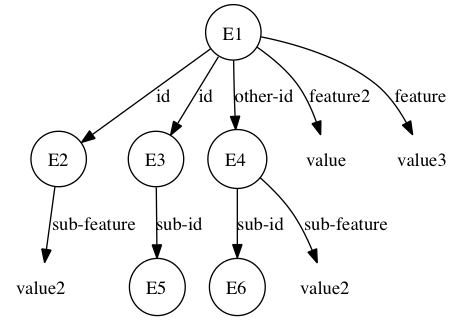

<!-- markdownlint-disable MD041 -->
{{tutorial_wip_warning("Soar.Tutorial.Part.8.-.EpMem.pdf")}}

## Part VIII: Episodic Memory

Episodic memory (EpMem) in Soar is a mechanism that automatically
captures, stores, and temporally indexes agent state and supports a
content-addressable agent interface to retrieve this autobiographical
prior experience. This information supplements what is contained in
short-term working memory and other long-term memories, such as rules in
procedural memory.

### A Short Demonstration

Before we delve into how an agent can use episodic memory, let's see an
example of capturing an episode and viewing the contents of the memory.

First, open the Soar Debugger. Then, execute the following command (this
can be loaded from a source file just as any other Soar command):

```shell
epmem --set trigger dc
epmem --set learning on
watch --epmem
```

Now, click the "Step" button twice. If we inspect the trace, and ignore
the state no-change impasses, we see the following message:

```shell
NEW EPISODE: 1
```

This is an indication that a new episode, with id 1, has been
automatically stored by the architecture within the episodic store.

We can view the contents of episodic memory using the `epmem --print`
command, which expects an episode id as an argument. For example,
execute the following command:

```shell
epmem --print 1
```

Which will output the following result:

```Soar
(<id0> ^io <id1> ^reward-link <id2> ^superstate nil ^type state)
(<id1> ^input-link <id4> ^output-link <id3>)
```

To pictorially view the contents of semantic memory, we can use the
visualize command to render the contents of semantic memory to an image.
For example, execute the following command:

```bash
visualize epmem
```

If you have [graphviz](http://graphviz.org) and DOT installed, it should launch
your system viewer to show a diagram similar to:


From both the trace output as well as the Graphviz rendering we can see
that episodic memory has stored most of the top-state of the agent’s
working memory at a particular moment in time. In the following sections
we’ll examine in more detail how to control automatic storage and how
agents can retrieve episodic knowledge.

### Episodic Storage

As we saw in [Part 1](01.md) of this tutorial, episodic storage is automatic and
captures the top state of the agent’s working memory. To enable storage,
episodic memory must be enabled. By default, all learning mechanisms in
Soar are disabled. To enable episodic memory, issue the following
command:

```shell
epmem --set learning on
```

There are a few architectural parameters that are important to control
episodic storage. The first is the event that triggers storage. By
default, episodic memory stores new episodes whenever a WME is added to
working memory that has the _output-link_ as its identifier. However,
Soar also supports storing episodes each decision cycle ("dc"), which is
enabled using the following command (which we used in [Part 1](01.md) of this
tutorial):

```shell
epmem --set trigger dc
```

The next important parameter is the phase during which episodic memory
stores episodes (and processes retrievals, as discussed later). By
default, this processing occurs at the end of the _output_ phase.
However, Soar also supports this processing occurring at the end of the
_decision_ phase, which is enabled using the following command:

```shell
epmem --set phase selection
```

Finally, it is sometimes the case that certain portions of the agent’s
working memory should be excluded from automatic storage. Episodic
memory supports specifying a set of excluded attributes: if automatic
storage encounters an excluded attribute during a breadth-first walk of
working memory, it does not store that WME, nor any substructure if it
was the case that the value of the WME was an identifier. To view the
current excluded set, issue the following command:

```shell
epmem --get exclusions
```

To change the excluded set, issue the following command:

```shell
epmem --set exclusions <attribute>
```

This command toggles the state of an _attribute_ within the set: thus if
this command is executed with an _attribute_ that is already in the
excluded set, it is removed from the set, otherwise it is added. By
default, "epmem" and "smem" are in the excluded set, which is why we do
not see these architectural links in the trace/visualization in [Part 1](01.md)
of this tutorial.

In [Part 1](01.md), we also enabled trace output that is useful for understanding
episodic memory via the following command:

```shell
watch --epmem
```

This trace option indicates when new episodes are recorded, as well as
debugging information for retrievals, as discussed later.

### Agent Interaction

Agents interact with episodic memory via special structures in working
memory. Soar automatically creates an _epmem_ link on each state, and
each _epmem_ link has specialized substructure: a _command_ link for
agent-initiated actions and a _result_ link for feedback from episodic
memory. For instance, issue the following command:

```bash
print --depth 10 <s>
```

If you read the output carefully you will notice a WME that can be
generally represented as (`<state> ^epmem <epmem>`) and three
additional WMEs that can be represented as (`<epmem> ^command <cmd>`),
(`<epmem> ^result <r>`), and (`<epmem> ^present-id <episode id>`)

As described in the following sections, the agent, via rules, populates
and maintains the _command_ link and the architecture populates and
cleans up the _result_ link. As episodes are stored, the _present-id_
augmentation updates to indicate the current episode id, the value of
which is a positive integer.

For the agent to interact with episodic memory, this mechanism must be
enabled. As mentioned in [Part 2](02.md), by default, all learning mechanisms in
Soar are disabled and so you must enable episodic memory via the command
in [Part 2](02.md).

By default, all commands are processed during the agent’s output phase
(this can be changed using the _phase_ parameter, as described in [Part 2](02.md)
of this tutorial) and only one command can be issued per state per
decision.

#### Cue-Based Retrieval

The primary method that an agent can retrieve knowledge from episodic memory is
called a cue-based retrieval: the agent requests from episodic memory an episode
that most closely matches a cue of working-memory elements. The syntax of the
command is (`<cmd> ^query <cue>`), where `<cue>` forms the root of the cue.
Conceptually, episodic memory compares the cue to all episodes in the store,
scoring each one, and returns the most recent episode with the maximal score.

Episodes are scored based upon the _leaf_ WMEs in the cue. A leaf WME has either
a value that is a constant, a long-term identifier, or a short-term identifier
with no augmentations. A leaf WME is _satisfied_, with respect to a particular
episode, if there exists a _path_, or sequence of WMEs, from the episode root to
that leaf WME, where the attributes of all intermediate WMEs exactly match those
in the cue, and short-term identifiers in the cue variablize to consistently
match identifiers in the episode. This is similar to how variables in the
conditions of rules bind to specific identifiers in working memory. However, as
discussed below, episode scoring is disjunctive with respect to leaf WMEs (i.e.
each leaf WME is considered independently), whereas rule matching is conjunctive
with respect to production conditions (i.e. a rule matches only if _all_
conditions are satisfied). By default, the score of an episode is simply the
number of satisfied leaf WMEs.

Let us consider an example cue, composed of the following WMEs, where N1
is the value of the _query_ command, as described above:

```Soar
(N1 ^feature value
   ^id N2)
(N2 ^sub-feature value2
   ^sub-id N3)
```

Or, visually:


This cue has three leaf WMEs: (`N1 ^feature value`),
(`N2 ^sub-feature value2`), and (`N2 ^id N3`). Now consider the following
episode:



The first leaf WME of the cue, (`N1 ^feature value`), is not satisfied by this
episode, as there is no (`E1 ^feature value`) WME: (`E1 ^feature2 value`) has a
different attribute and (`E1 ^feature value3`) has a different value. Both
other leaf WMEs, however, are satisfied. (`N2 ^sub-feature value2`) is
satisfied by variablizing E1 as N1 and E2 as N2: (`E1 ^id E2`) and (`E2
^sub-feature value2`). (`N2 ^id N3`) is satisfied by variablizing `E1` as `N1`,
`E3` as `N2`, and `E5` as `N3`: (`E1 ^id E3`), (`E3 ^sub-id E5`). Note that the
substructure of E4 in the episode matches that of N2 in the cue, but there is
no WME (`E1 ^id E4`), and so `E4` is not considered. Thus, this episode, with
respect to the cue, has a score of 2.

Note, however, that it is not possible to _unify_ the cue with the episode:
there is no single identifier in the episode that, when bound as `N2` in the cue,
satisfies both (`N2 ^sub-feature value2`) and (`N2 ^sub-id N3`). If an episode gets
a perfect score, such that all leaf WMEs are satisfied, episodic memory attempts
to graph match the cue with the episode (i.e. determine if there exists an
isomorphism between the cue and the episode). So in response to a cue-based
retrieval command, episodic memory will return the most recent graph-matched
episode, or, if one does not exist, the most recent episode with the maximal
episode score. For clarity, episode recency is directly proportional to the
episode id, where larger episode id’s are more recent.

Let’s see how the example above works in Soar. Run the Soar Debugger and source
the following rules (these rules are already part of the epmem-tutorial.soar
file in the _Agents_ directory):

```Soar
sp {propose*init
   (state <s> ^superstate nil
      -^name)
   -->
   (<s> ^operator <op> + =)
   (<op> ^name init)}
```

```Soar
sp {apply*init
   (state <s> ^operator <op>)
   (<op> ^name init)
   -->
   (<s> ^name epmem
      ^feature2 value
      ^feature value3
      ^id <e2>
      ^id <e3>
      ^other-id <e4>)
   (<e2> ^sub-feature value2)
   (<e3> ^sub-id <e5>)
   (<e4> ^sub-id <e6>
      ^sub-feature value2)}
```

```Soar
sp {epmem*propose*cbr
   (state <s> ^name epmem
      -^epmem.command.<cmd>)
   -->
   (<s> ^operator <op> + =)
   (<op> ^name cbr)}
```

```Soar
sp {epmem*apply*cbr-clean
   (state <s> ^operator <op>
      ^feature2 <f2>
      ^feature <f>
      ^id <e2>
      ^id <e3>
      ^other-id <e4>)
   (<e2> ^sub-feature value2)
   (<e3> ^sub-id)
   (<op> ^name cbr)
   -->
   (<s> ^feature2 <f2> -
      ^feature <f> -
      ^id <e2> -
      ^id <e3> -
      ^other-id <e4> -)}
```

```Soar
sp {epmem*apply*cbr-query
   (state <s> ^operator <op>
      ^epmem.command <cmd>)
   (<op> ^name cbr)
-->
   (<cmd> ^query <n1>)
   (<n1> ^feature value
      ^id <n2>)
   (<n2> ^sub-feature value2
      ^sub-id <n3>)}
```

Now execute the following commands:

```bash
epmem --set trigger dc
epmem --set learning on
watch --epmem
```

Then click the "Step" button and then the "Run 1 -p" button. Now print
out the top state of working memory (`print --depth 10 s1`). Notice that
the top state contains the structures of the sample episode above (such
as `^feature value`), as well as other WMEs (such as `^superstate nil`).

Now click the "Step" button. You should notice in the trace that episode
`#1` was stored. Click the "Run 1 -p" button to apply the _cbr_ operator
and print the top state of working memory (`print --depth 10 s1`).
Notice that the structures of the sample episode have been removed and
that the sample cue has been added to the _command_ structure of the
_epmem_ link.

Now click the "Run 1 -p" button. Episodic memory stored another episode
(`#2`) and then processed the cue-based query. The trace contains the
following text:

```shell
CONSIDERING EPISODE (time, cardinality, score): (1, 2, 2.000000)
NEW KING (perfect, graph-match): (false, false)
```

The first line indicates that episodic memory compared the cue to
episode `#1` (i.e. $time=1$), found that the cardinality of the set of
satisfied leaf WMEs was 2, and thus the episode was scored as 2. Since
this was the first considered episode, it is indicated as "king" \[of
the mountain\]. However, since the episode did not have a perfect score
(2 out of 3), graph-match was not attempted and was thus not successful.
Since episode `#2` did not have any features in common with the cue
(application of the _cbr_ operator removed these structures), episodic
memory did not consider it as a performance optimization.

Now print the full contents of the episodic memory link (`print --depth 10 e1`):

```Soar
(E1 ^command C1 ^present-id 3 ^result R2)
   (C1 ^query N1)
      (N1 ^feature value ^id N2)
         (N2 ^sub-feature value2 ^sub-id N3)
   (R2 ^cue-size 3 ^graph-match 0 ^match-cardinality 2
      ^match-score 2.^memory-id 1
      ^normalized-match-score 0.6666666666666666 ^present-id 3
      ^retrieved R4 ^success N1)
      (R4 ^feature value3 ^feature2 value
         ^id I5 ^id I6 ^io I4 ^name epmem
         ^operator* O5 ^other-id O4 ^reward-link R5
         ^superstate nil ^type state)
         (I5 ^sub-feature value2)
         (I6 ^sub-id S3)
         (I4 ^input-link I7 ^output-link O6)
         (O5 ^name cbr)
         (O4 ^sub-feature value2 ^sub-id S4)
```

The _result_ structure indicates that the retrieval was successful, has
a link to the full episode contents (rooted at R4), and has meta-data
about the cue-matching process, with respect to the retrieved episode.
Details of these augmentations are in the Episodic Memory chapter of the
Soar Manual. Note that a WME with an `operator*` attribute (such as: `R4
^operator* R5`) in a retrieved episode represents an acceptable
preference WME in the original episode.

There are optional modifiers to cue-based queries, including the ability
to prohibit specific episodes from being retrieved and indicating
features that are not desirable in the retrieved episode. More
information on this functionality is in the Episodic Memory chapter of
the Soar Manual.

#### Temporal Progression

Another way the agent can gain access to episodes is by retrieving the
episode that came temporally before/after the last episode that was
retrieved. The syntax of these commands, respectively, are
(`<cmd> ^previous <id>`) and (`<cmd> ^next <id>`), where `<id>` is any
identifier.

As an example, add the following rules to our agent from [Part 4](04.md) of this
tutorial (these rules are already part of the _epmem-tutorial.soar_ file
in the _Agents_ directory):

```Soar
sp {epmem*propose*next
   (state <s> ^name epmem
      ^epmem.command.query)
   -->
   (<s> ^operator <op> + =)
   (<op> ^name next)}
```

```Soar
sp {epmem*apply*next
   (state <s> ^operator <op>
      ^epmem.command <cmd>)
   (<op> ^name next)
   (<cmd> ^query <q>)
   -->
   (<cmd> ^query <q> -
      ^next <next>)}
```

These rules will retrieve the episode that temporally proceeds the
episode retrieved in the previous part of this tutorial.

Click the "Step" button, then the "Run 1 -p" button. Now print the
episodic memory link (`print --depth 10 e1`). Notice that the _query_
command has been replaced with a _next_ command. Note that the results
of the previous commands are still in working memory: these will be
automatically cleaned by episodic memory when the _next_ command is
processed.

Now click the "Run 1 -p" button and print the episodic memory link
(`print --depth 10 e1`):

```Soar
(E1 ^command C1 ^present-id 4 ^result R2)
   (C1 ^next N4)
   (R2 ^memory-id 2 ^present-id 4 ^retrieved R6 ^success N4)
      (R6 ^io I8 ^name epmem ^operator* O7 ^reward-link R
         ^superstate nil ^type state)
      (I8 ^input-link I9 ^output-link O8)
      (O7 ^name next)
```

The result structure has been cleaned of old structures and now shows
that the command was successful and episode `#2` was retrieved (with all
of its original contents).

You now have some basic understanding of using episodic memory. Read the
Episodic Memory chapter of the Soar manual for additional detail and
functionality.
